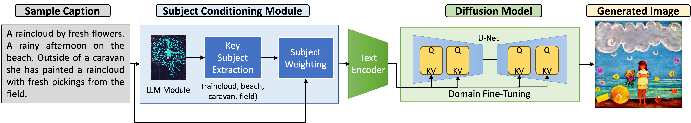
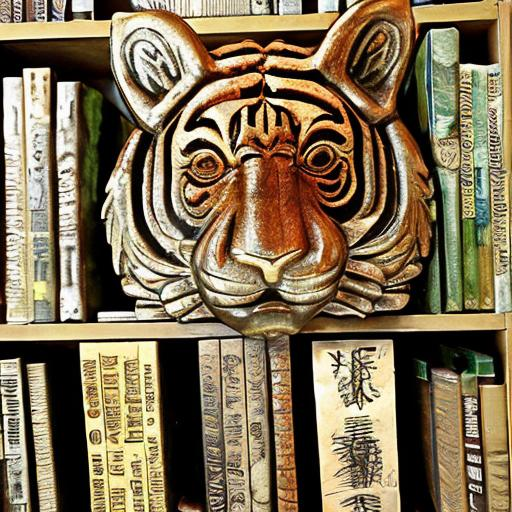
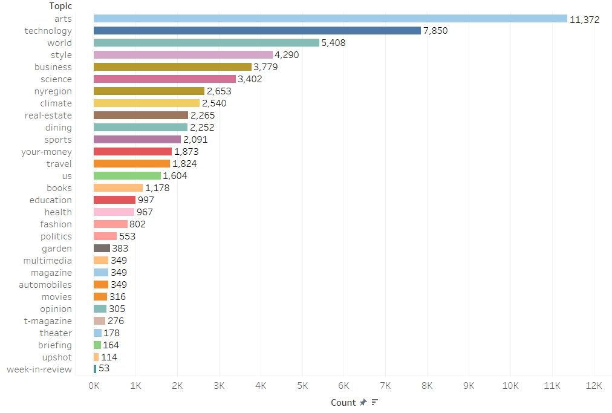
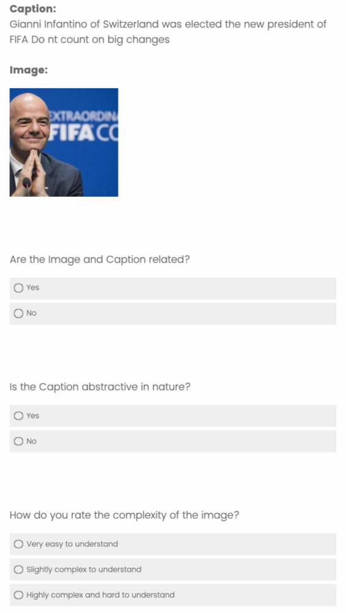
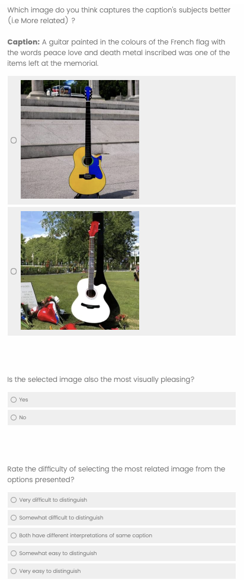

# 锚定：借助大型语言模型实现文本至图像合成中的新闻主题条件设置

发布时间：2024年04月15日

`LLM应用` `图像合成`

> ANCHOR: LLM-driven News Subject Conditioning for Text-to-Image Synthesis

# 摘要

> 文本到图像合成技术已大幅提升图像质量，但现有评估多依赖于描述性指令。新闻图片标题则更注重实用性，提供丰富的情境和命名实体信息，而非具体物体描述，呈现出抽象性。为此，我们推出了抽象新闻标题与高层次上下文表示（ANCHOR）数据集，收集了5家新闻机构的70,000多个样本，旨在测试T2I模型对新闻标题中主题的捕捉能力。借助大型语言模型在语言和常识推理上的卓越表现，我们研究了不同LLM在解析抽象标题中关键主题的能力。我们提出的“主题感知微调”（SAFE）方法，通过LLM生成的主题权重来提升合成图像中关键主题的表现，并针对新闻图像和标题的领域分布进行定制化微调，其在ANCHOR数据集上的表现超越了现有技术。发布ANCHOR数据集，我们期望推动T2I模型自然语言理解能力的进一步研究。

> Text-to-Image (T2I) Synthesis has made tremendous strides in enhancing synthesized image quality, but current datasets evaluate model performance only on descriptive, instruction-based prompts. Real-world news image captions take a more pragmatic approach, providing high-level situational and Named-Entity (NE) information and limited physical object descriptions, making them abstractive. To evaluate the ability of T2I models to capture intended subjects from news captions, we introduce the Abstractive News Captions with High-level cOntext Representation (ANCHOR) dataset, containing 70K+ samples sourced from 5 different news media organizations. With Large Language Models (LLM) achieving success in language and commonsense reasoning tasks, we explore the ability of different LLMs to identify and understand key subjects from abstractive captions. Our proposed method Subject-Aware Finetuning (SAFE), selects and enhances the representation of key subjects in synthesized images by leveraging LLM-generated subject weights. It also adapts to the domain distribution of news images and captions through custom Domain Fine-tuning, outperforming current T2I baselines on ANCHOR. By launching the ANCHOR dataset, we hope to motivate research in furthering the Natural Language Understanding (NLU) capabilities of T2I models.

[Arxiv](https://arxiv.org/abs/2404.10141)