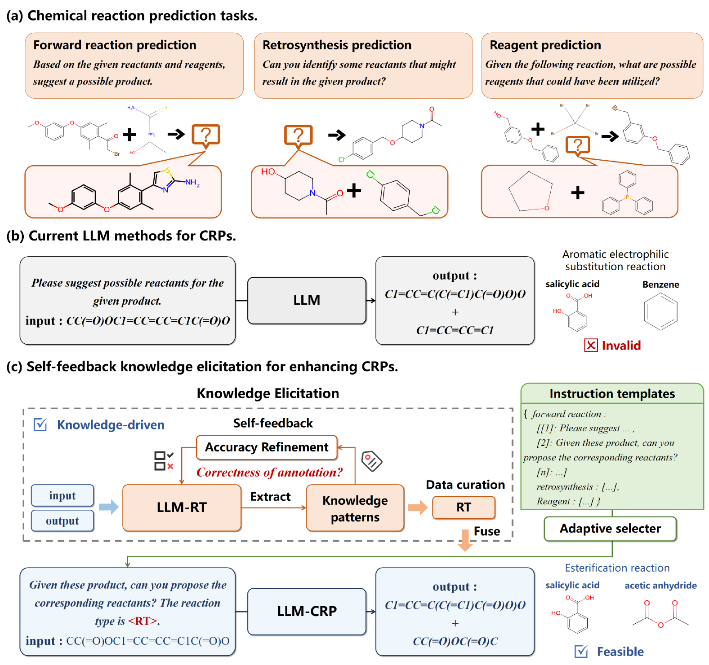
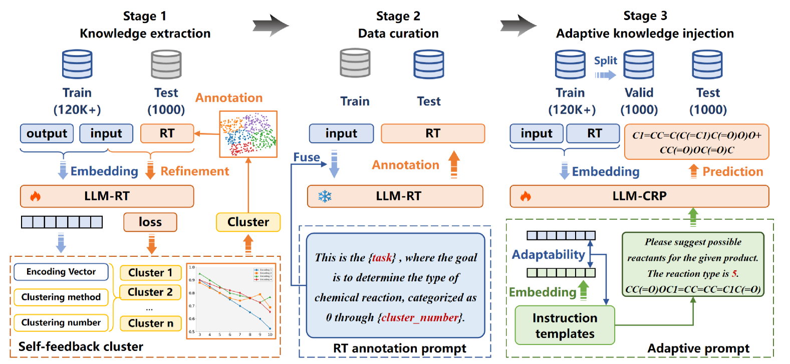
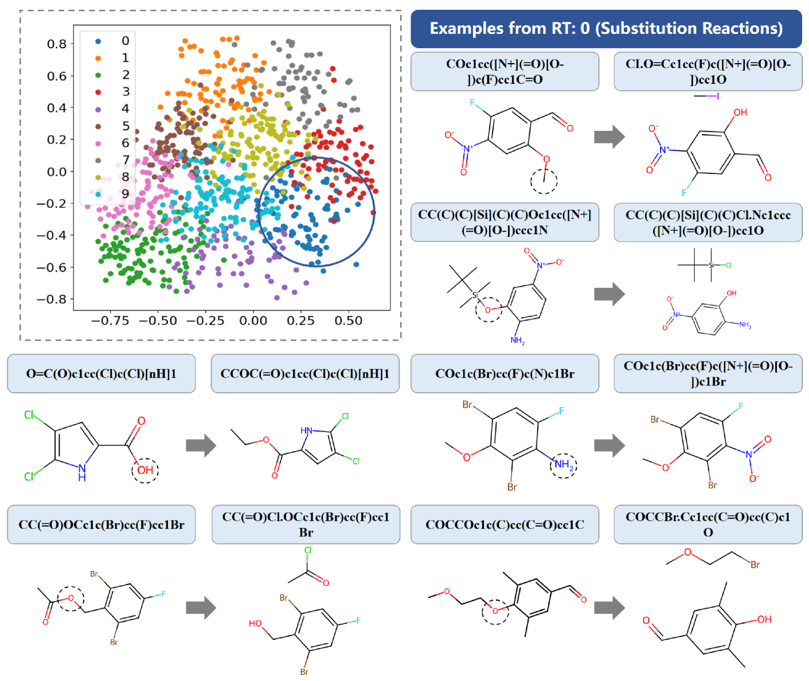

# 采用自反馈知识提取方法，提升化学反应预测的准确性

发布时间：2024年04月15日

`LLM应用` `药物发现` `材料科学`

> A Self-feedback Knowledge Elicitation Approach for Chemical Reaction Predictions

# 摘要

> 化学反应预测对于推动药物发现和材料科学至关重要。但这一领域受限于复杂的化学反应空间和反应选择性的捕捉难题，现有方法在利用数据内在知识方面存在局限。为此，我们提出了一种基于数据筛选的自我反馈式知识挖掘新策略。该策略通过迭代优化分子表达，助力提炼化学反应类型的知识。接着，我们运用自适应提示学习技术，将这些知识融入大型语言模型。这一方法显著提升了预测效果：逆合成预测准确率提升了14.2%，试剂预测准确率大幅攀升至74.2%，同时增强了模型处理多样化化学反应任务的能力。本研究开辟了科学领域知识挖掘的新途径，并充分展示了大型语言模型在化学预测任务中的潜在力量。

> The task of chemical reaction predictions (CRPs) plays a pivotal role in advancing drug discovery and material science. However, its effectiveness is constrained by the vast and uncertain chemical reaction space and challenges in capturing reaction selectivity, particularly due to existing methods' limitations in exploiting the data's inherent knowledge. To address these challenges, we introduce a data-curated self-feedback knowledge elicitation approach. This method starts from iterative optimization of molecular representations and facilitates the extraction of knowledge on chemical reaction types (RTs). Then, we employ adaptive prompt learning to infuse the prior knowledge into the large language model (LLM). As a result, we achieve significant enhancements: a 14.2% increase in retrosynthesis prediction accuracy, a 74.2% rise in reagent prediction accuracy, and an expansion in the model's capability for handling multi-task chemical reactions. This research offers a novel paradigm for knowledge elicitation in scientific research and showcases the untapped potential of LLMs in CRPs.

[Arxiv](https://arxiv.org/abs/2404.09606)