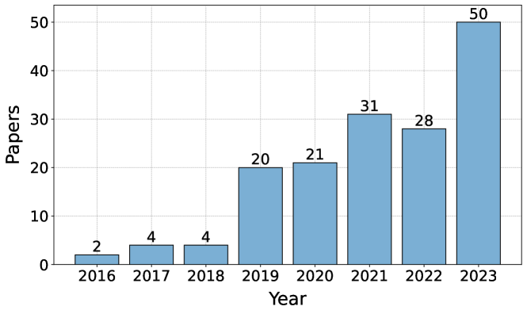
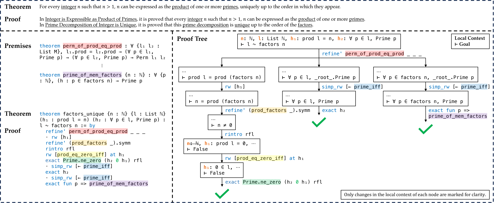

# 本文综述了深度学习在定理证明领域的研究进展。

发布时间：2024年04月15日

`LLM应用` `定理证明`

> A Survey on Deep Learning for Theorem Proving

# 摘要

> 定理证明是数学领域的基石，从数学语言的直观推理到形式系统的精确推演，无一不包。随着深度学习的发展，尤其是大型语言模型的兴起，近年来涌现出大量研究，探索如何利用这些技术提升定理证明的效率。本篇论文首次全面梳理了深度学习在定理证明领域的应用，包括对自动形式化、前提筛选、证明步骤生成和搜索等多种任务的现有方法的深入回顾；对现有数据集及数据生成策略的详尽梳理；对评估标准和最新技术表现的细致分析；以及对当前挑战和未来研究方向的深入探讨。我们的目标是为深度学习在定理证明领域的研究提供坚实的参考基础，以期激发更多在这一蓬勃发展的领域的研究尝试。

> Theorem proving is a fundamental aspect of mathematics, spanning from informal reasoning in mathematical language to rigorous derivations in formal systems. In recent years, the advancement of deep learning, especially the emergence of large language models, has sparked a notable surge of research exploring these techniques to enhance the process of theorem proving. This paper presents a pioneering comprehensive survey of deep learning for theorem proving by offering i) a thorough review of existing approaches across various tasks such as autoformalization, premise selection, proofstep generation, and proof search; ii) a meticulous summary of available datasets and strategies for data generation; iii) a detailed analysis of evaluation metrics and the performance of state-of-the-art; and iv) a critical discussion on the persistent challenges and the promising avenues for future exploration. Our survey aims to serve as a foundational reference for deep learning approaches in theorem proving, seeking to catalyze further research endeavors in this rapidly growing field.

[Arxiv](https://arxiv.org/abs/2404.09939)