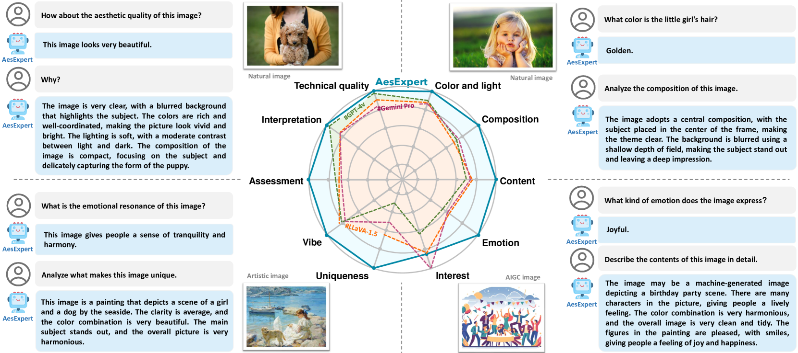
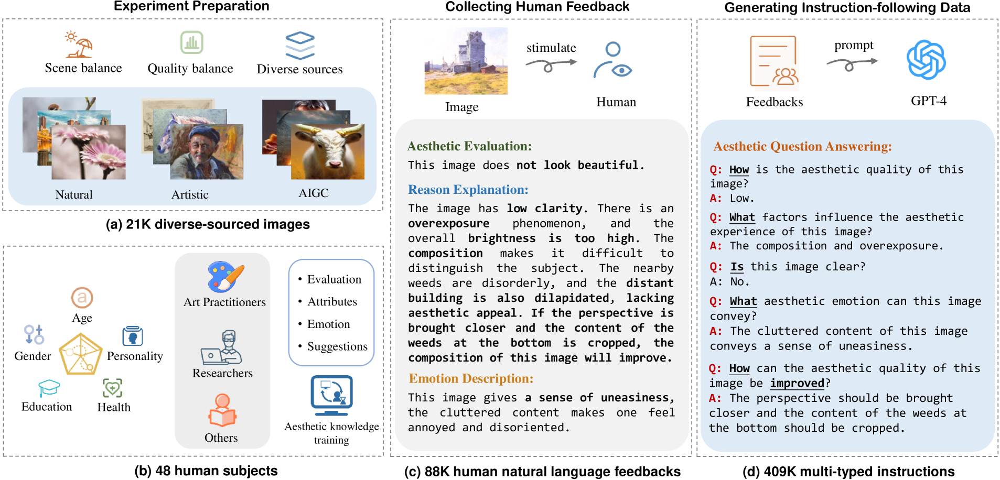
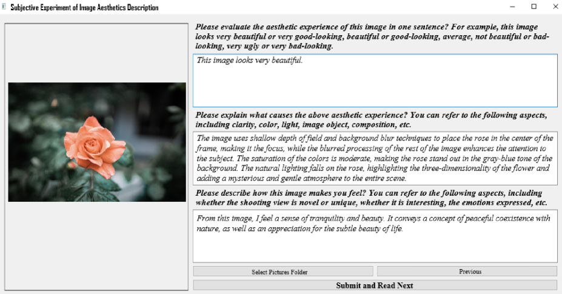
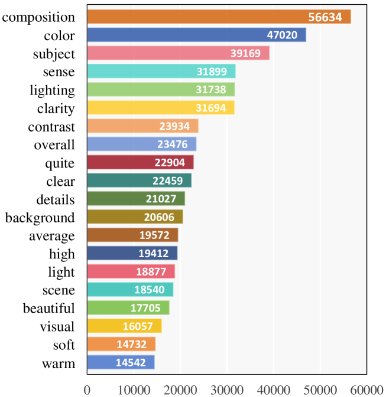
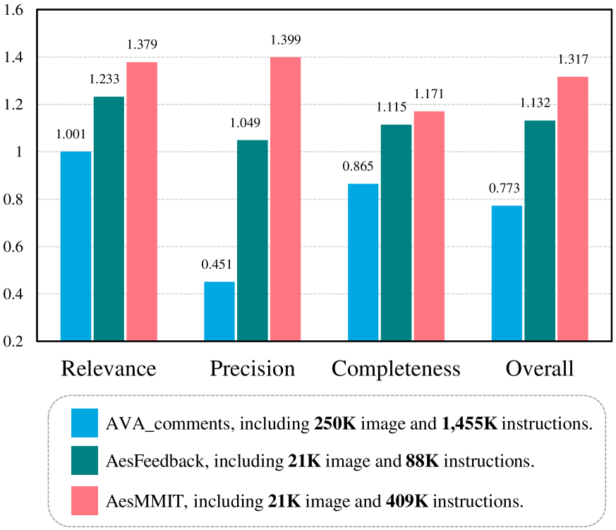

# AesExpert：探索构建多模态基础模型，以提升图像美学感知能力。

发布时间：2024年04月15日

`LLM应用` `多模态` `美学评估`

> AesExpert: Towards Multi-modality Foundation Model for Image Aesthetics Perception

# 摘要

> 图像美学感知的高度抽象性对多模态大型语言模型（MLLMs）构成了巨大挑战，而人类注释的多模态美学数据的缺失更使得MLLMs在美学感知方面力不从心。为此，我们首先推出了一个详尽标注的美学多模态指令调整（AesMMIT）数据集，作为建立多模态美学基础模型的基石。我们精心打造了一个包含21,904张多元来源图像及88K条人类自然语言反馈的美学批评数据库，通过逐步提问收集，覆盖从粗略到细致的美学评价。为了让MLLMs能应对各种查询，我们进一步引导GPT对美学批评进行精炼，并构建了一个包含409K条多类型指令的大规模美学指令调整数据集AesMMIT，以激发更强的美学能力。基于此，我们对开源的基础模型进行微调，打造出多模态美学专家模型AesExpert。实验证明，AesExpert模型在美学感知方面的表现远超现有的MLLMs，包括顶尖的GPT-4V和Gemini-Pro-Vision。相关源数据可在 https://github.com/yipoh/AesExpert 获取。

> The highly abstract nature of image aesthetics perception (IAP) poses significant challenge for current multimodal large language models (MLLMs). The lack of human-annotated multi-modality aesthetic data further exacerbates this dilemma, resulting in MLLMs falling short of aesthetics perception capabilities. To address the above challenge, we first introduce a comprehensively annotated Aesthetic Multi-Modality Instruction Tuning (AesMMIT) dataset, which serves as the footstone for building multi-modality aesthetics foundation models. Specifically, to align MLLMs with human aesthetics perception, we construct a corpus-rich aesthetic critique database with 21,904 diverse-sourced images and 88K human natural language feedbacks, which are collected via progressive questions, ranging from coarse-grained aesthetic grades to fine-grained aesthetic descriptions. To ensure that MLLMs can handle diverse queries, we further prompt GPT to refine the aesthetic critiques and assemble the large-scale aesthetic instruction tuning dataset, i.e. AesMMIT, which consists of 409K multi-typed instructions to activate stronger aesthetic capabilities. Based on the AesMMIT database, we fine-tune the open-sourced general foundation models, achieving multi-modality Aesthetic Expert models, dubbed AesExpert. Extensive experiments demonstrate that the proposed AesExpert models deliver significantly better aesthetic perception performances than the state-of-the-art MLLMs, including the most advanced GPT-4V and Gemini-Pro-Vision. Source data will be available at https://github.com/yipoh/AesExpert.

[Arxiv](https://arxiv.org/abs/2404.09624)