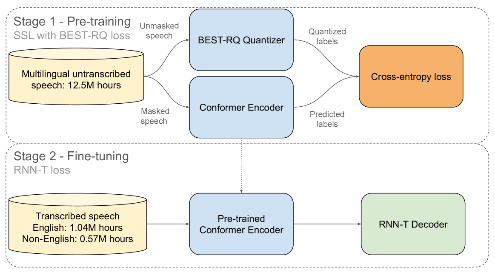
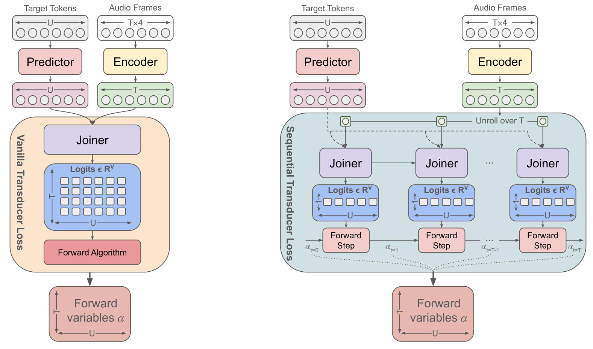
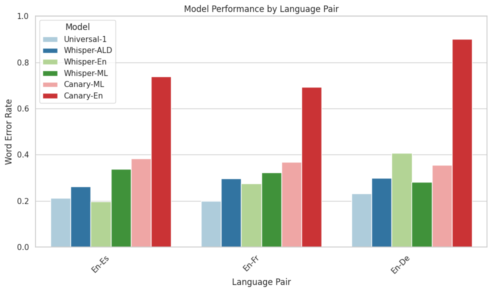
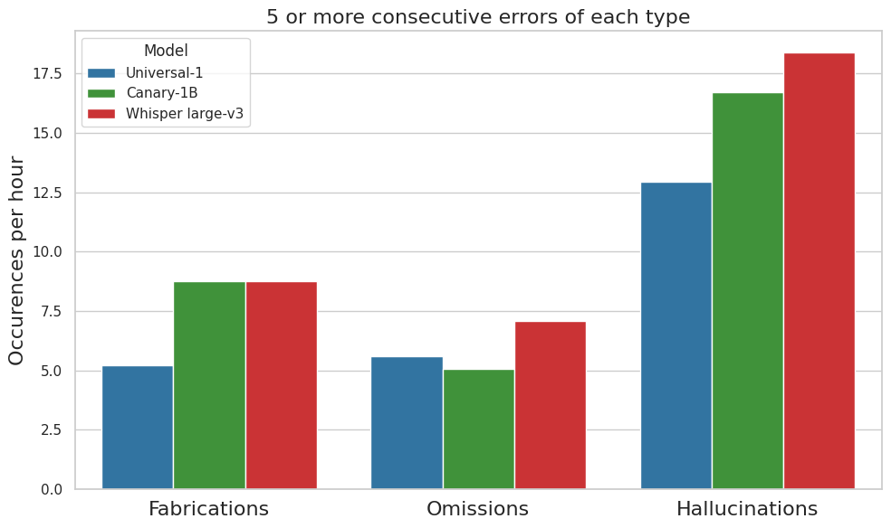
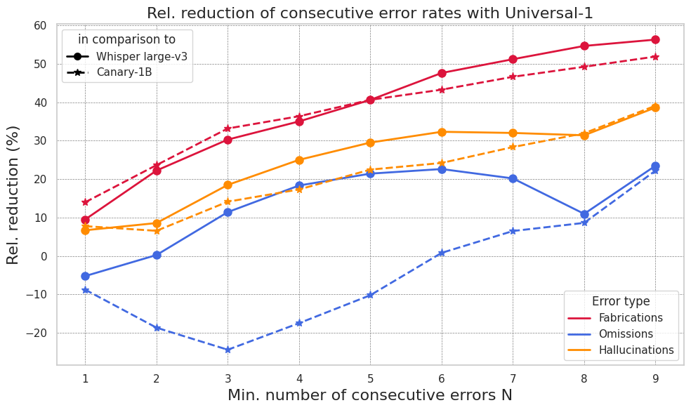
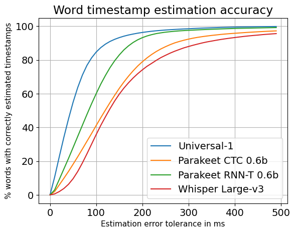
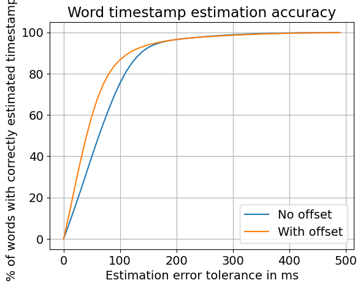
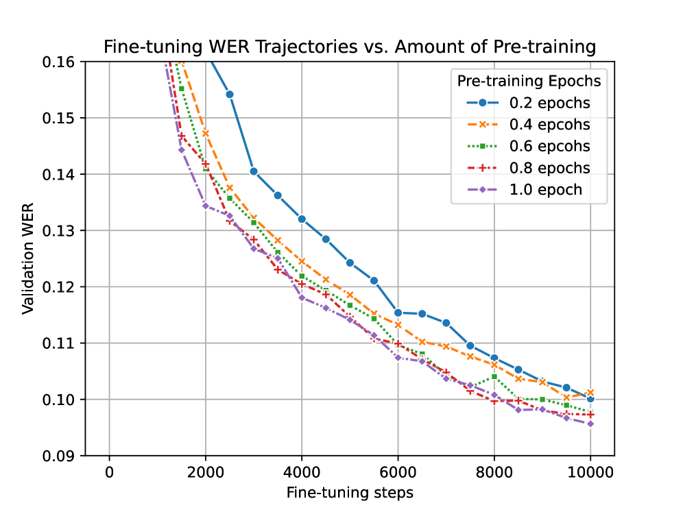

# 探究工业级多语言自动语音识别的内在机制

发布时间：2024年04月15日

`LLM应用` `自动语音识别`

> Anatomy of Industrial Scale Multilingual ASR

# 摘要

> 本文介绍了AssemblyAI打造的大规模工业级自动语音识别系统，专为满足多语言、大规模ASR应用需求设计。系统整合了无监督、监督和伪标签数据，总计1400多万小时，覆盖四国语言。模型核心为全上下文600M参数Conformer编码器，搭配RNN-T解码器，经BEST-RQ预训练及联合微调。评估结果显示，该系统在词错误率方面与更大、更昂贵的Whisper和Canary-1B模型相媲美。此外，系统设计上的优势还包括：代码切换能力增强、推理速度提升5倍、语音数据幻觉率降低30%、环境噪声减少90%，以及时间戳准确度显著改善。我们通过系统化分析，深入探讨了成熟的ASR模型的各个方面，为实际运营的大型服务提供了实用的洞察。

> This paper describes AssemblyAI's industrial-scale automatic speech recognition (ASR) system, designed to meet the requirements of large-scale, multilingual ASR serving various application needs. Our system leverages a diverse training dataset comprising unsupervised (12.5M hours), supervised (188k hours), and pseudo-labeled (1.6M hours) data across four languages. We provide a detailed description of our model architecture, consisting of a full-context 600M-parameter Conformer encoder pre-trained with BEST-RQ and an RNN-T decoder fine-tuned jointly with the encoder. Our extensive evaluation demonstrates competitive word error rates (WERs) against larger and more computationally expensive models, such as Whisper large and Canary-1B. Furthermore, our architectural choices yield several key advantages, including an improved code-switching capability, a 5x inference speedup compared to an optimized Whisper baseline, a 30% reduction in hallucination rate on speech data, and a 90% reduction in ambient noise compared to Whisper, along with significantly improved time-stamp accuracy. Throughout this work, we adopt a system-centric approach to analyzing various aspects of fully-fledged ASR models to gain practically relevant insights useful for real-world services operating at scale.

[Arxiv](https://arxiv.org/abs/2404.09841)