# 通过预测任务分配，架起视觉与语言之间的桥梁

发布时间：2024年04月15日

`LLM应用` `视觉-语言处理` `多模态学习`

> Bridging Vision and Language Spaces with Assignment Prediction

# 摘要

> 本文提出了VLAP，这是一种创新的方法，它连接了预训练的视觉模型与大型语言模型（LLMs），让静态的LLMs得以理解视觉世界。VLAP通过一个简单的线性层，将视觉模型的嵌入空间转换到LLMs的词嵌入空间，实现了高效且通用的视觉与语言理解。我们运用成熟的词嵌入技术，架起了视觉与文本两个模态的嵌入空间之桥。通过将分配过程视作一个最优传输问题，使得视觉和文本的表征能够同时映射到预训练LLMs的词嵌入集合中。我们根据一种模态数据的表征来预测另一种模态的分配，确保多模态数据配对的一致性。这样，视觉和语言的表征就能共享相同的信息，使得LLMs的词嵌入空间得以基于视觉数据构建。而且，由于LLMs通过词嵌入间的关联来解释和推理语言信息，它们能够保持一个强大的语义分类体系，使得LLMs的视觉语义运算成为可能。实验结果显示，VLAP在图像字幕、视觉问答和跨模态检索等多个视觉-语言任务上，相较于以往的线性变换方法，取得了显著的进步。我们还证实了学习到的视觉表征能够体现LLMs的语义分类，让视觉语义运算得以实现。

> This paper introduces VLAP, a novel approach that bridges pretrained vision models and large language models (LLMs) to make frozen LLMs understand the visual world. VLAP transforms the embedding space of pretrained vision models into the LLMs' word embedding space using a single linear layer for efficient and general-purpose visual and language understanding. Specifically, we harness well-established word embeddings to bridge two modality embedding spaces. The visual and text representations are simultaneously assigned to a set of word embeddings within pretrained LLMs by formulating the assigning procedure as an optimal transport problem. We predict the assignment of one modality from the representation of another modality data, enforcing consistent assignments for paired multimodal data. This allows vision and language representations to contain the same information, grounding the frozen LLMs' word embedding space in visual data. Moreover, a robust semantic taxonomy of LLMs can be preserved with visual data since the LLMs interpret and reason linguistic information from correlations between word embeddings. Experimental results show that VLAP achieves substantial improvements over the previous linear transformation-based approaches across a range of vision-language tasks, including image captioning, visual question answering, and cross-modal retrieval. We also demonstrate the learned visual representations hold a semantic taxonomy of LLMs, making visual semantic arithmetic possible.

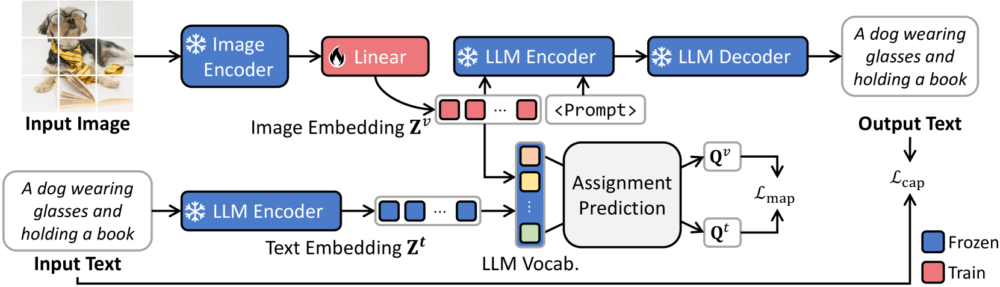

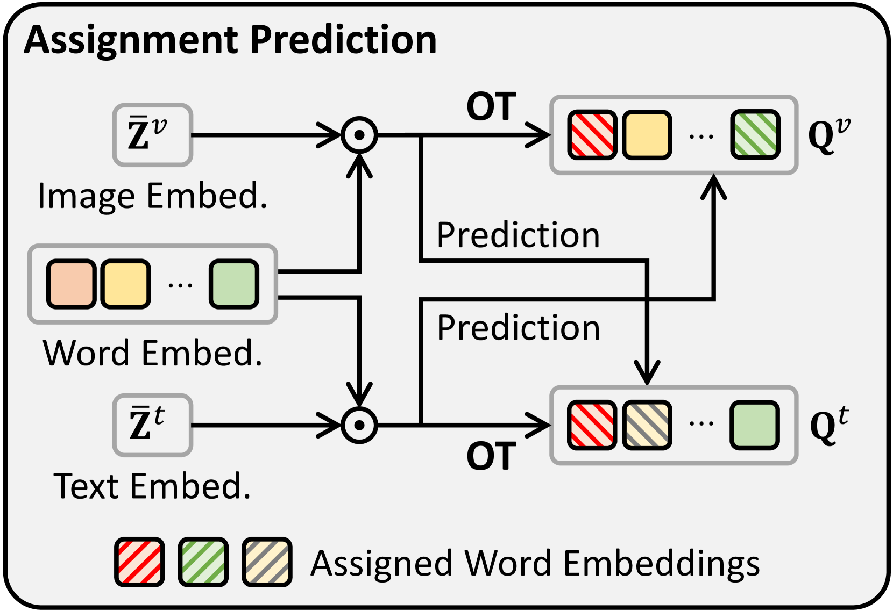

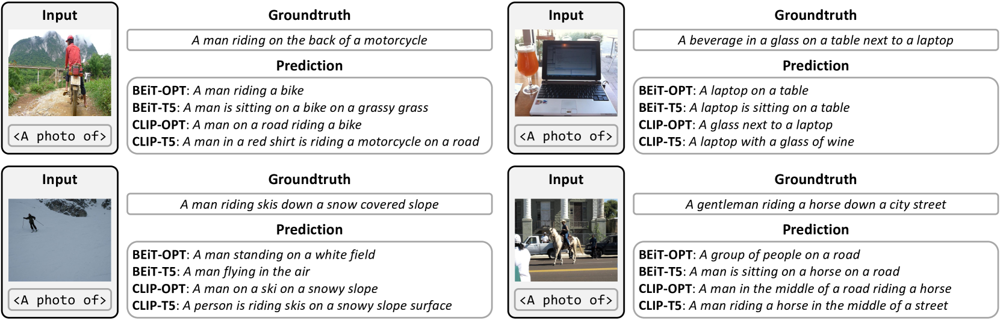

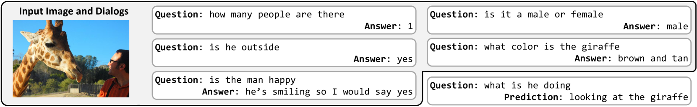

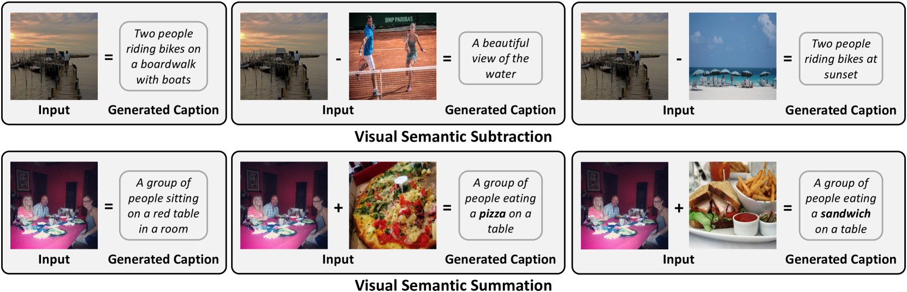

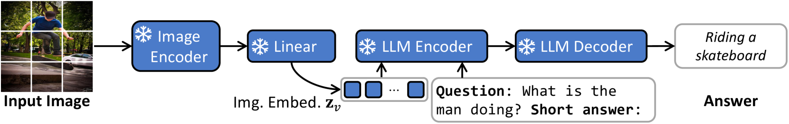

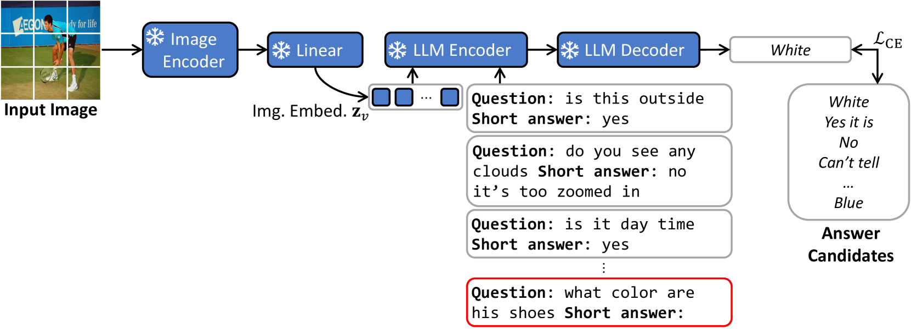

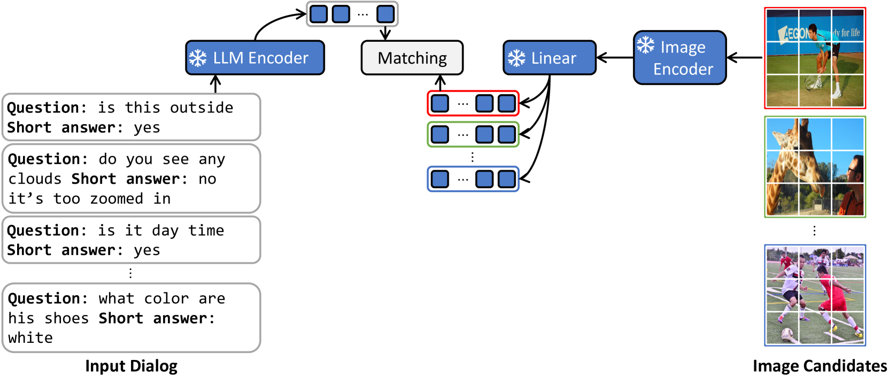

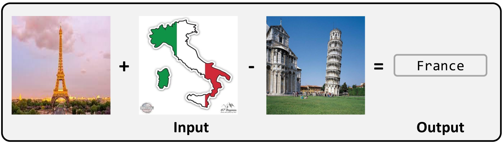

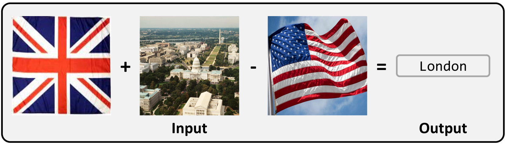

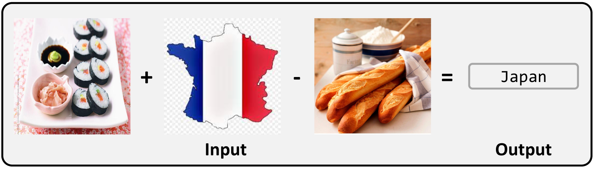

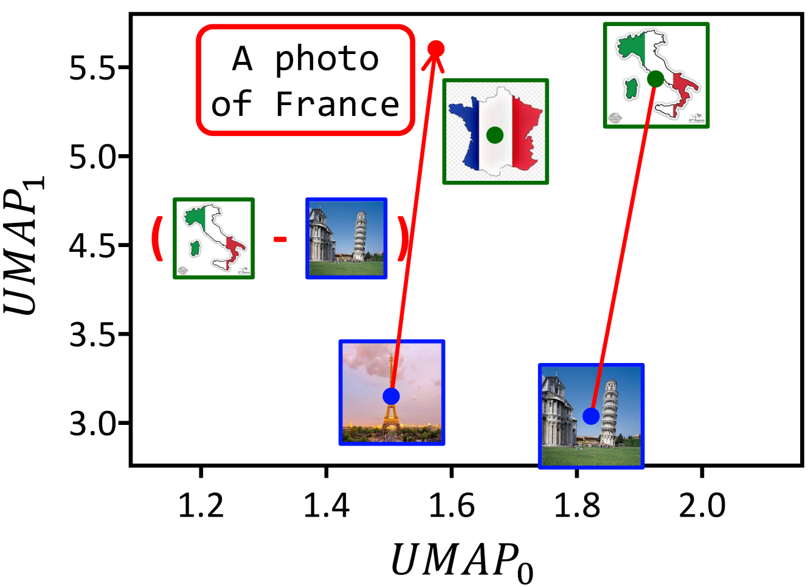

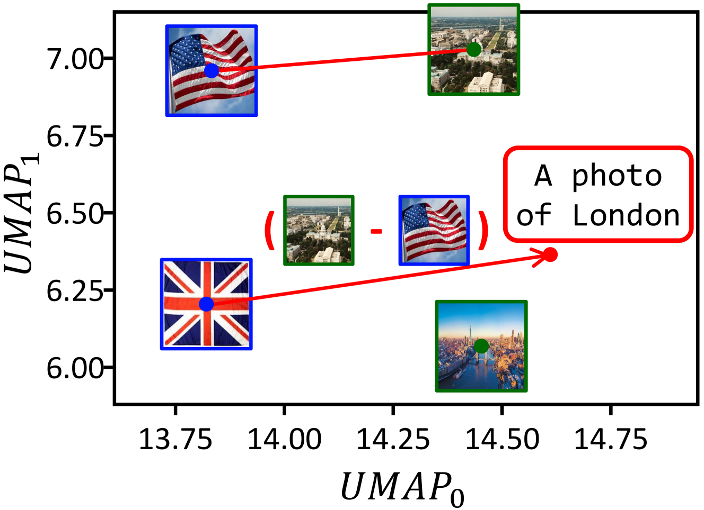

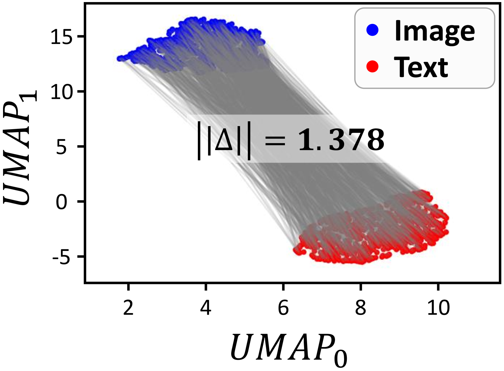

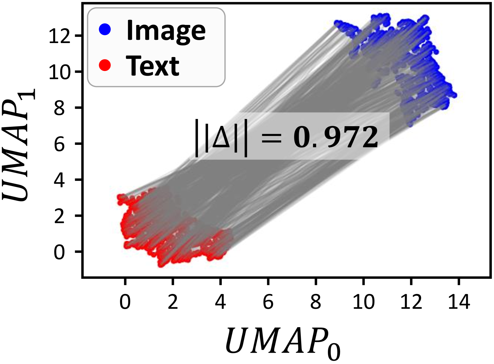

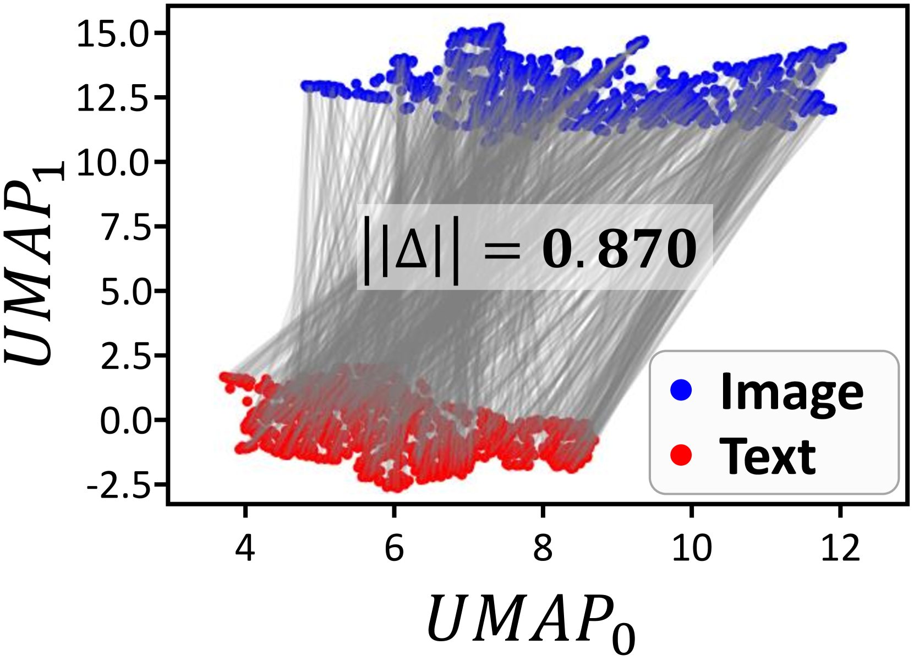

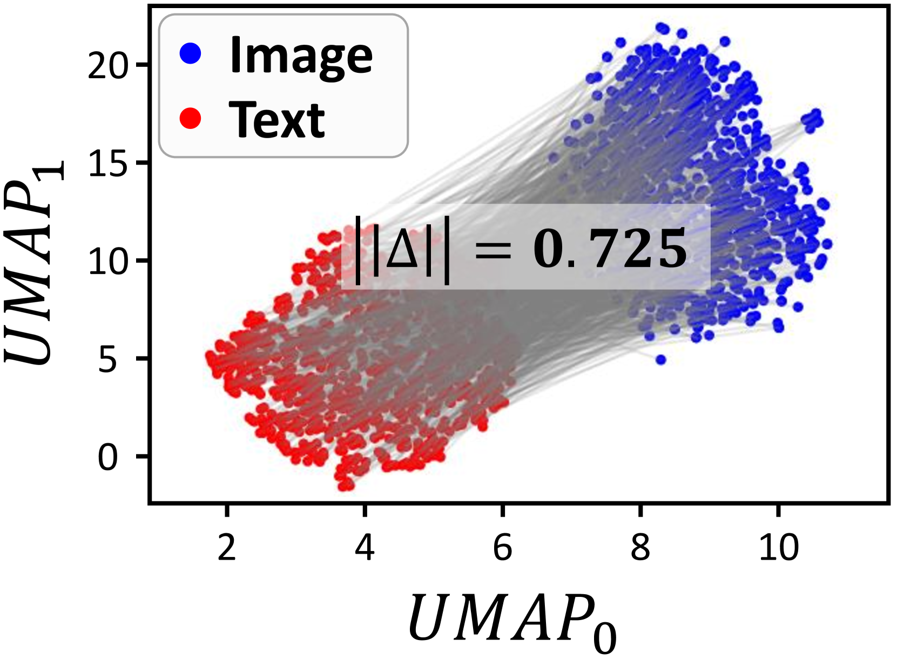

[Arxiv](https://arxiv.org/abs/2404.09632)