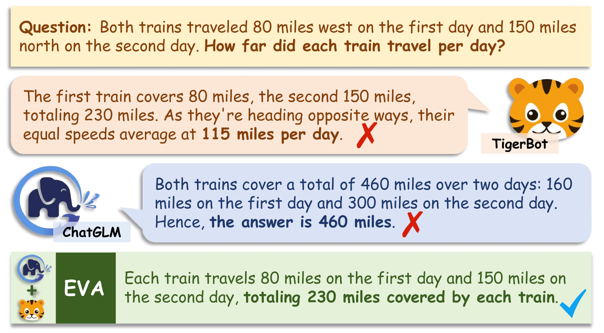
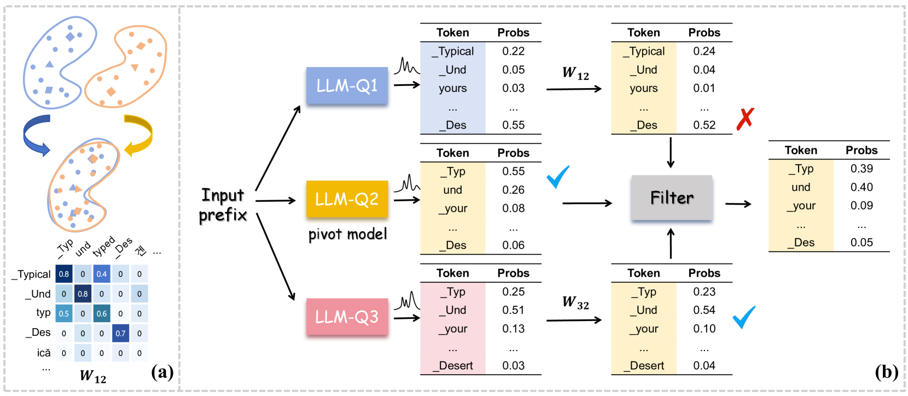
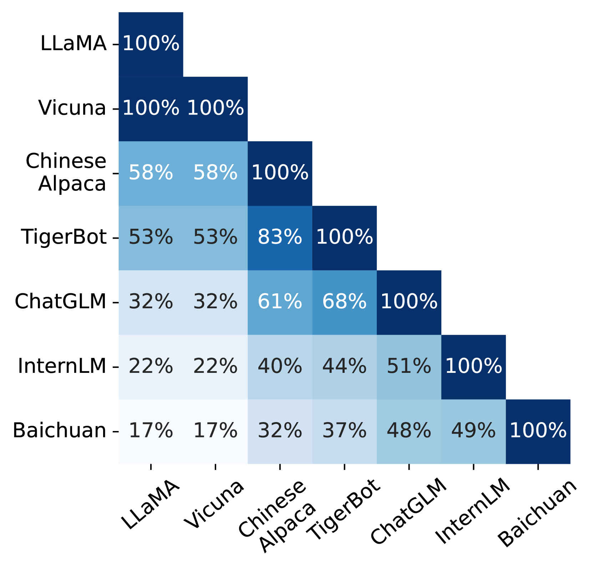
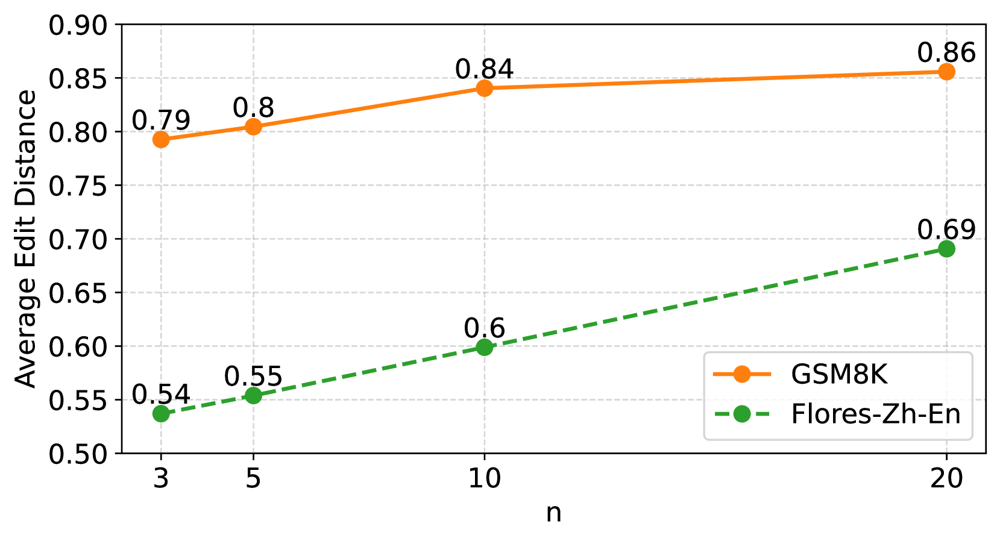
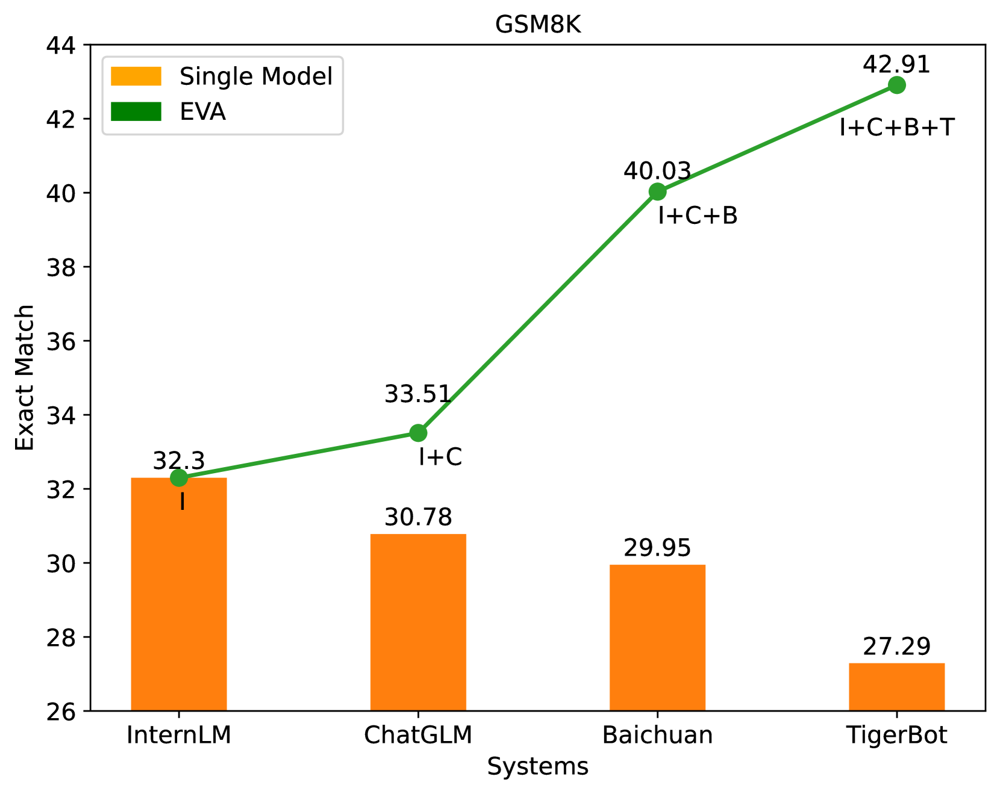

# 搭建桥梁，实现大型语言模型集合中词汇差异的融合

发布时间：2024年04月15日

`LLM理论` `人工智能`

> Bridging the Gap between Different Vocabularies for LLM Ensemble

# 摘要

> 将不同大型语言模型（LLMs）融合，发挥它们的协同效应和独特优势，这一做法极为重要。但不同模型间词汇的不统一，往往让研究受限于选择或混合成品输出。这阻碍了生成过程中对输出的实时优化，使得集成效果不尽如人意。为突破这一瓶颈，我们提出了一种创新的词汇对齐（EVA）方法，用以融合LLMs。EVA通过连接各模型的词汇差异，确保在生成的每个环节都能精确地进行融合。我们首先学习不同LLMs词汇间的映射关系，借助共有的标记进行。然后，利用这些映射将各模型的输出分布映射到同一空间，实现精细集成。最终，我们设计了一种过滤机制，筛除那些产出不可靠标记的模型。在常识推理、算术推理、机器翻译和数据到文本生成等任务上的实验结果显示，我们的方法超越了单独的LLMs和以往的集成方法。深入分析也证实，此方法能有效整合多模型知识，带来稳定的性能提升。

> Ensembling different large language models (LLMs) to unleash their complementary potential and harness their individual strengths is highly valuable. Nevertheless, vocabulary discrepancies among various LLMs have constrained previous studies to either selecting or blending completely generated outputs. This limitation hinders the dynamic correction and enhancement of outputs during the generation process, resulting in a limited capacity for effective ensemble. To address this issue, we propose a novel method to Ensemble LLMs via Vocabulary Alignment (EVA). EVA bridges the lexical gap among various LLMs, enabling meticulous ensemble at each generation step. Specifically, we first learn mappings between the vocabularies of different LLMs with the assistance of overlapping tokens. Subsequently, these mappings are employed to project output distributions of LLMs into a unified space, facilitating a fine-grained ensemble. Finally, we design a filtering strategy to exclude models that generate unfaithful tokens. Experimental results on commonsense reasoning, arithmetic reasoning, machine translation, and data-to-text generation tasks demonstrate the superiority of our approach compared with individual LLMs and previous ensemble methods conducted on complete outputs. Further analyses confirm that our approach can leverage knowledge from different language models and yield consistent improvement.

[Arxiv](https://arxiv.org/abs/2404.09492)