# 压缩与智能之间呈现出线性的正相关性。

发布时间：2024年04月15日

`LLM理论` `数据压缩`

> Compression Represents Intelligence Linearly

# 摘要

> 人们相信，精通压缩能够催生智能。近期研究表明，语言建模与压缩本质上是一回事，这为大型语言模型（LLMs）的成功提供了有力解释：语言模型的进步本质上是提升压缩能力，进而增强智能。尽管这一观点颇具吸引力，但关于压缩与智能之间如何相互作用的实证研究却不多。本研究将LLMs视作数据压缩工具，探讨了它们之间的关系。由于“智能”这一概念较为抽象，我们选用平均下游基准测试分数作为衡量标准，重点关注与知识、常识、编码和数学推理相关的智能。我们汇集了12个不同机构开发的30个公共LLMs进行测试。有趣的是，我们发现LLMs的智能——通过平均基准测试分数体现——与它们压缩外部文本的能力几乎成线性关系。这一发现为“优秀的压缩能力意味着更高的智能”这一观点提供了确凿证据。此外，我们的研究还表明，压缩效率这一无监督指标，直接从原始文本中得出，是衡量模型能力的可靠标准。我们已将压缩数据集和数据收集流程开源，以便未来研究者能更准确地评估压缩效果。

> There is a belief that learning to compress well will lead to intelligence. Recently, language modeling has been shown to be equivalent to compression, which offers a compelling rationale for the success of large language models (LLMs): the development of more advanced language models is essentially enhancing compression which facilitates intelligence. Despite such appealing discussions, little empirical evidence is present for the interplay between compression and intelligence. In this work, we examine their relationship in the context of LLMs, treating LLMs as data compressors. Given the abstract concept of "intelligence", we adopt the average downstream benchmark scores as a surrogate, specifically targeting intelligence related to knowledge and commonsense, coding, and mathematical reasoning. Across 12 benchmarks, our study brings together 30 public LLMs that originate from diverse organizations. Remarkably, we find that LLMs' intelligence -- reflected by average benchmark scores -- almost linearly correlates with their ability to compress external text corpora. These results provide concrete evidence supporting the belief that superior compression indicates greater intelligence. Furthermore, our findings suggest that compression efficiency, as an unsupervised metric derived from raw text corpora, serves as a reliable evaluation measure that is linearly associated with the model capabilities. We open-source our compression datasets as well as our data collection pipelines to facilitate future researchers to assess compression properly.

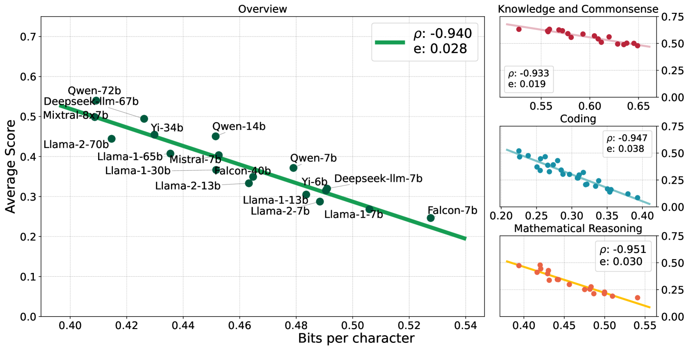

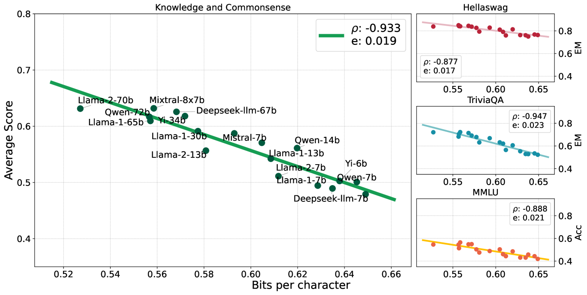

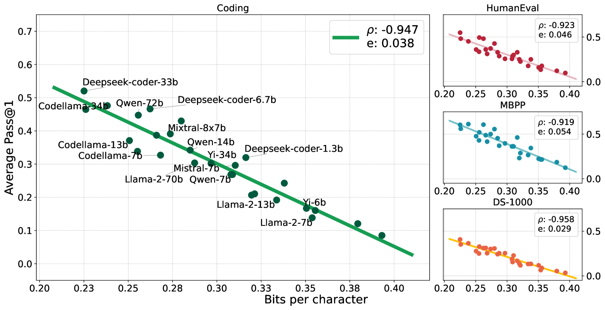

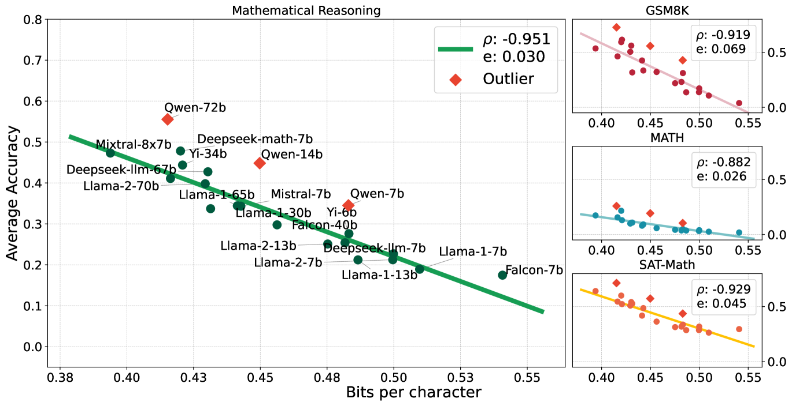

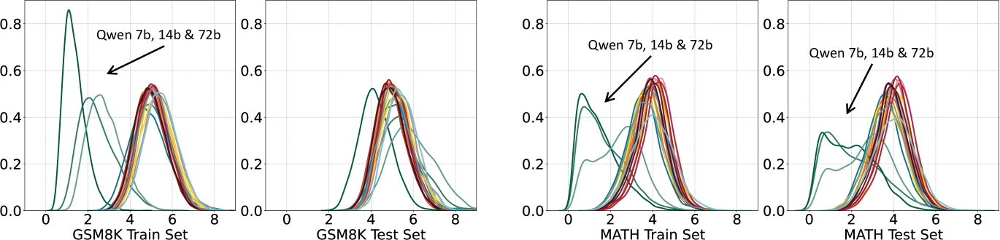

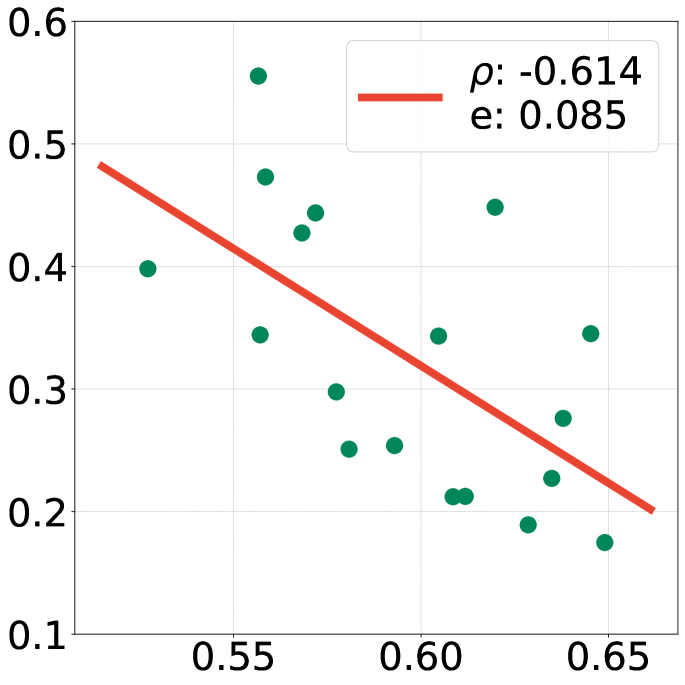

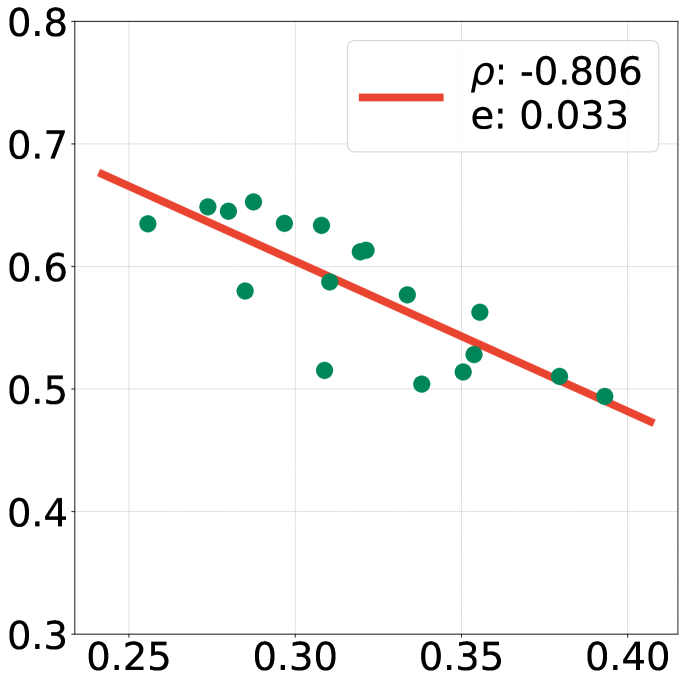

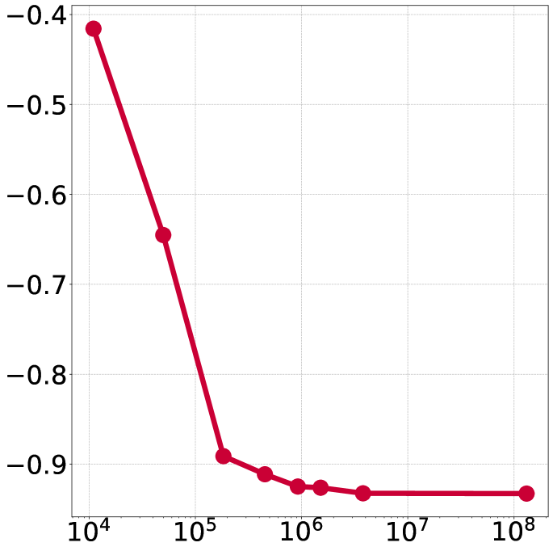

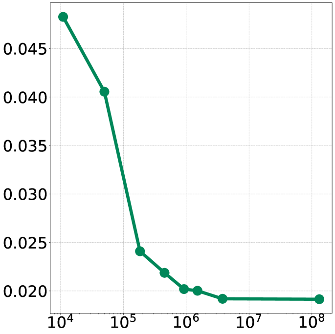

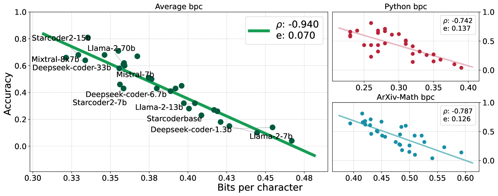

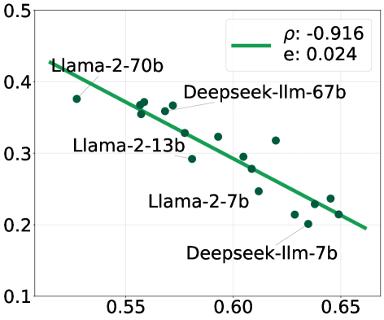

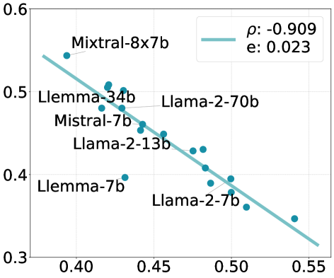

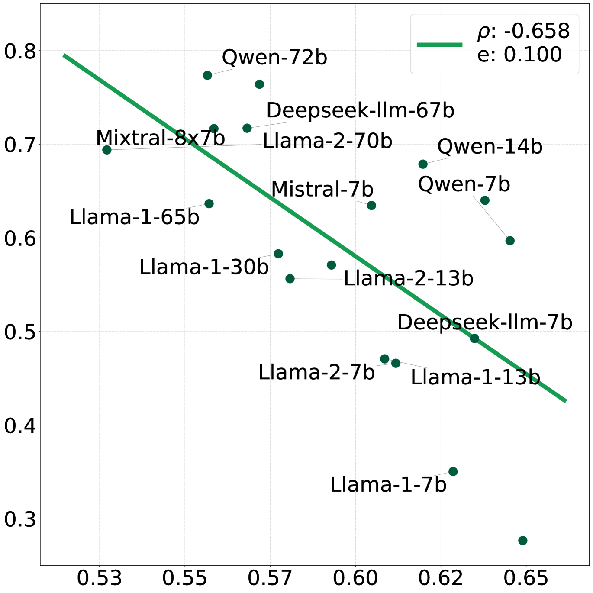

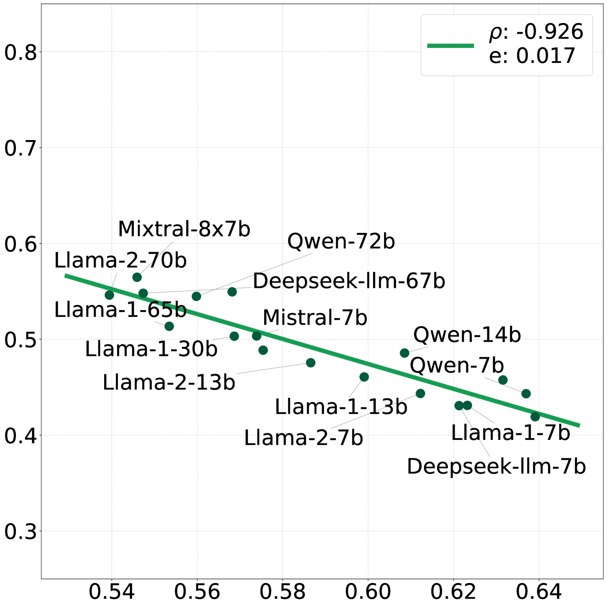

[Arxiv](https://arxiv.org/abs/2404.09937)