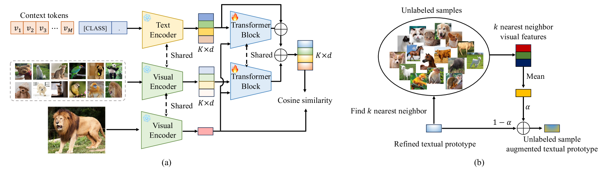
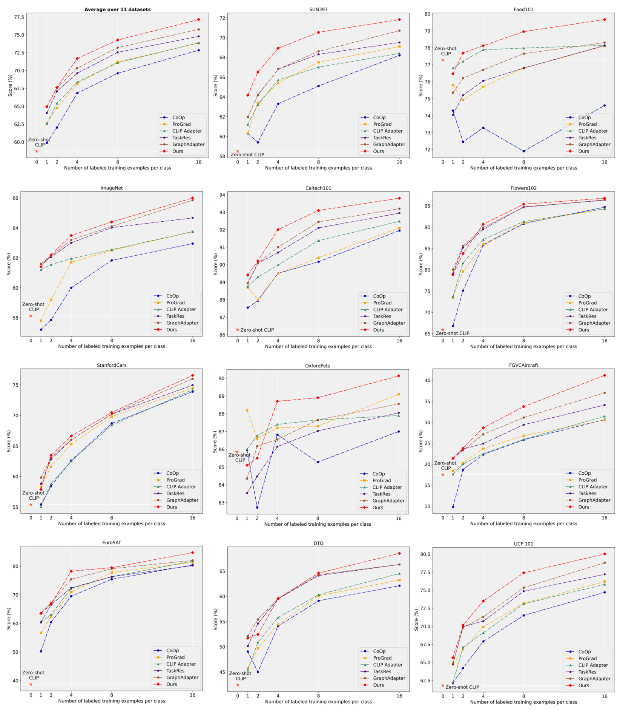
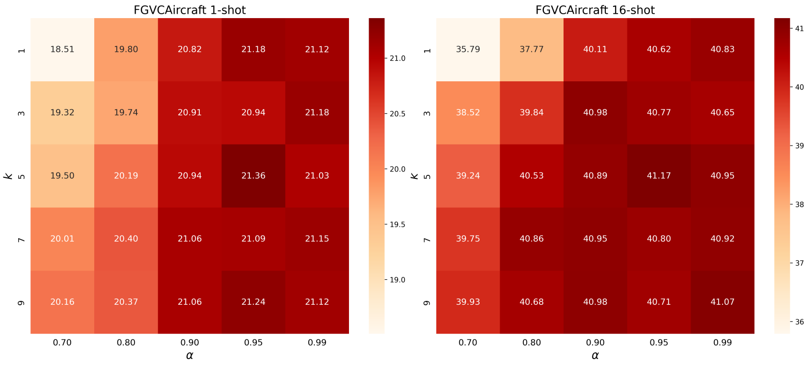

# 条件原型调整提示学习法

发布时间：2024年04月15日

`LLM应用` `计算机视觉` `迁移学习`

> Conditional Prototype Rectification Prompt Learning

# 摘要

> 通过预训练，大型视觉-语言模型（VLMs）对普遍的视觉概念有了深入的认识。在高效的迁移学习（ETL）领域，最近的研究成功地在数据受限的情况下对VLMs进行微调，仅需引入少量参数便能从VLMs中提取特定于任务的见解。尽管进步显著，现有的ETL方法仍容易过度拟合训练过程中遇到的有限基类分布，面临两大主要问题：一是仅依赖单一模态信息建模特定任务知识；二是采用昂贵且耗时的方法补充知识。为应对这些问题，我们提出了条件原型校正提示学习（CPR）方法，旨在纠正基例偏差，有效扩充有限数据。具体而言，我们双管齐下缓解对基类的过度拟合：一方面，每张输入图像同时吸收文本和视觉原型的知识，进而产生依赖于样本的文本令牌；另一方面，我们从未经标记的数据中提取可利用的知识，以进一步优化原型。这两种策略有效减少了基类偏差，打造出更为精准的分类器。在11个基准数据集上的广泛测试显示，我们的CPR方法在小样本分类和基类到新类别泛化任务中均取得了顶尖成果。相关代码已在 \url{https://github.com/chenhaoxing/CPR} 上发布。

> Pre-trained large-scale vision-language models (VLMs) have acquired profound understanding of general visual concepts. Recent advancements in efficient transfer learning (ETL) have shown remarkable success in fine-tuning VLMs within the scenario of limited data, introducing only a few parameters to harness task-specific insights from VLMs. Despite significant progress, current leading ETL methods tend to overfit the narrow distributions of base classes seen during training and encounter two primary challenges: (i) only utilizing uni-modal information to modeling task-specific knowledge; and (ii) using costly and time-consuming methods to supplement knowledge. To address these issues, we propose a Conditional Prototype Rectification Prompt Learning (CPR) method to correct the bias of base examples and augment limited data in an effective way. Specifically, we alleviate overfitting on base classes from two aspects. First, each input image acquires knowledge from both textual and visual prototypes, and then generates sample-conditional text tokens. Second, we extract utilizable knowledge from unlabeled data to further refine the prototypes. These two strategies mitigate biases stemming from base classes, yielding a more effective classifier. Extensive experiments on 11 benchmark datasets show that our CPR achieves state-of-the-art performance on both few-shot classification and base-to-new generalization tasks. Our code is avaliable at \url{https://github.com/chenhaoxing/CPR}.

[Arxiv](https://arxiv.org/abs/2404.09872)