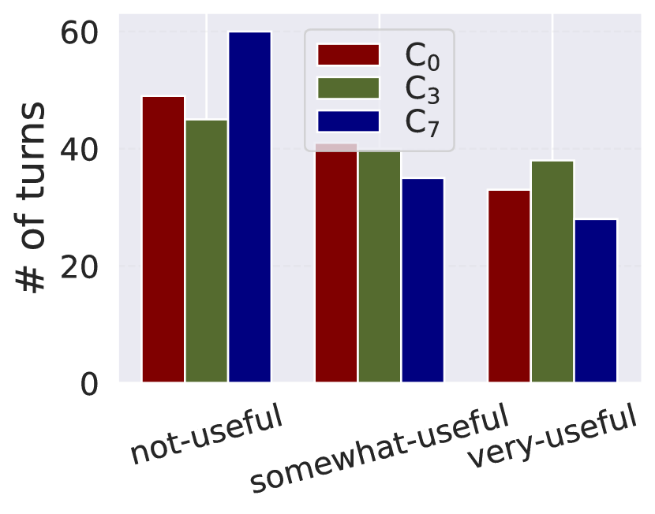
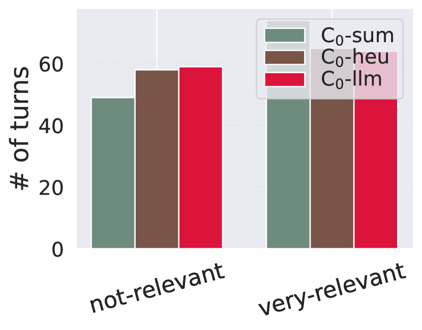
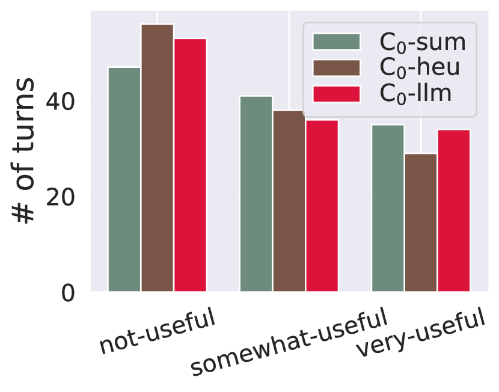
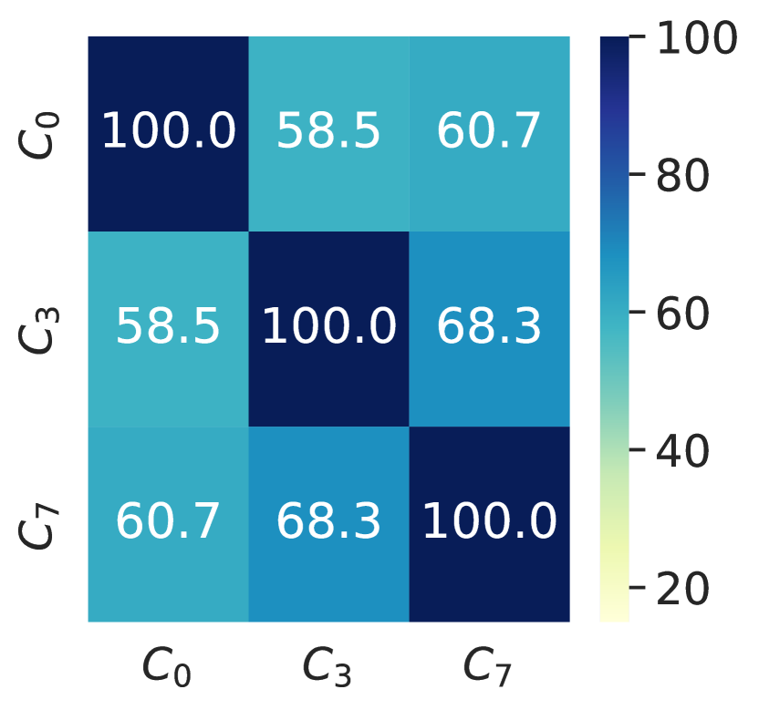
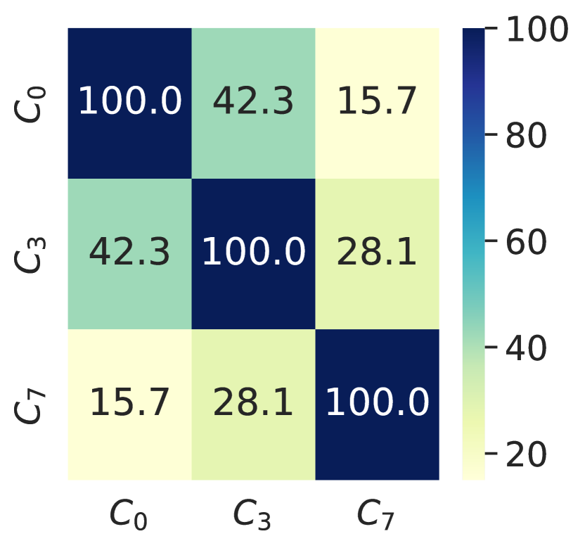
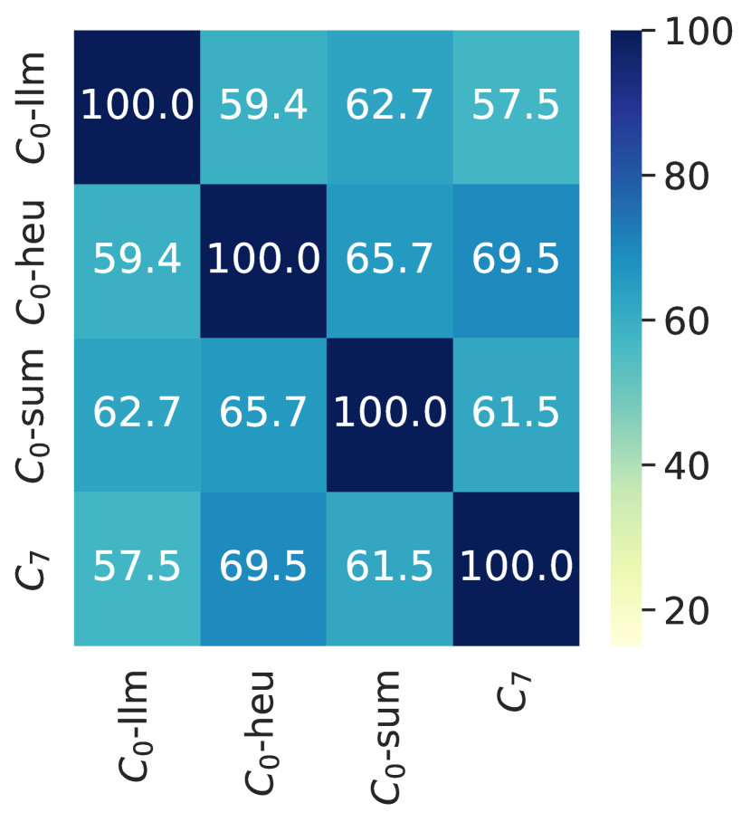
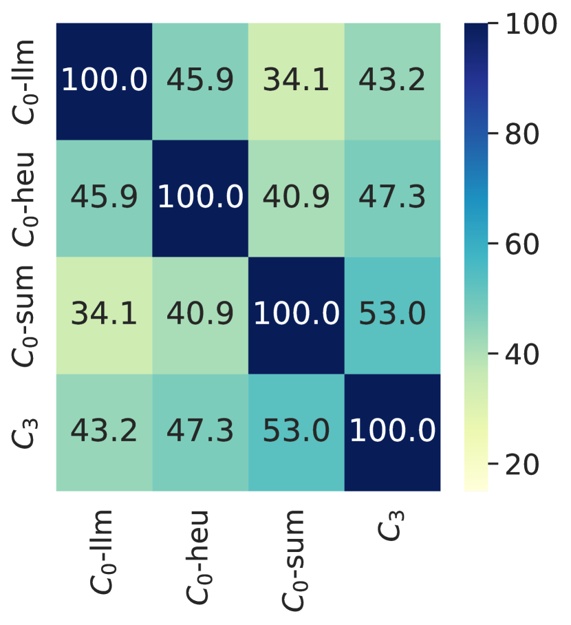
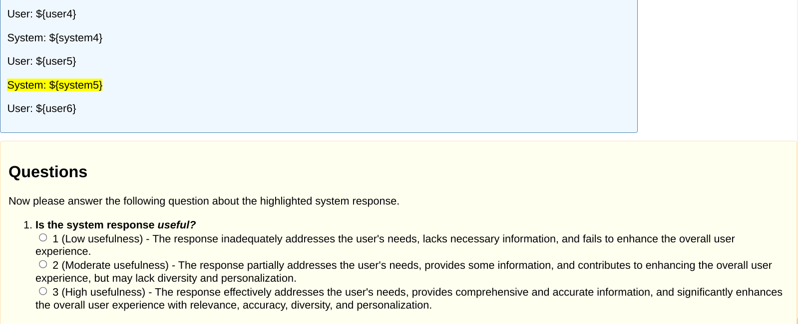
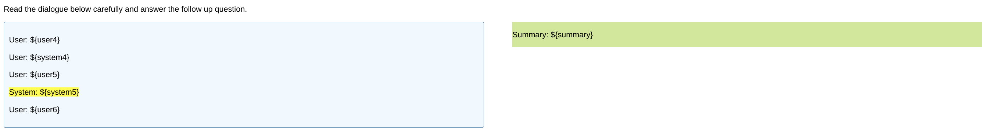

# 上下文在任务导向对话系统的众包评估标签中具有重要意义。

发布时间：2024年04月15日

`LLM应用` `对话系统` `众包标注`

> Context Does Matter: Implications for Crowdsourced Evaluation Labels in Task-Oriented Dialogue Systems

# 摘要

> 众包标签对于评价任务型对话系统至关重要。获取高质量且一致性强的真值标签并非易事。评估对话系统时，注释者需充分理解对话内容才能做出准确判断。尽管先前研究建议在注释过程中仅使用部分对话内容，但这种做法对标签质量的具体影响尚待探究。本研究深入探讨了对话上下文对注释质量的影响，并尝试利用大型语言模型对对话内容进行总结，以简洁丰富地呈现上下文信息，同时考察了这一做法对注释者表现的作用。研究发现，减少上下文信息有助于提高评分的积极性；而完整呈现对话内容虽能提升相关性评分的质量，却可能带来实用性评价的不确定性。当以用户首句话作为上下文时，可获得与全文对话相似的一致性评分，且大幅减轻了注释负担。研究结果揭示了任务设计尤其是对话上下文的充分展现，对众包评价标签质量与一致性的重要影响。

> Crowdsourced labels play a crucial role in evaluating task-oriented dialogue systems (TDSs). Obtaining high-quality and consistent ground-truth labels from annotators presents challenges. When evaluating a TDS, annotators must fully comprehend the dialogue before providing judgments. Previous studies suggest using only a portion of the dialogue context in the annotation process. However, the impact of this limitation on label quality remains unexplored. This study investigates the influence of dialogue context on annotation quality, considering the truncated context for relevance and usefulness labeling. We further propose to use large language models (LLMs) to summarize the dialogue context to provide a rich and short description of the dialogue context and study the impact of doing so on the annotator's performance. Reducing context leads to more positive ratings. Conversely, providing the entire dialogue context yields higher-quality relevance ratings but introduces ambiguity in usefulness ratings. Using the first user utterance as context leads to consistent ratings, akin to those obtained using the entire dialogue, with significantly reduced annotation effort. Our findings show how task design, particularly the availability of dialogue context, affects the quality and consistency of crowdsourced evaluation labels.

[Arxiv](https://arxiv.org/abs/2404.09980)