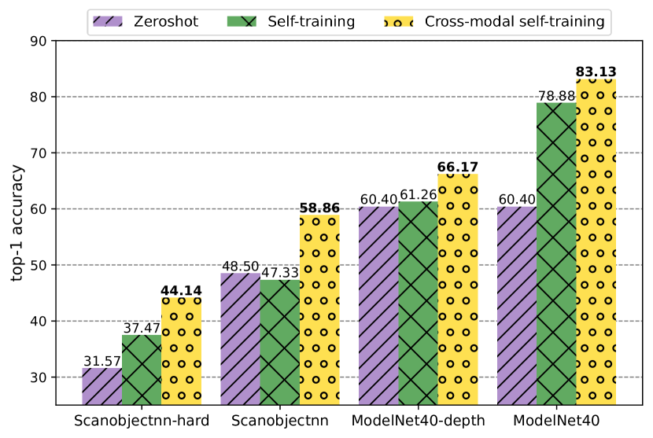
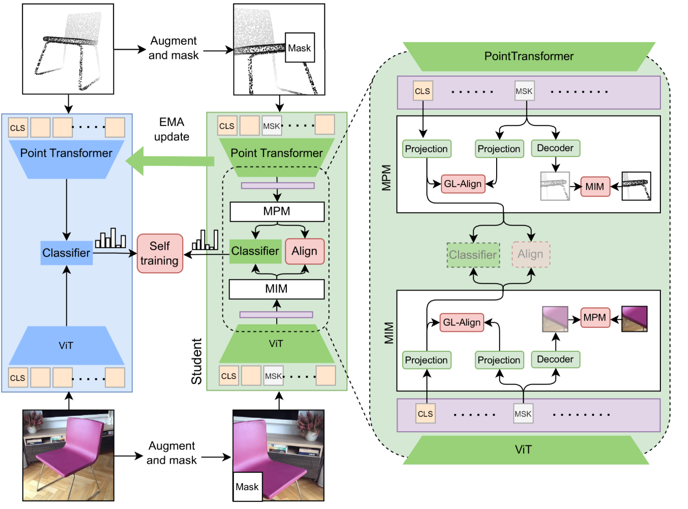
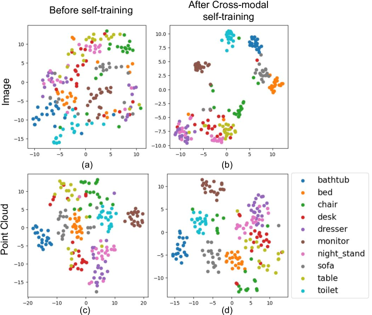
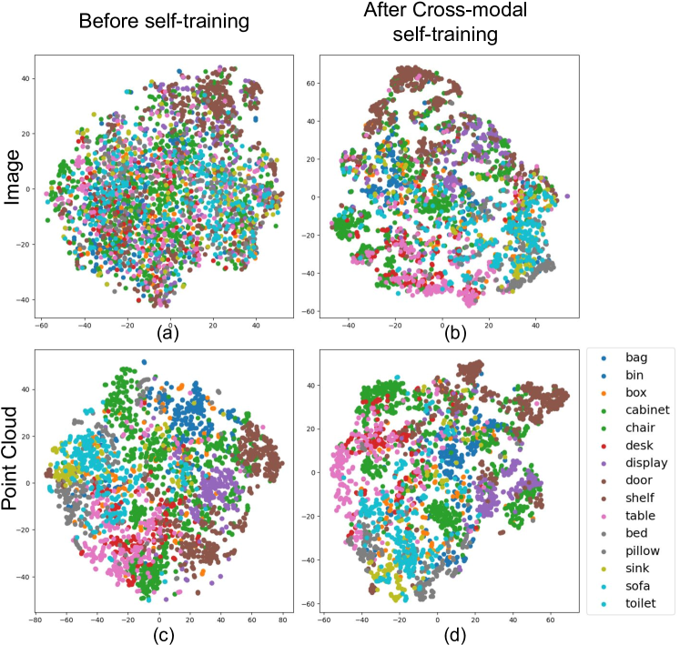
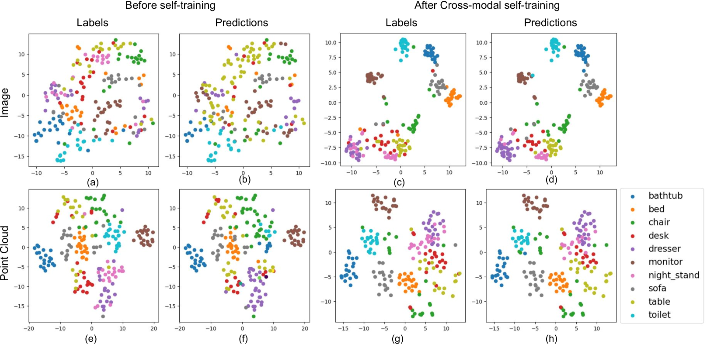
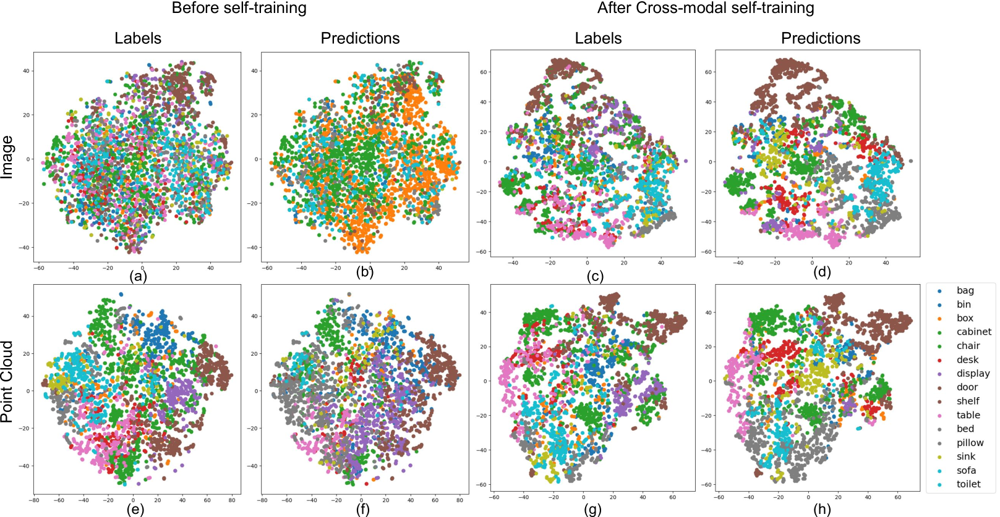

# 通过跨模态自训练，我们能够将图像与点云数据对齐，从而在无需标签的情况下学习分类，这一方法为无监督学习开辟了新的可能性。

发布时间：2024年04月15日

`LLM应用` `3D视觉` `跨模态学习`

> Cross-Modal Self-Training: Aligning Images and Pointclouds to Learn Classification without Labels

# 摘要

> 像CLIP这样的大规模2D视觉语言模型能够与3D编码器结合，学习具备广泛适用性的3D视觉模型。但目前这些模型在现实世界中的应用表现尚不理想，且需要监督式预训练来实现对齐。本研究提出了一种名为Cross-MoST的优化框架，即跨模态自训练，它通过利用未标记的3D数据及其2D视图，显著提升了零样本3D视觉模型的分类能力。我们设计了一个学生-教师框架，同步处理2D图像和3D点云，生成联合伪标签，既训练了分类器，又促进了模型间的特征对齐。这一方法证明了无需昂贵的类别注释，也能利用CLIP等2D模型强化3D表示学习，提升分类准确度。通过合成数据和真实世界3D数据集的测试，我们进一步展示了Cross-MoST在跨模态知识转移上的高效性，使得图像和点云能够互相学习丰富的特征表示。

> Large-scale vision 2D vision language models, such as CLIP can be aligned with a 3D encoder to learn generalizable (open-vocabulary) 3D vision models. However, current methods require supervised pre-training for such alignment, and the performance of such 3D zero-shot models remains sub-optimal for real-world adaptation. In this work, we propose an optimization framework: Cross-MoST: Cross-Modal Self-Training, to improve the label-free classification performance of a zero-shot 3D vision model by simply leveraging unlabeled 3D data and their accompanying 2D views. We propose a student-teacher framework to simultaneously process 2D views and 3D point clouds and generate joint pseudo labels to train a classifier and guide cross-model feature alignment. Thereby we demonstrate that 2D vision language models such as CLIP can be used to complement 3D representation learning to improve classification performance without the need for expensive class annotations. Using synthetic and real-world 3D datasets, we further demonstrate that Cross-MoST enables efficient cross-modal knowledge exchange resulting in both image and point cloud modalities learning from each other's rich representations.

[Arxiv](https://arxiv.org/abs/2404.10146)