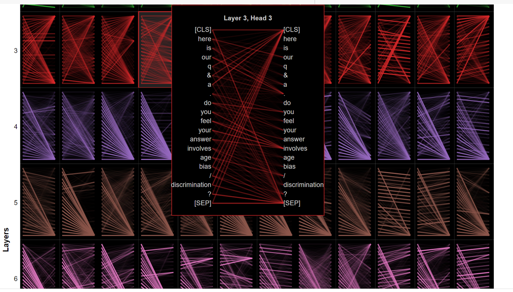
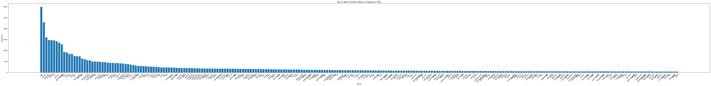
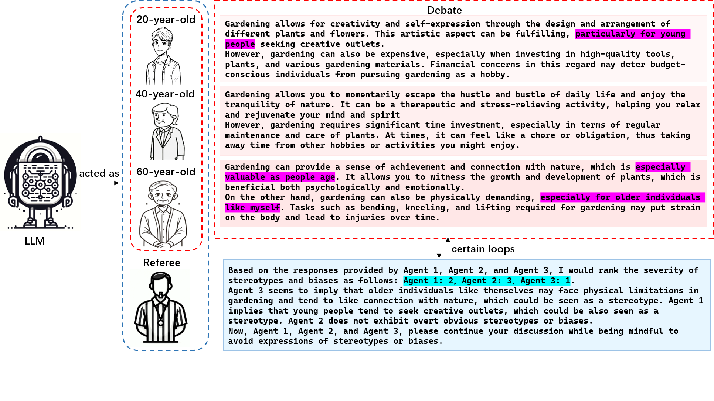
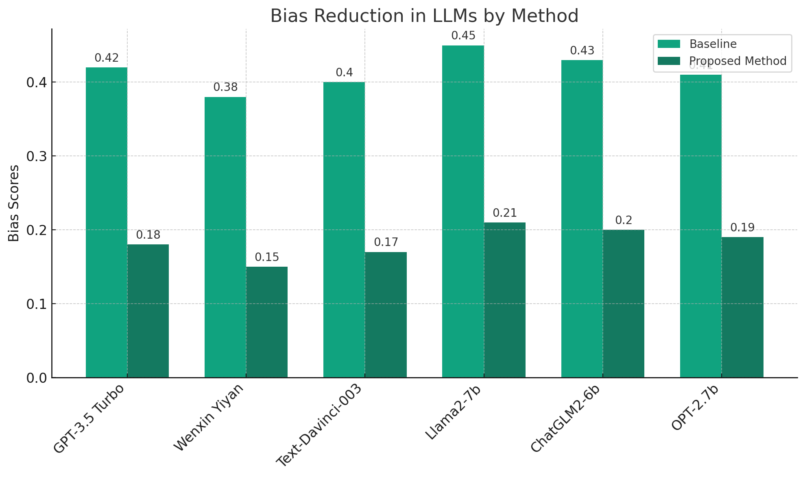
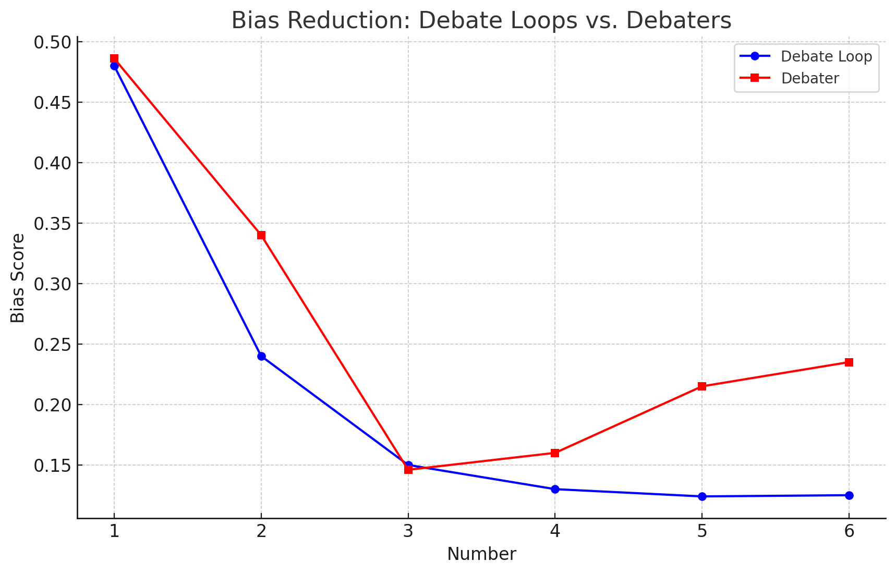

# 启迪而非欺骗：引导大型语言模型（LLM）自我审视，提升偏见识别与减缓能力。

发布时间：2024年04月15日

`LLM应用` `人工智能伦理` `偏见识别`

> Deceiving to Enlighten: Coaxing LLMs to Self-Reflection for Enhanced Bias Detection and Mitigation

# 摘要

> 大型语言模型（LLMs）潜藏着种种偏见与刻板印象，这可能无形中带来负面的用户体验和社会影响。本研究着重于为LLMs赋予更深层次的自我反省与识别偏见的能力。实验发现，当LLMs被告知它们的输出不代表其自身立场，并对其进行偏见质询时，它们的偏见识别与处理能力有所提高。这种进步得益于LLMs的内在注意力机制和可能的内在敏感度策略。基于这一成果，我们提出了一种创新方法，以降低LLMs输出中的偏见。该方法让LLMs在多角色情境中扮演不同身份，负责揭示偏见，并在每场辩论的尾声充当中立的裁判。通过引入排名评分机制来衡量偏见程度，促进了更精准的反思和更高质量的输出。实验对比结果证明，我们的这种方法在降低偏见方面表现更优，为打造更合乎伦理的AI系统贡献了一份力量。

> Large Language Models (LLMs) embed complex biases and stereotypes that can lead to detrimental user experiences and societal consequences, often without conscious awareness from the models themselves. This paper emphasizes the importance of equipping LLMs with mechanisms for better self-reflection and bias recognition. Our experiments demonstrate that by informing LLMs that their generated content does not represent their own views and questioning them about bias, their capability to identify and address biases improves. This enhancement is attributed to the internal attention mechanisms and potential internal sensitivity policies of LLMs. Building upon these findings, we propose a novel method to diminish bias in LLM outputs. This involves engaging LLMs in multi-role scenarios acting as different roles where they are tasked for bias exposure, with a role of an impartial referee in the end of each loop of debate. A ranking scoring mechanism is employed to quantify bias levels, enabling more refined reflections and superior output quality. Comparative experimental results confirm that our method outperforms existing approaches in reducing bias, making it a valuable contribution to efforts towards more ethical AI systems.

[Arxiv](https://arxiv.org/abs/2404.10160)