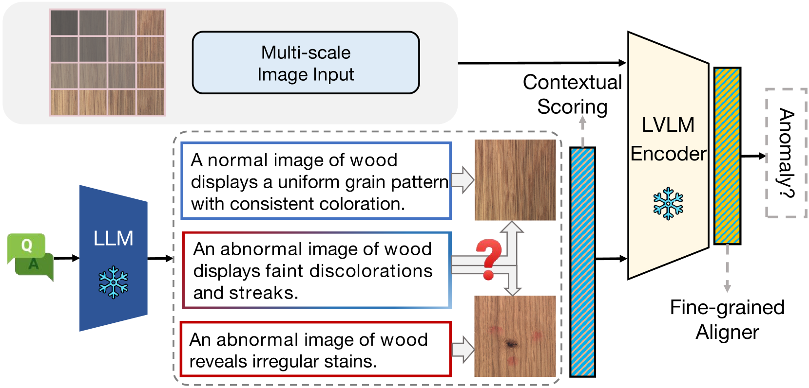
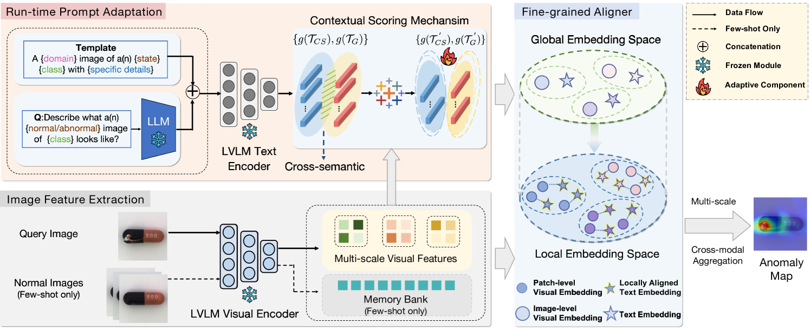
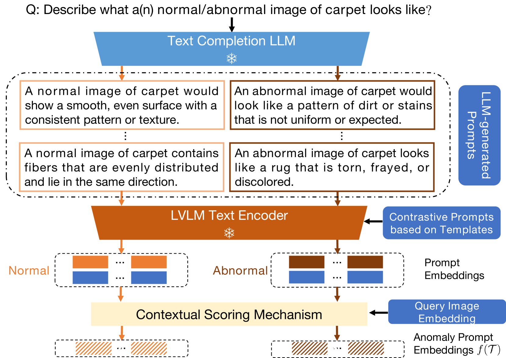
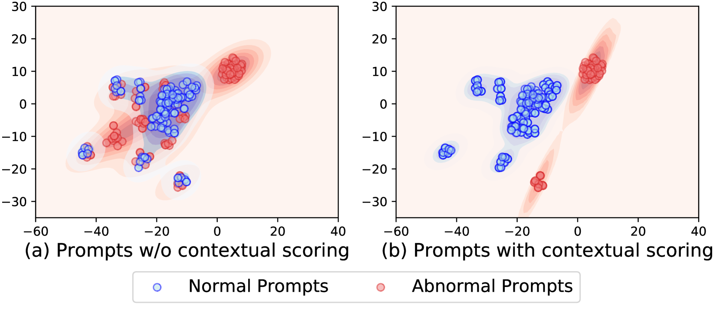
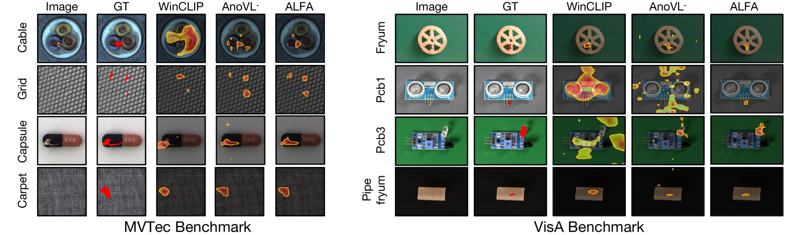
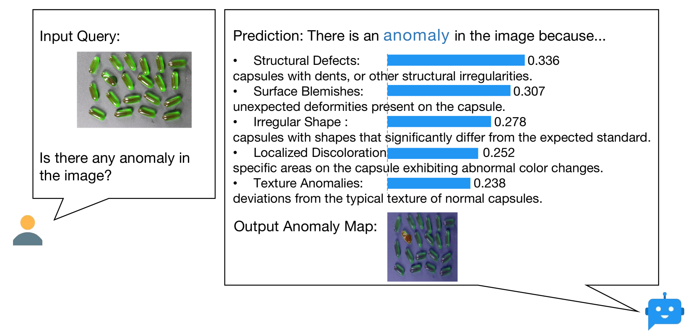

# 大型语言模型能否洞察视觉异常？探究LLM在无先验知识下的异常检测技能。

发布时间：2024年04月15日

`LLM应用` `视觉异常检测` `零样本学习`

> Do LLMs Understand Visual Anomalies? Uncovering LLM Capabilities in Zero-shot Anomaly Detection

# 摘要

> 大型视觉-语言模型（LVLMs）擅长利用自然语言指导来提取视觉信息。最新研究开始运用这些模型来挑战零样本视觉异常检测（VAD），通过图像与描述正常或异常状况的文本配对，即所谓的异常提示。但现有方法依赖的静态异常提示容易引发语义交叉混淆，并且更注重全局图像表示，忽略了精确定位异常所需的局部像素级图像与文本的精确对齐。本文提出了ALFA，一种免训练的方法，通过统一模型应对这些挑战。我们设计了一种运行时提示调整策略，先生成有助于LLM发挥能力的描述性异常提示。该策略通过为每个图像定制异常提示的上下文评分机制来增强，并减少语义交叉混淆。我们还引入了一种创新的细粒度对齐器，通过将图像与文本的对齐从全局语义空间细化到局部语义空间，实现精准的异常定位。在MVTec和VisA这两个难度较高的数据集上的广泛测试显示，ALFA在零样本VAD中发挥语言潜力方面极为有效，与当前最先进的零样本VAD方法相比，MVTec AD的PRO性能提升了12.1%，VisA提升了8.9%。

> Large vision-language models (LVLMs) are markedly proficient in deriving visual representations guided by natural language. Recent explorations have utilized LVLMs to tackle zero-shot visual anomaly detection (VAD) challenges by pairing images with textual descriptions indicative of normal and abnormal conditions, referred to as anomaly prompts. However, existing approaches depend on static anomaly prompts that are prone to cross-semantic ambiguity, and prioritize global image-level representations over crucial local pixel-level image-to-text alignment that is necessary for accurate anomaly localization. In this paper, we present ALFA, a training-free approach designed to address these challenges via a unified model. We propose a run-time prompt adaptation strategy, which first generates informative anomaly prompts to leverage the capabilities of a large language model (LLM). This strategy is enhanced by a contextual scoring mechanism for per-image anomaly prompt adaptation and cross-semantic ambiguity mitigation. We further introduce a novel fine-grained aligner to fuse local pixel-level semantics for precise anomaly localization, by projecting the image-text alignment from global to local semantic spaces. Extensive evaluations on the challenging MVTec and VisA datasets confirm ALFA's effectiveness in harnessing the language potential for zero-shot VAD, achieving significant PRO improvements of 12.1% on MVTec AD and 8.9% on VisA compared to state-of-the-art zero-shot VAD approaches.

[Arxiv](https://arxiv.org/abs/2404.09654)