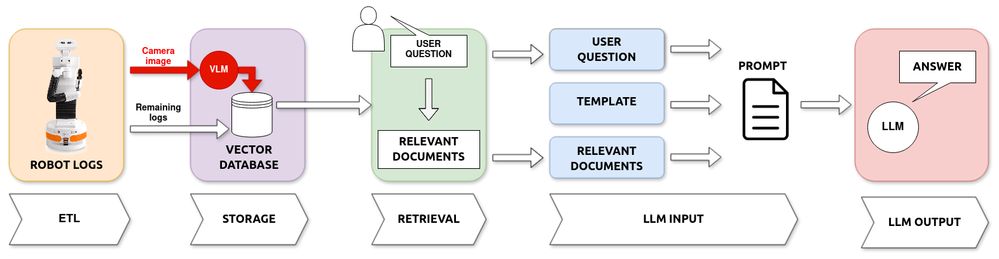
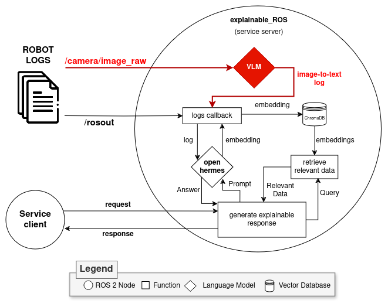
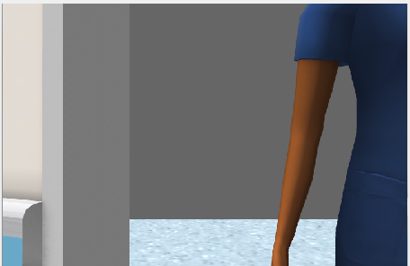
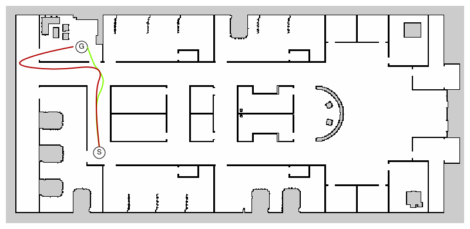

# 本初步研究探讨了如何通过视觉-语言模型提升机器人的解释能力，通过解读视觉信息来优化人机互动体验。

发布时间：2024年04月15日

`Agent` `人机交互` `机器人技术`

> Enhancing Robot Explanation Capabilities through Vision-Language Models: a Preliminary Study by Interpreting Visual Inputs for Improved Human-Robot Interaction

# 摘要

> 本文提出了一个升级版系统，它在我们之前的研究基础上，旨在为人机互动中的机器人行为提供解释。早期，我们构建了一个系统，利用大型语言模型解读日志并生成自然语言的解释。在本研究中，我们引入了视觉-语言模型，让系统能够结合视觉信息来分析文本记录，从而生成更丰富的解释。这种方法能够整合机器人的日志数据和捕获的图像，形成全面的解释。我们在机器人避开人类障碍物的简单导航任务中对这一系统进行了测试。初步研究结果显示，引入视觉信息的解释更加精确，能准确识别障碍物，提高了解释的准确性。

> This paper presents an improved system based on our prior work, designed to create explanations for autonomous robot actions during Human-Robot Interaction (HRI). Previously, we developed a system that used Large Language Models (LLMs) to interpret logs and produce natural language explanations. In this study, we expand our approach by incorporating Vision-Language Models (VLMs), enabling the system to analyze textual logs with the added context of visual input. This method allows for generating explanations that combine data from the robot's logs and the images it captures. We tested this enhanced system on a basic navigation task where the robot needs to avoid a human obstacle. The findings from this preliminary study indicate that adding visual interpretation improves our system's explanations by precisely identifying obstacles and increasing the accuracy of the explanations provided.

[Arxiv](https://arxiv.org/abs/2404.09705)