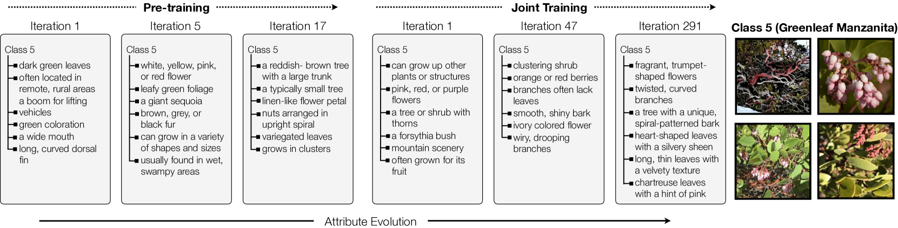
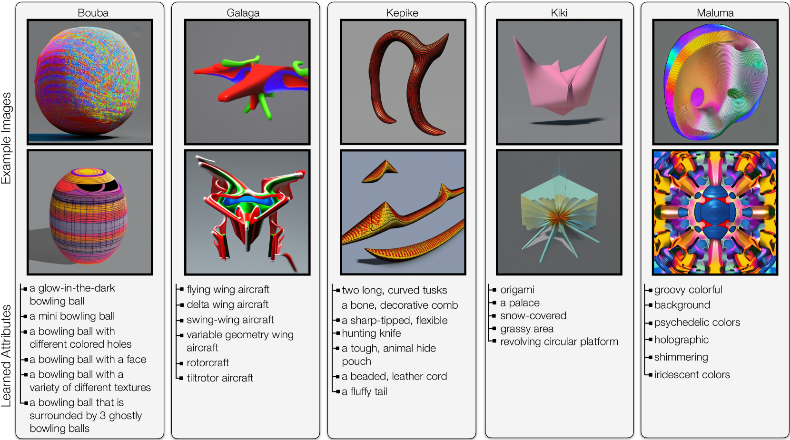
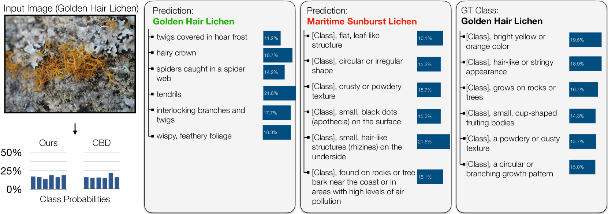
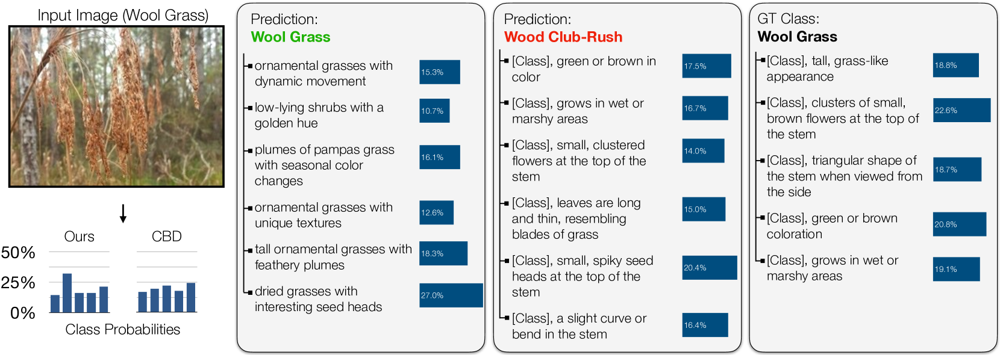
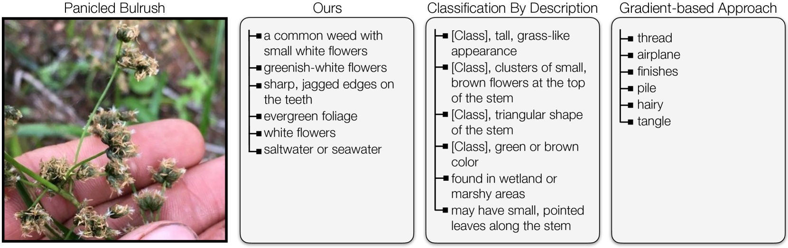
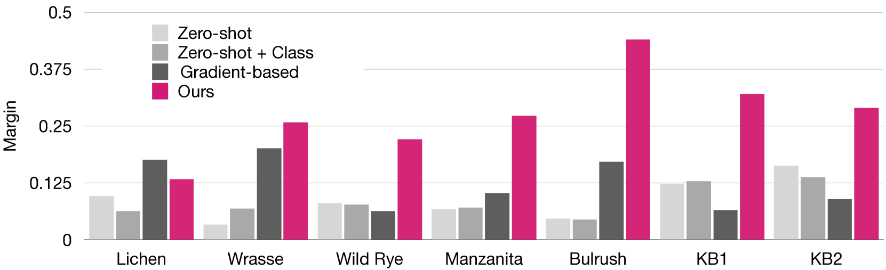

# 通过结合大型语言模型，我们不断优化和提升视觉分类器的可解释性。

发布时间：2024年04月15日

`LLM应用` `生物多样性` `图像识别`

> Evolving Interpretable Visual Classifiers with Large Language Models

# 摘要

> CLIP 等多模态预训练模型在零样本分类任务中因其开放词汇的灵活性和出色的性能而广受欢迎。然而，这类模型在解释性、偏见风险以及探索新视觉概念方面存在局限。实际应用中，专业领域的概念名称和属性可能未知，使得这些模型在处理大规模视觉-语言数据集中罕见图像时表现不佳。为了克服这些挑战，我们提出了一种创新方法，能够发掘出既具可解释性又具有区分度的视觉属性集。我们设计了一种进化搜索算法，利用大型语言模型的上下文学习能力，逐步优化属性瓶颈以实现分类。该方法生成了业界领先的细粒度可解释分类器，在五个 iNaturalist 细粒度数据集上比最新基线高出 18.4%，在两个 KikiBouba 数据集上高出 22.2%，即便基线模型能够获取类别名称的内部信息。

> Multimodal pre-trained models, such as CLIP, are popular for zero-shot classification due to their open-vocabulary flexibility and high performance. However, vision-language models, which compute similarity scores between images and class labels, are largely black-box, with limited interpretability, risk for bias, and inability to discover new visual concepts not written down. Moreover, in practical settings, the vocabulary for class names and attributes of specialized concepts will not be known, preventing these methods from performing well on images uncommon in large-scale vision-language datasets. To address these limitations, we present a novel method that discovers interpretable yet discriminative sets of attributes for visual recognition. We introduce an evolutionary search algorithm that uses a large language model and its in-context learning abilities to iteratively mutate a concept bottleneck of attributes for classification. Our method produces state-of-the-art, interpretable fine-grained classifiers. We outperform the latest baselines by 18.4% on five fine-grained iNaturalist datasets and by 22.2% on two KikiBouba datasets, despite the baselines having access to privileged information about class names.

[Arxiv](https://arxiv.org/abs/2404.09941)