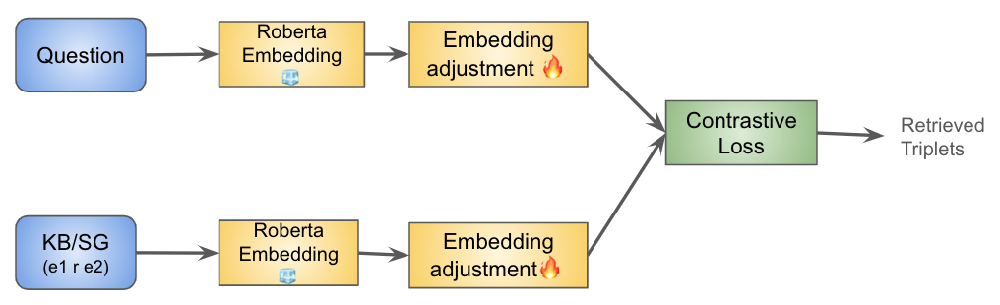
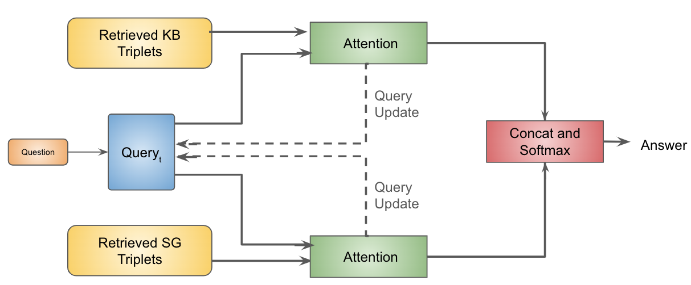
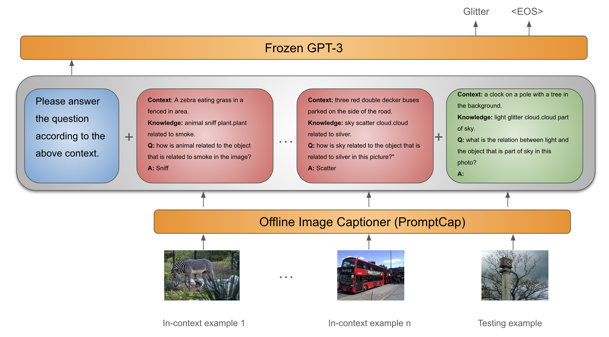

# 揭秘背后：视觉问答中的知识库逻辑推理

发布时间：2024年04月15日

`LLM应用` `视觉问答` `知识库`

> Find The Gap: Knowledge Base Reasoning For Visual Question Answering

# 摘要

> 我们深入探讨了知识驱动的视觉问答系统，该系统需将问题与视觉内容结合，并从庞大的知识库中提取相关信息以解答问题。研究分为两部分：一是设计并训练新的神经网络架构；二是利用预训练的大型语言模型。我们探求的答案包括：1）通过直接监督检索知识库信息，能否有效提升模型解决视觉问答问题的效能？2）针对特定任务的模型和基于LLM的模型，在融合视觉信息与外部知识以及进行跨信息源的多步推理方面表现如何？3）LLMs内在的知识是否足够应对KB-VQA挑战，它能否在某种程度上取代显式的知识库？研究结果显示，为特定任务和LLM模型引入监督式外部知识与视觉信息检索机制，能显著提升其性能。尽管LLMs在一步推理上表现更佳，但在两步推理上，即便模型可以获取两种模态的全部相关信息，其表现仍不如经过精细调整的神经网络模型。此外，我们还发现，LLMs在处理与知识库相关的问题时，性能超过了神经网络模型，这验证了LLMs内在知识的效用，但同时也表明，外部知识库依然是不可或缺的。

> We analyze knowledge-based visual question answering, for which given a question, the models need to ground it into the visual modality and retrieve the relevant knowledge from a given large knowledge base (KB) to be able to answer. Our analysis has two folds, one based on designing neural architectures and training them from scratch, and another based on large pre-trained language models (LLMs). Our research questions are: 1) Can we effectively augment models by explicit supervised retrieval of the relevant KB information to solve the KB-VQA problem? 2) How do task-specific and LLM-based models perform in the integration of visual and external knowledge, and multi-hop reasoning over both sources of information? 3) Is the implicit knowledge of LLMs sufficient for KB-VQA and to what extent it can replace the explicit KB? Our results demonstrate the positive impact of empowering task-specific and LLM models with supervised external and visual knowledge retrieval models. Our findings show that though LLMs are stronger in 1-hop reasoning, they suffer in 2-hop reasoning in comparison with our fine-tuned NN model even if the relevant information from both modalities is available to the model. Moreover, we observed that LLM models outperform the NN model for KB-related questions which confirms the effectiveness of implicit knowledge in LLMs however, they do not alleviate the need for external KB.

[Arxiv](https://arxiv.org/abs/2404.10226)