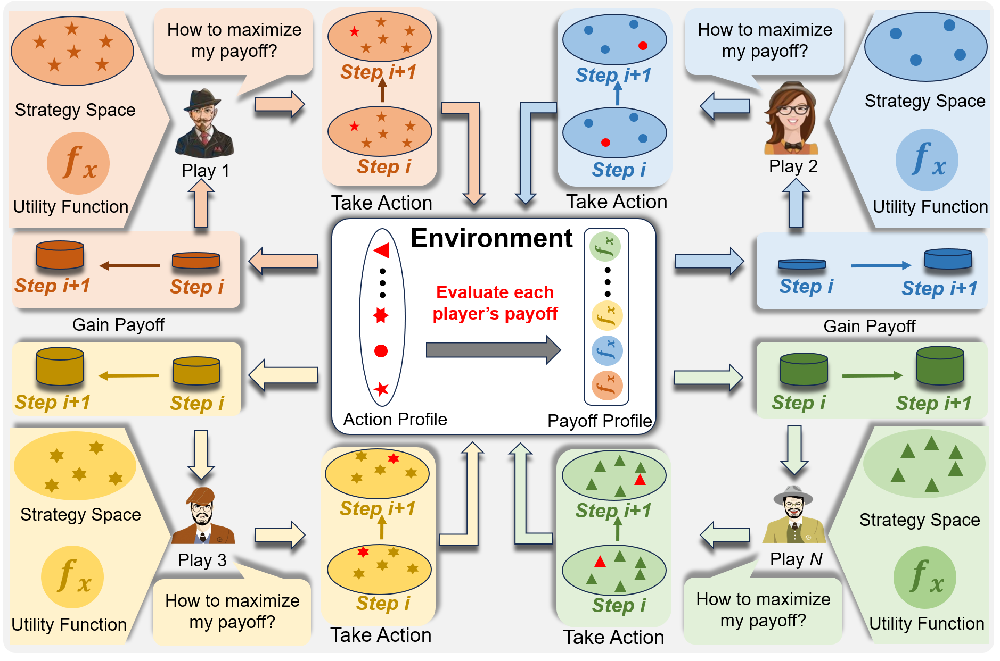
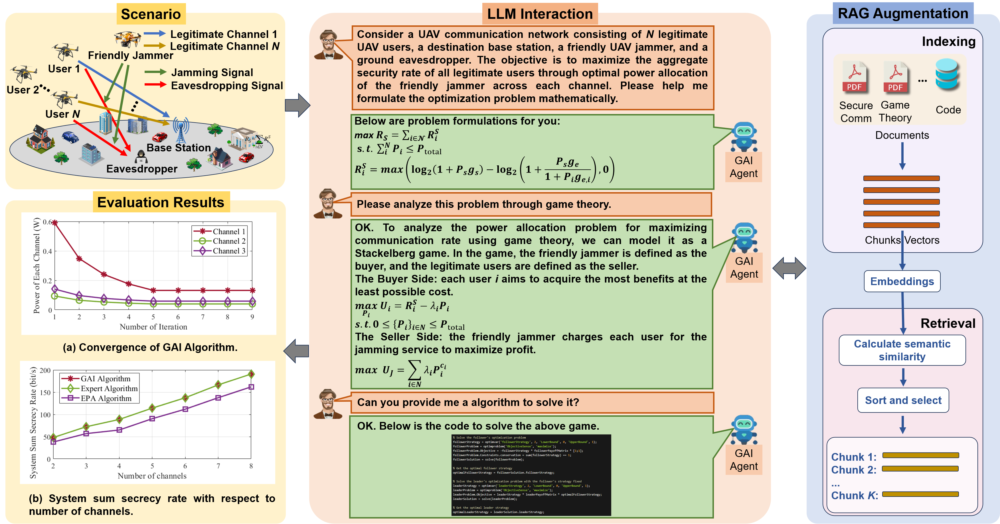

# 在移动网络领域，生成性AI运用博弈论原理，为网络通信带来创新性解决方案。

发布时间：2024年04月15日

`LLM应用` `移动网络` `博弈论`

> Generative AI for Game Theory-based Mobile Networking

# 摘要

> 网络技术日新月异，博弈论在解决新兴的复杂网络优化问题上大放异彩。但博弈论作为数学框架，其解决方案往往依赖专家的丰富经验与知识。生成性人工智能（GAI）的异军突起，引起了业界的广泛关注。本文提出了一种创新方案，将GAI的推理与创造能力融入博弈论，以优化移动网络设计。我们先概述了博弈论与GAI的关键技术，再探讨二者结合的优势。接着，我们简要分析了现有研究的利弊，并展望了GAI在移动网络博弈论应用的前景。我们进一步构建了一个由大型语言模型（LLMs）驱动的博弈论框架，并通过无人机网络的安全案例研究验证了其有效性。最后，我们为未来的发展指明了方向。

> With the continuous advancement of network technology, various emerging complex networking optimization problems opened up a wide range of applications utilizating of game theory. However, since game theory is a mathematical framework, game theory-based solutions often require the experience and knowledge of human experts. Recently, the remarkable advantages exhibited by generative artificial intelligence (GAI) have gained widespread attention. In this article, we propose a novel GAI-enabled game theory solution that combines the powerful reasoning and generation capabilities of GAI to the design and optimization of mobile networking. Specifically, we first outline the game theory and key technologies of GAI, and then explore the advantages of combining GAI with game theory. Then, we briefly review the advantages and limitations of existing research and demonstrate the potential application values of GAI applied to game theory in mobile networking. Subsequently, we develop a game theory framework enabled by large language models (LLMs) to realize this combination, and demonstrate the effectiveness of the proposed framework through a case study in secured UAV networks. Finally, we provide several directions for future extensions.

[Arxiv](https://arxiv.org/abs/2404.09699)