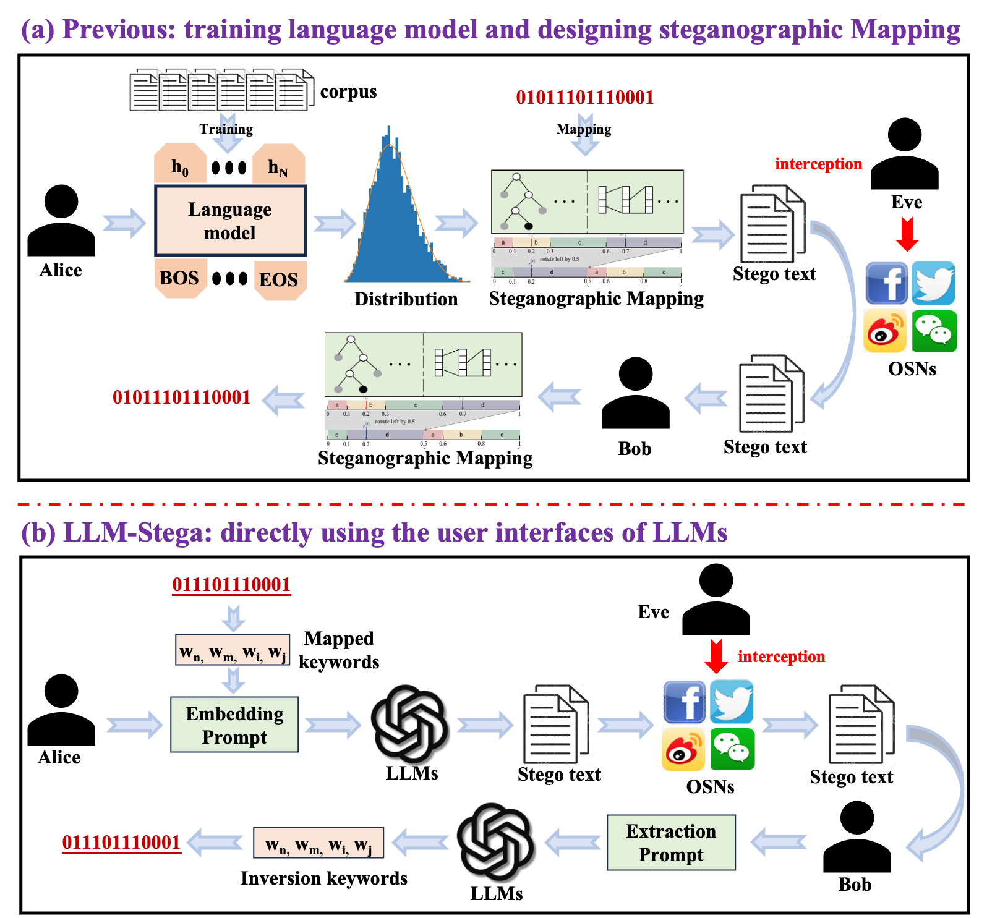
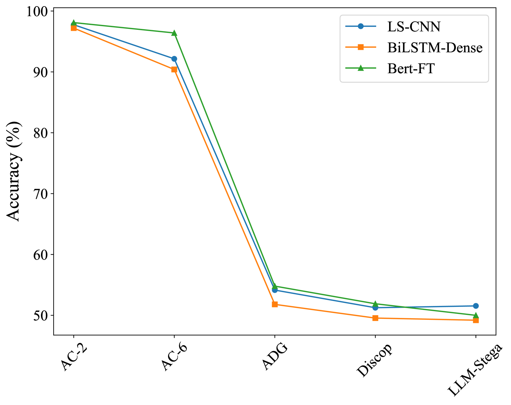
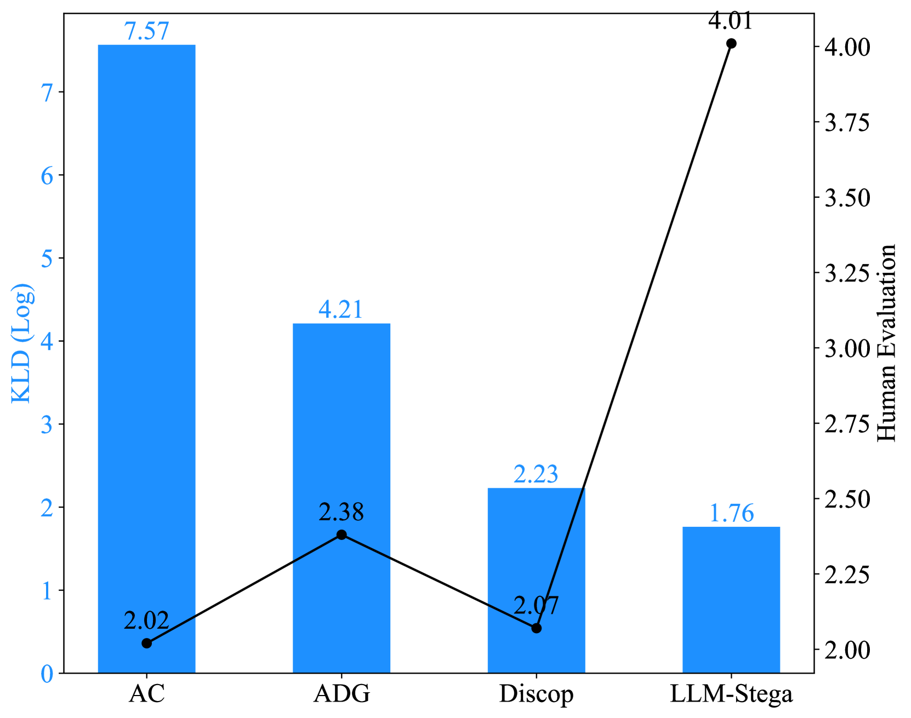

# 借助大型语言模型，探索生成性文本隐写技术。

发布时间：2024年04月15日

`LLM应用` `隐写术` `信息安全`

> Generative Text Steganography with Large Language Model

# 摘要

> 近期大型语言模型（LLMs）的突破性发展，让人类与机器在高品质文本创作上的界线变得模糊，这对文本隐写技术的发展极为有利。然而，现有的先进隐写技术并不适用于LLMs，因为大多数用户仅能通过LLMs的黑盒API或用户界面进行操作，无法接触到模型的训练词汇及其取样概率。本文提出了一种新颖的基于LLM用户界面的黑盒文本隐写方法——LLM-Stega。其核心目标是利用LLM的用户界面实现Alice（发送方）与Bob（接收方）之间的安全隐秘交流。我们首先构建了一套关键词，并设计了一种加密的隐写映射技术，用以隐藏秘密信息。为了确保秘密信息的准确提取以及生成的隐写文本语义丰富，我们还提出了一种基于拒绝采样的优化机制。经过一系列全面的实验验证，LLM-Stega在性能上超越了现有的最先进方法。

> Recent advances in large language models (LLMs) have blurred the boundary of high-quality text generation between humans and machines, which is favorable for generative text steganography. While, current advanced steganographic mapping is not suitable for LLMs since most users are restricted to accessing only the black-box API or user interface of the LLMs, thereby lacking access to the training vocabulary and its sampling probabilities. In this paper, we explore a black-box generative text steganographic method based on the user interfaces of large language models, which is called LLM-Stega. The main goal of LLM-Stega is that the secure covert communication between Alice (sender) and Bob (receiver) is conducted by using the user interfaces of LLMs. Specifically, We first construct a keyword set and design a new encrypted steganographic mapping to embed secret messages. Furthermore, to guarantee accurate extraction of secret messages and rich semantics of generated stego texts, an optimization mechanism based on reject sampling is proposed. Comprehensive experiments demonstrate that the proposed LLM-Stega outperforms current state-of-the-art methods.

[Arxiv](https://arxiv.org/abs/2404.10229)