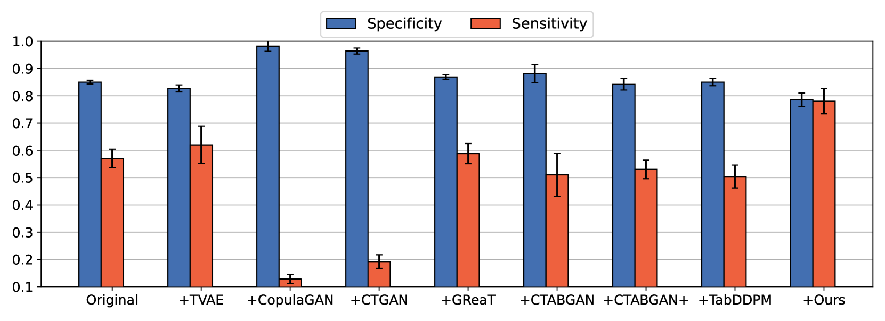
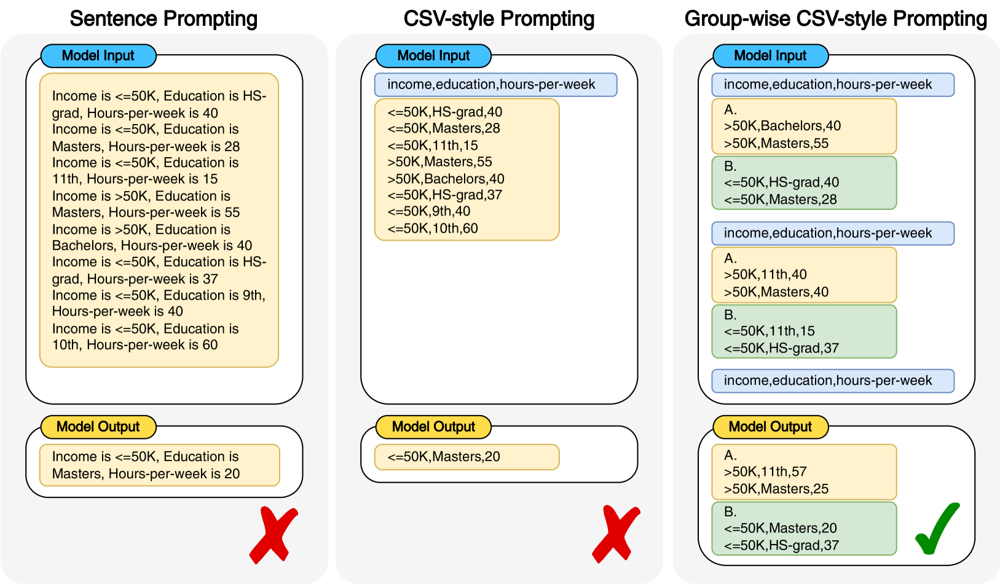
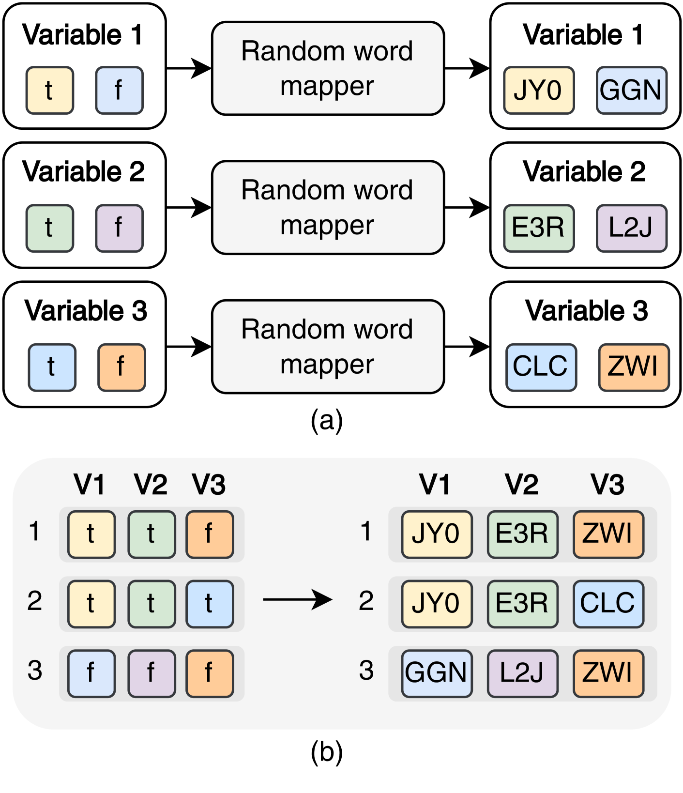
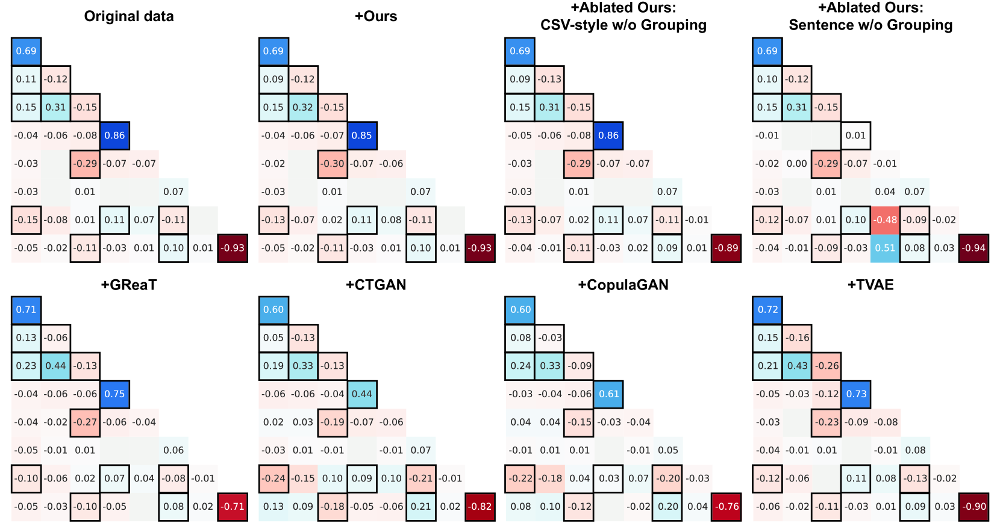
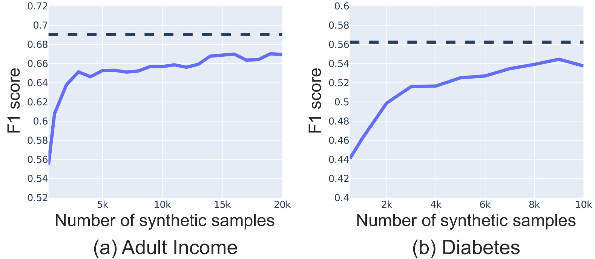
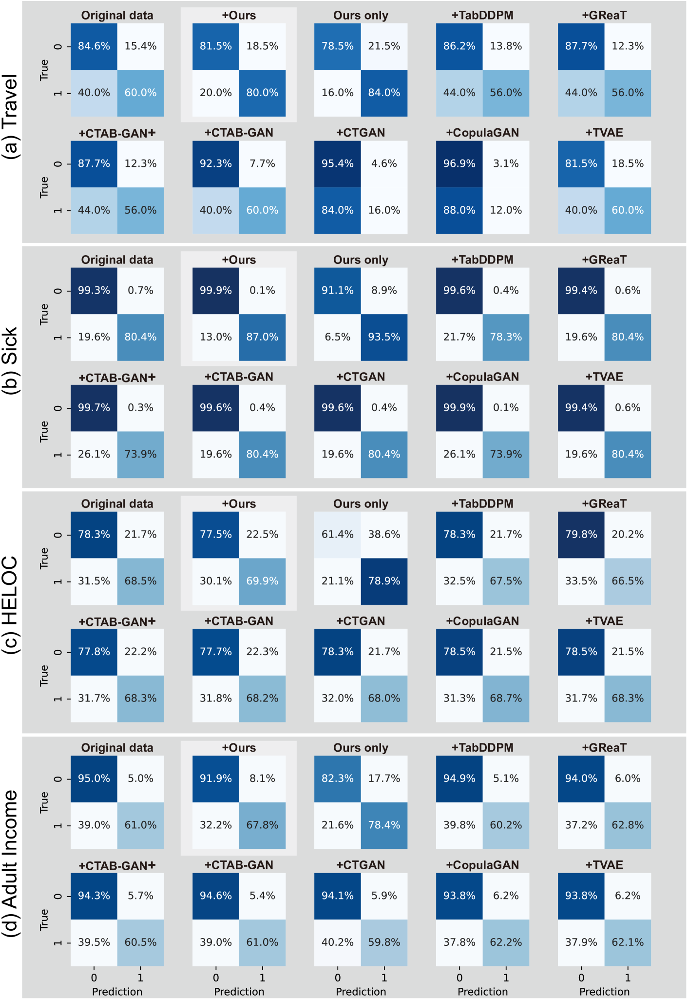
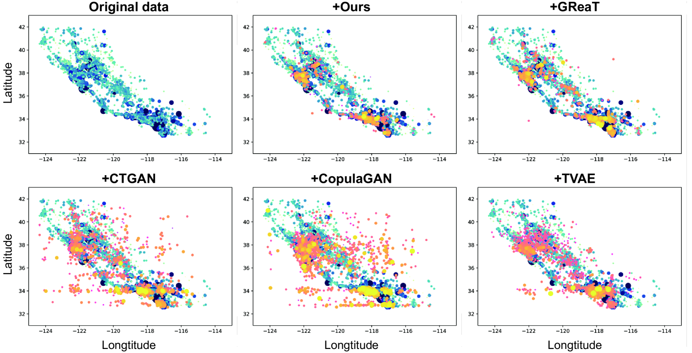
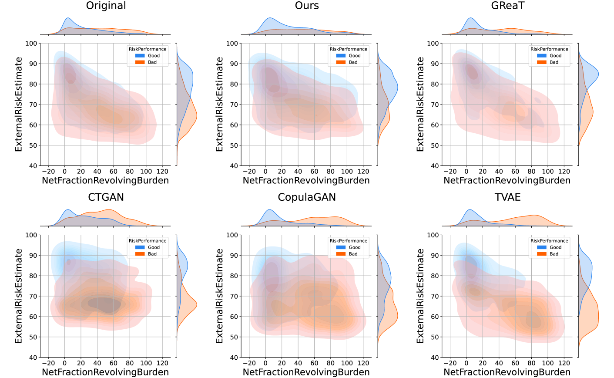

# 本文介绍了一种利用大型语言模型进行合成表格数据生成的策略，即通过组内提示来实现。

发布时间：2024年04月15日

`LLM应用` `机器学习` `数据生成`

> Group-wise Prompting for Synthetic Tabular Data Generation using Large Language Models

# 摘要

> 在机器学习领域，创造逼真的合成表格数据是一项至关重要的挑战。本研究提出了一种既简洁又高效的新方法，利用大型语言模型（LLMs）来生成合成数据，有效解决了数据不平衡的问题。我们创新性地采用了一种基于CSV格式的分组提示技术，充分发挥了LLMs的上下文学习功能，以生成与目标数据集的要求和特性高度一致的数据。此外，我们设计的随机单词替换策略显著提升了对单一分类值的处理能力，从而提高了合成数据的精确度和代表性。该方法在八个现实世界的公共数据集上进行了广泛测试，并在下游的分类与回归任务中达到了业界领先的性能水平，同时保持了特征间的相关性，并在现有方法的基础上提高了标记效率。这一成果对于机器学习应用中的表格数据生成和类别不平衡处理等关键问题具有重要的贡献。相关工作的源代码已在 https://github.com/seharanul17/synthetic-tabular-LLM 上公开。

> Generating realistic synthetic tabular data presents a critical challenge in machine learning. This study introduces a simple yet effective method employing Large Language Models (LLMs) tailored to generate synthetic data, specifically addressing data imbalance problems. We propose a novel group-wise prompting method in CSV-style formatting that leverages the in-context learning capabilities of LLMs to produce data that closely adheres to the specified requirements and characteristics of the target dataset. Moreover, our proposed random word replacement strategy significantly improves the handling of monotonous categorical values, enhancing the accuracy and representativeness of the synthetic data. The effectiveness of our method is extensively validated across eight real-world public datasets, achieving state-of-the-art performance in downstream classification and regression tasks while maintaining inter-feature correlations and improving token efficiency over existing approaches. This advancement significantly contributes to addressing the key challenges of machine learning applications, particularly in the context of tabular data generation and handling class imbalance. The source code for our work is available at: https://github.com/seharanul17/synthetic-tabular-LLM

[Arxiv](https://arxiv.org/abs/2404.12404)