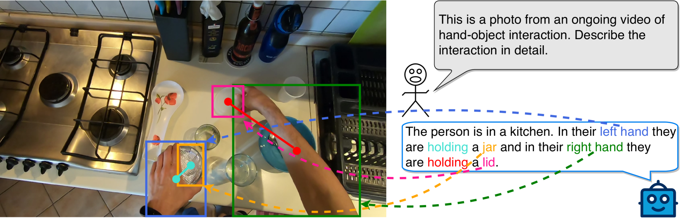
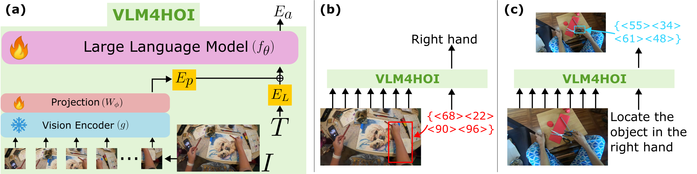
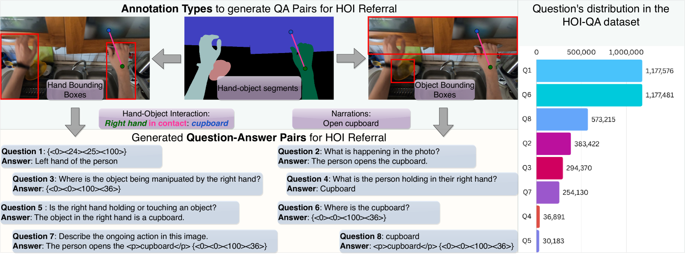
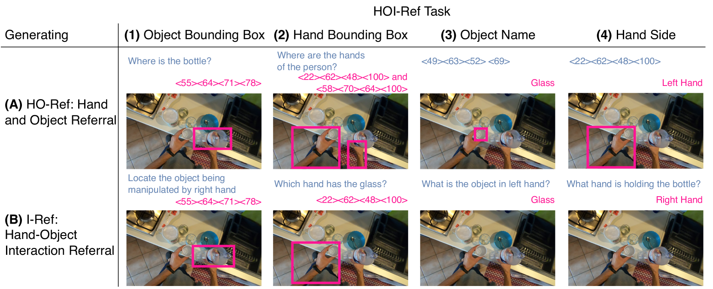
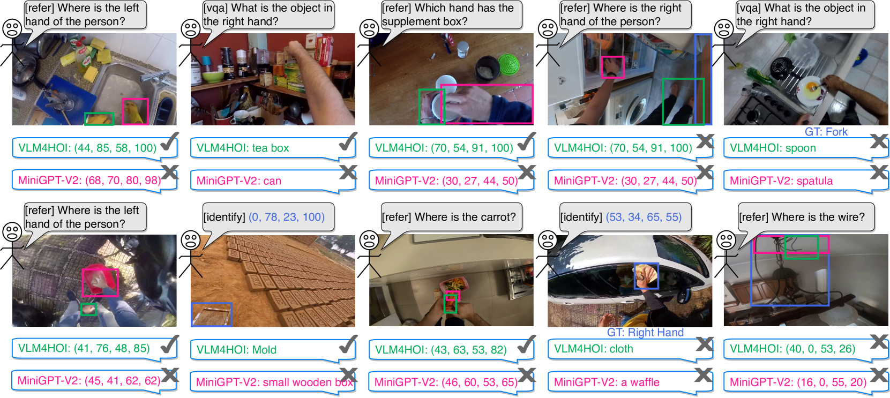
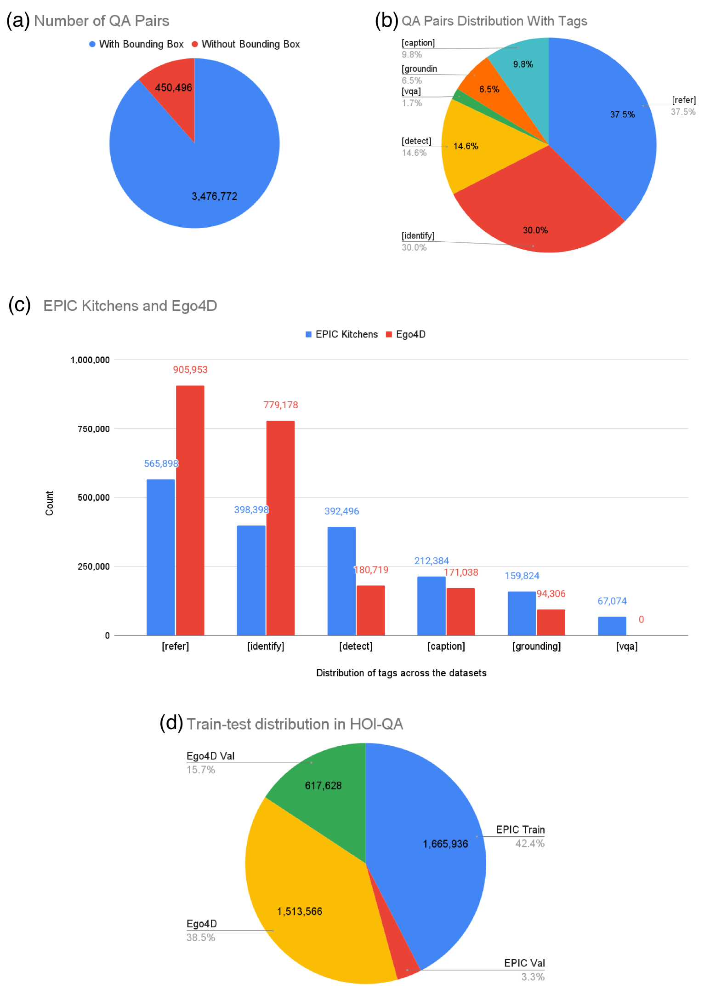
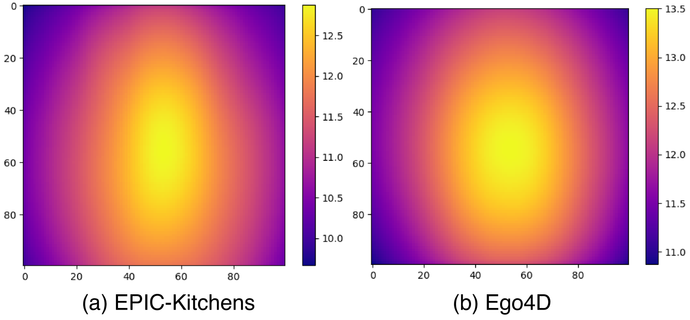
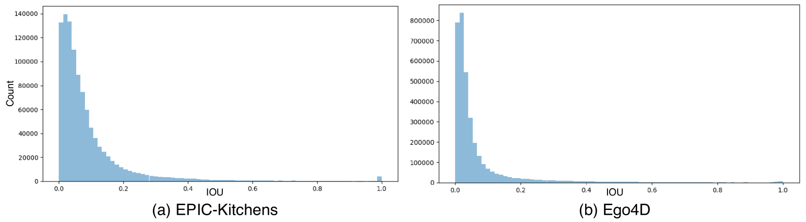

# HOI-Ref：自我视角视觉中的手部与物体互动参照

发布时间：2024年04月15日

`LLM应用` `视觉问答` `数据集`

> HOI-Ref: Hand-Object Interaction Referral in Egocentric Vision

# 摘要

> 大型视觉语言模型（VLMs）已成为视觉问答、物体识别和空间指引等多项任务的新标杆。本研究提出了一种新的HOI-Ref任务，专注于利用VLMs探索手与物体之间的互动。为此，我们精心打造了HOI-QA数据集，内含390万组问题与答案，旨在训练和评估VLMs。该数据集涵盖了定位手部和物体的问题，尤其是它们之间的互动（例如，指出手正在操作的物体）。我们首次在该数据集上训练VLM，命名为VLM4HOI。研究结果显示，仅在第三方图像上训练的VLMs难以识别和描述自我视角图像中的手和物体。通过在HOI-QA数据集上进行精细调整，模型在描述手和物体方面的准确度提升了27.9%，在描述互动方面的准确度提升了26.7%。

> Large Vision Language Models (VLMs) are now the de facto state-of-the-art for a number of tasks including visual question answering, recognising objects, and spatial referral. In this work, we propose the HOI-Ref task for egocentric images that aims to understand interactions between hands and objects using VLMs. To enable HOI-Ref, we curate the HOI-QA dataset that consists of 3.9M question-answer pairs for training and evaluating VLMs. HOI-QA includes questions relating to locating hands, objects, and critically their interactions (e.g. referring to the object being manipulated by the hand). We train the first VLM for HOI-Ref on this dataset and call it VLM4HOI. Our results demonstrate that VLMs trained for referral on third person images fail to recognise and refer hands and objects in egocentric images. When fine-tuned on our egocentric HOI-QA dataset, performance improves by 27.9% for referring hands and objects, and by 26.7% for referring interactions.

[Arxiv](https://arxiv.org/abs/2404.09933)