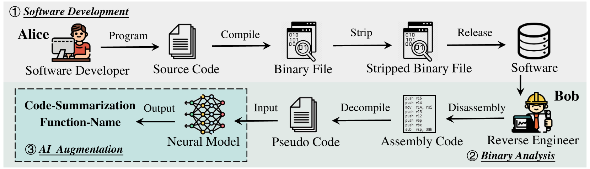
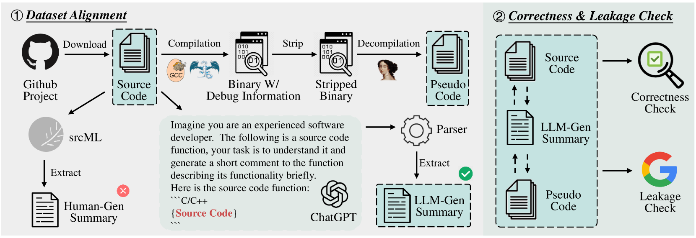
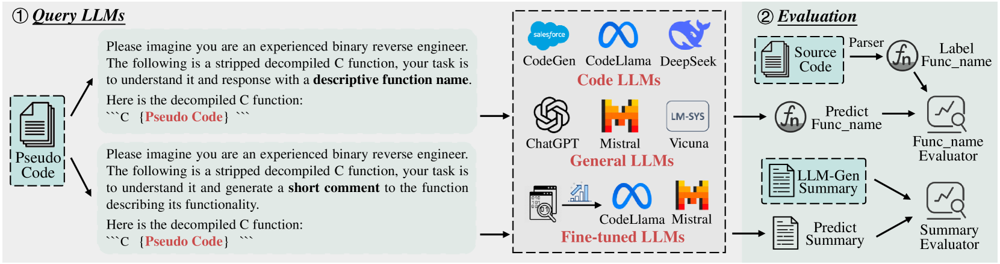
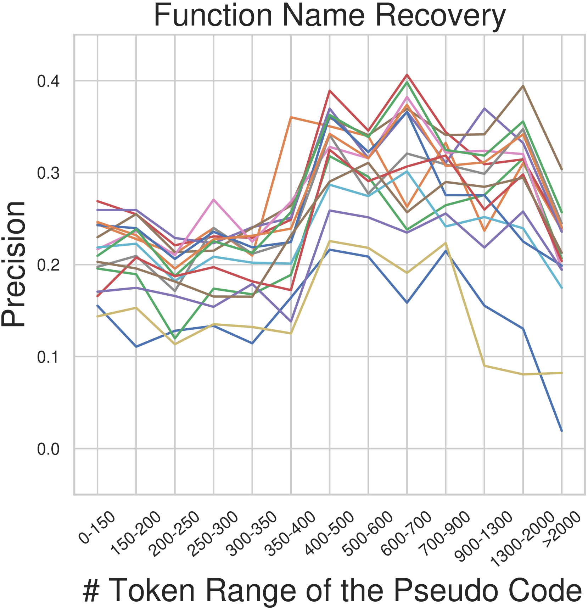
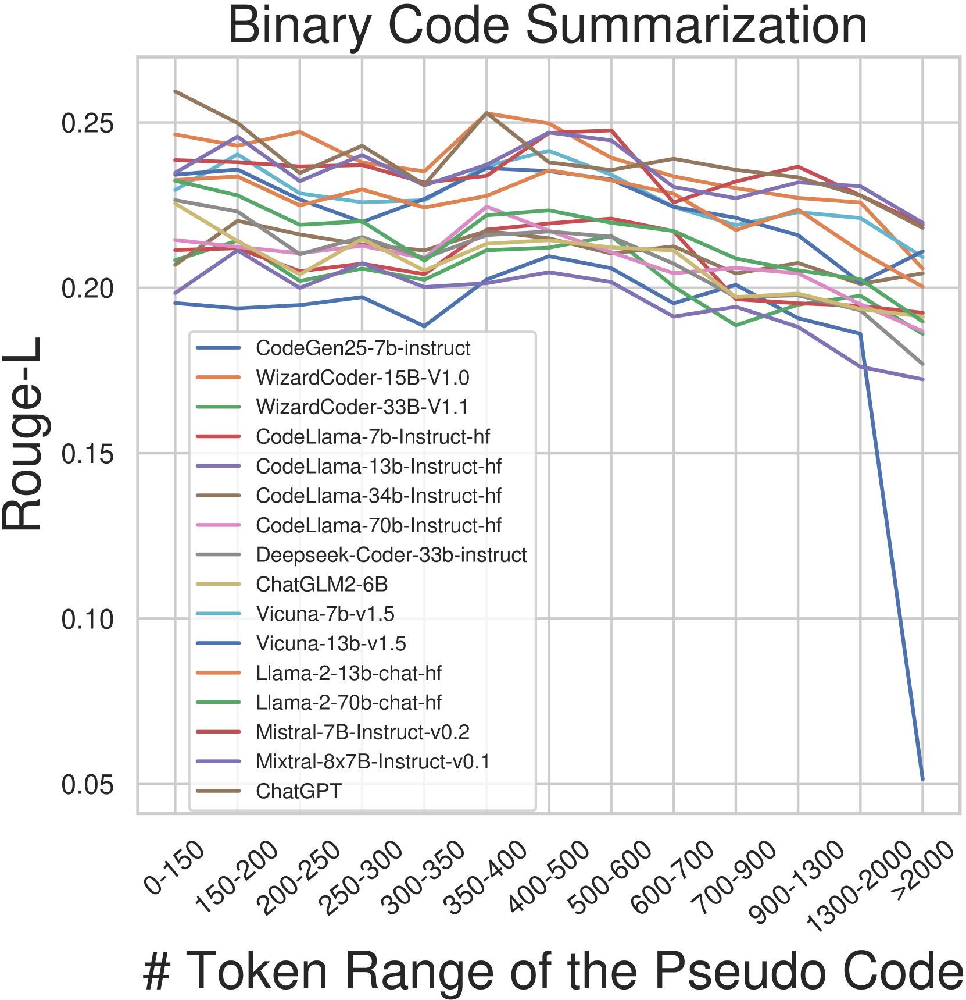
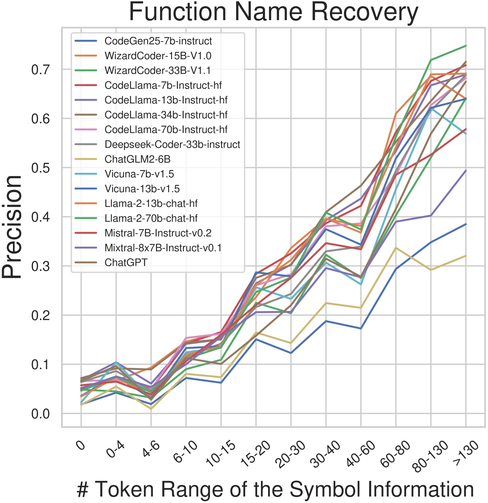
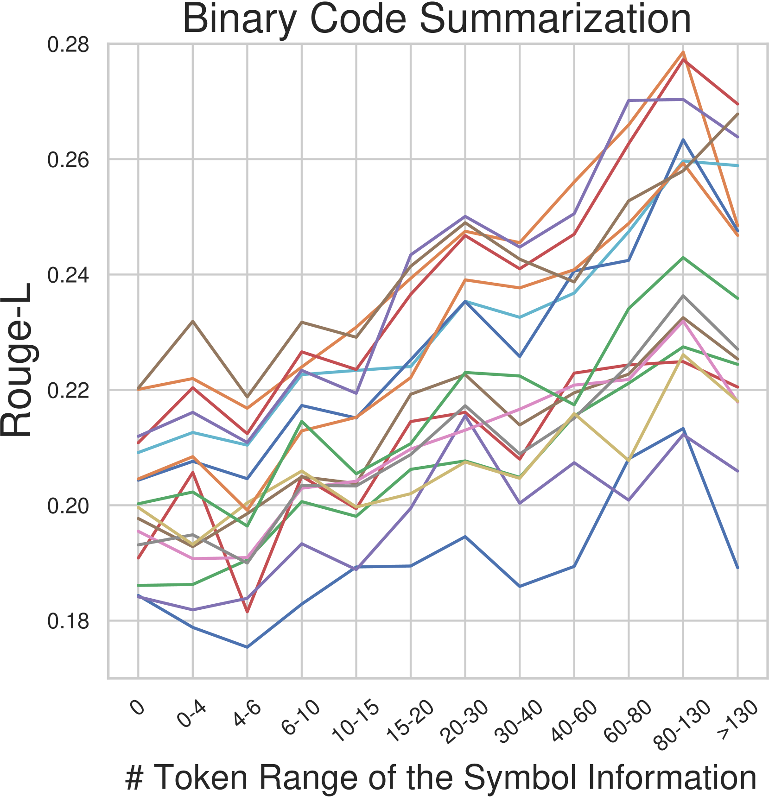
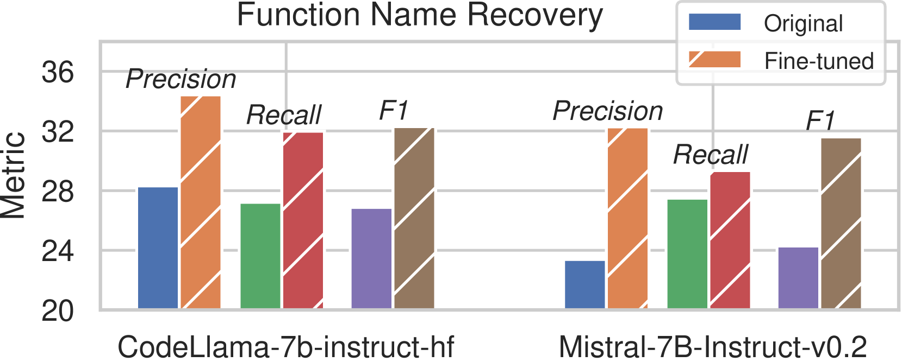
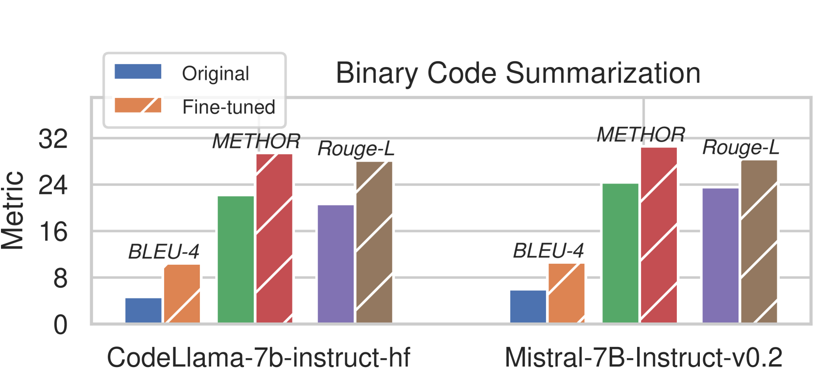
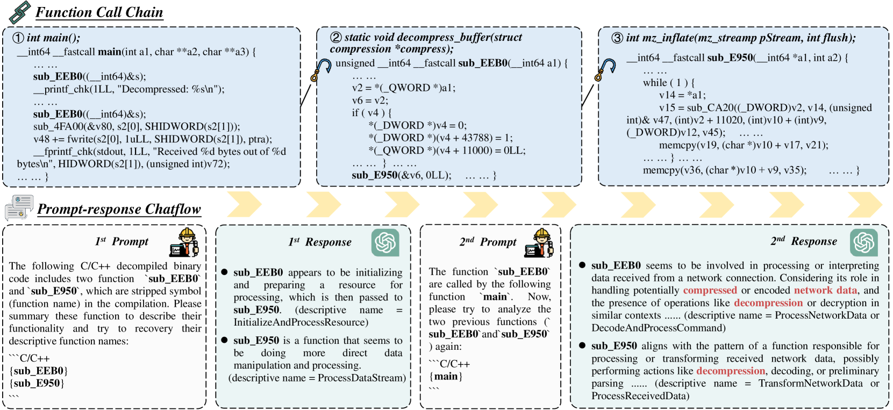

# 通过大型语言模型，我们在解析简化的二进制代码理解方面取得了哪些进展？

发布时间：2024年04月15日

`LLM应用` `软件安全` `逆向工程`

> How Far Have We Gone in Stripped Binary Code Understanding Using Large Language Models

# 摘要

> 二进制代码分析对于软件安全至关重要，包括软件维护、恶意软件检测等。由于缺乏语义信息，二进制代码对逆向工程师来说难以解读。幸运的是，自动化工具的发展为解读二进制代码提供了帮助。近年来，深度学习技术和大型语言模型（LLMs）在代码理解与生成方面取得了显著进展。这引发了对LLMs在二进制代码理解能力的关注。本研究旨在通过一个基准测试，评估LLMs在实际逆向工程环境中的表现。该测试包括函数名恢复和二进制代码总结两个核心任务。通过对多个流行LLMs的深入评估，我们对其在二进制代码理解方面的能力和局限有了更深入的认识。评估结果表明，现有的LLMs能够一定程度上理解二进制代码，有助于提升分析效率。这一发现凸显了LLMs在推动二进制代码理解研究方面的巨大潜力。

> Binary code analysis plays a pivotal role in various software security applications, such as software maintenance, malware detection, software vulnerability discovery, patch analysis, etc. However, unlike source code, understanding binary code is challenging for reverse engineers due to the absence of semantic information. Therefore, automated tools are needed to assist human players in interpreting binary code. In recent years, two groups of technologies have shown promising prospects: (1) Deep learning-based technologies have demonstrated competitive results in tasks related to binary code understanding, furthermore, (2) Large Language Models (LLMs) have been extensively pre-trained at the source-code level for tasks such as code understanding and generation. This makes participants wonder about the ability of LLMs in binary code understanding.
  In this work, we propose a benchmark to evaluate the effectiveness of LLMs in real-world reverse engineering scenarios. The benchmark covers two key binary code understanding tasks, including function name recovery and binary code summarization. We gain valuable insights into their capabilities and limitations through extensive evaluations of popular LLMs using our benchmark. Our evaluations reveal that existing LLMs can understand binary code to a certain extent, thereby improving the efficiency of binary code analysis. Our results highlight the great potential of the LLMs in advancing the field of binary code understanding.

[Arxiv](https://arxiv.org/abs/2404.09836)