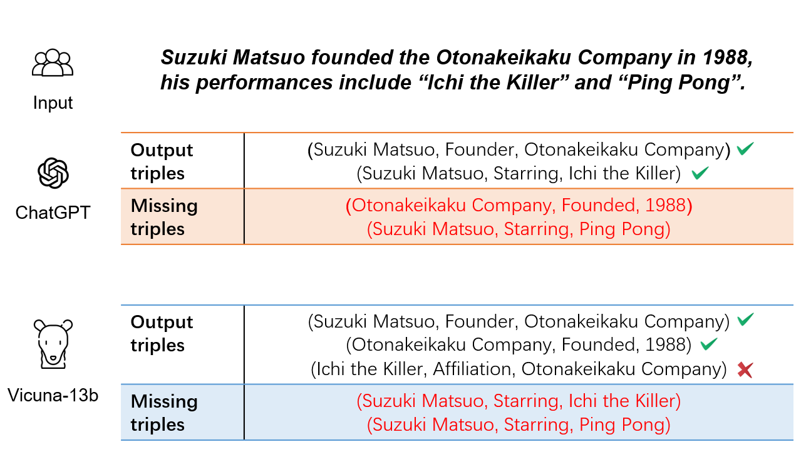
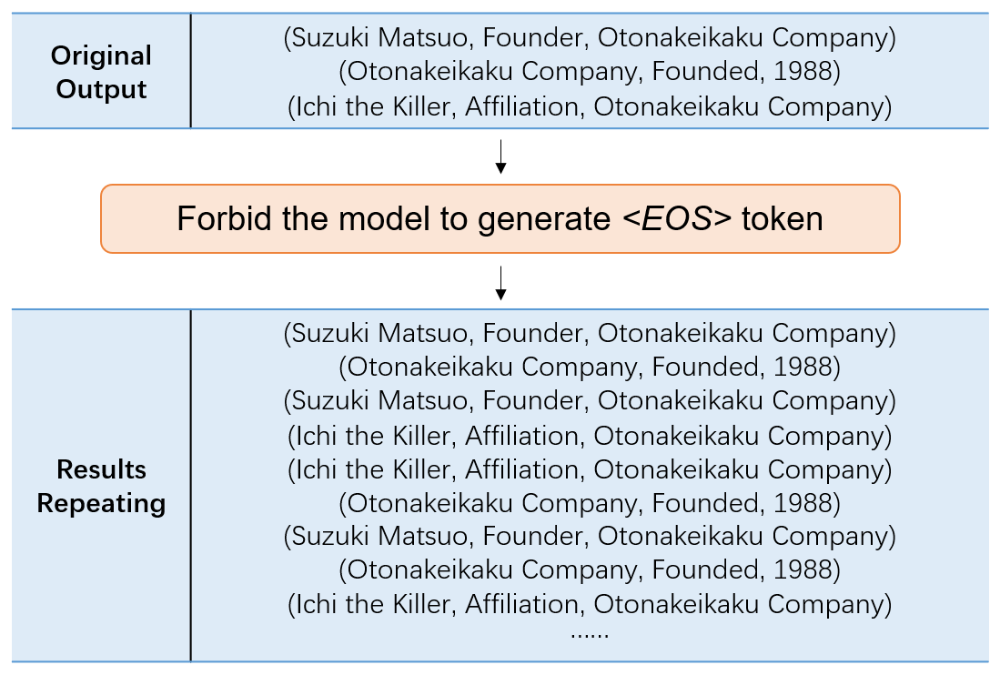
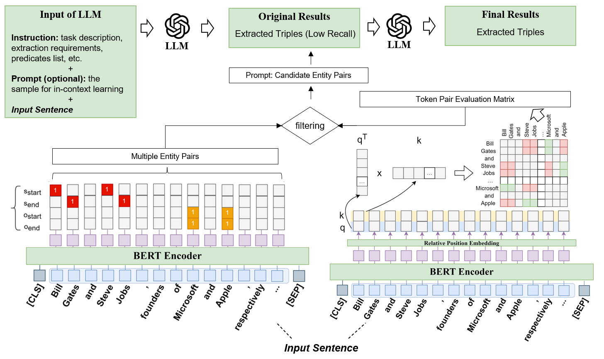
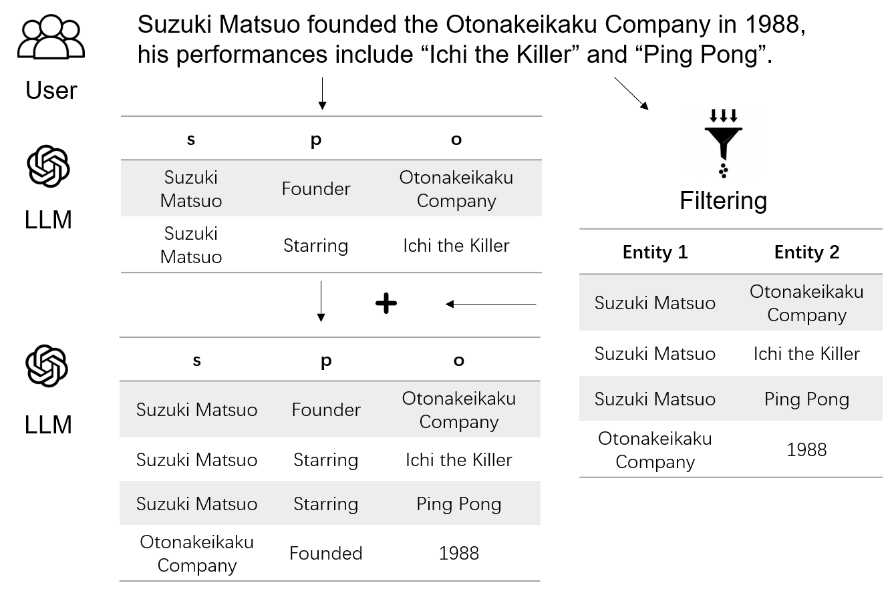
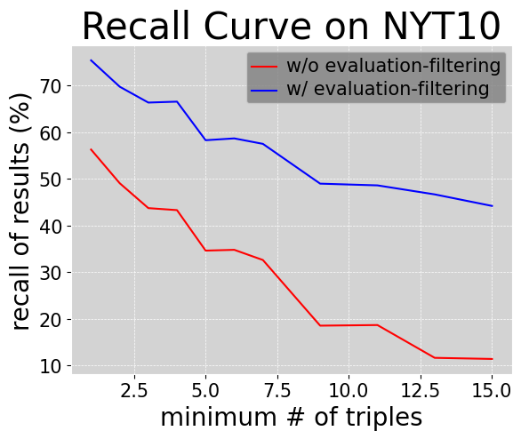
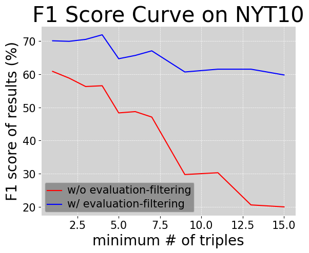

# 为了提升大型语言模型在关系三元组提取方面的召回率，本文提出了一种模型协作方法。通过这种方法，多个模型可以协同工作，共同提高对实体间关系的识别和提取能力。

发布时间：2024年04月15日

`RAG` `知识图谱` `信息抽取`

> Improving Recall of Large Language Models: A Model Collaboration Approach for Relational Triple Extraction

# 摘要

> 关系三元组提取对于知识获取至关重要，它能从长句子中提炼出关键信息。大型语言模型在经过适当的指导后，能通过少次学习或微调，精确地从简单句子中抽取三元组，但在处理复杂句子时却常常力不从心。为此，我们构建了一个融合大型与小型模型的评估-过滤框架，专门针对关系三元组的提取。该框架内含一个评估模型，其能够高效地识别出相关的实体对。我们引入了一种简洁的标记原则，并利用深度神经网络构建此模型，将输出嵌入到大型模型的提取流程中，作为提示信息。经过大量实验验证，我们的方法显著提升了大型语言模型在提取复杂句子中的准确性，尤其是那些包含多重关系三元组的句子。此外，我们的评估模型还能整合进传统提取模型，进一步增强其对复杂句子的提取精确度。

> Relation triple extraction, which outputs a set of triples from long sentences, plays a vital role in knowledge acquisition. Large language models can accurately extract triples from simple sentences through few-shot learning or fine-tuning when given appropriate instructions. However, they often miss out when extracting from complex sentences. In this paper, we design an evaluation-filtering framework that integrates large language models with small models for relational triple extraction tasks. The framework includes an evaluation model that can extract related entity pairs with high precision. We propose a simple labeling principle and a deep neural network to build the model, embedding the outputs as prompts into the extraction process of the large model. We conduct extensive experiments to demonstrate that the proposed method can assist large language models in obtaining more accurate extraction results, especially from complex sentences containing multiple relational triples. Our evaluation model can also be embedded into traditional extraction models to enhance their extraction precision from complex sentences.

[Arxiv](https://arxiv.org/abs/2404.09593)