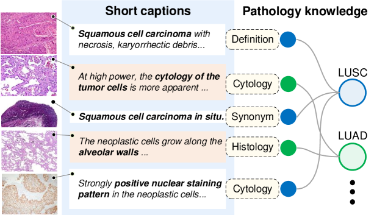
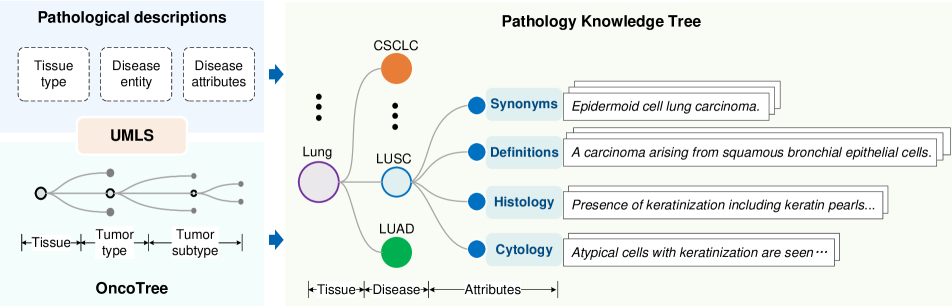
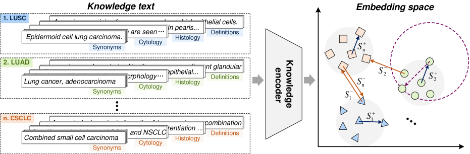
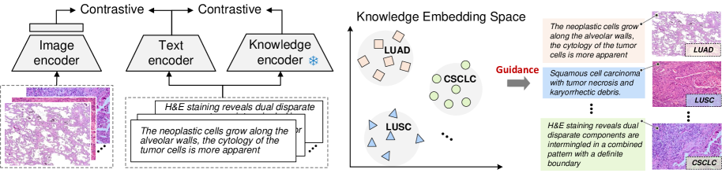
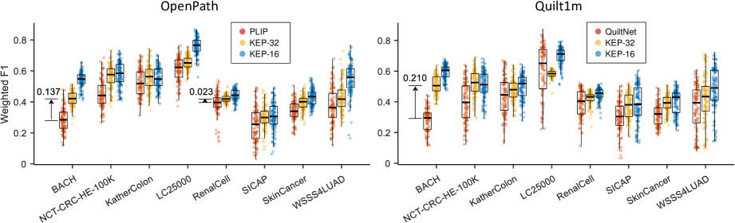
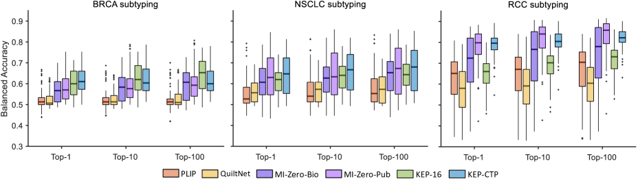
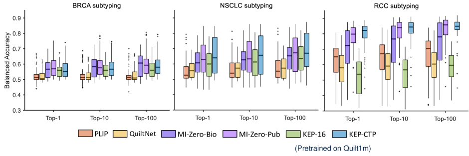
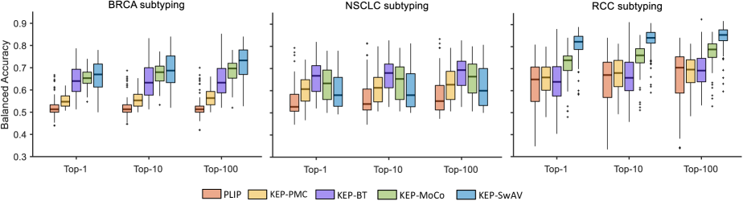

# 计算病理学领域中，通过知识增强的视觉-语言预训练方法，旨在提升模型的性能。

发布时间：2024年04月15日

`RAG` `病理学` `计算机视觉`

> Knowledge-enhanced Visual-Language Pretraining for Computational Pathology

# 摘要

> 本文探讨了计算病理学中的视觉表示学习问题，利用公共资源中的大量图像-文本对和病理学专业知识。我们首先构建了一个包含50470个属性的病理学知识树，涵盖4718种疾病的诊断，这在病理学领域尚属首次。接着，我们提出了一种结合知识的视觉-语言预训练方法，将病理学知识融入潜在空间，引领视觉表示的学习过程。经过一系列实验验证，我们的方法在跨模态检索、病理切片的零样本分类，以及全幻灯片图像的零样本肿瘤亚型分型等任务上取得了显著进步。我们将所有的代码、模型和病理学知识树向研究界开放。

> In this paper, we consider the problem of visual representation learning for computational pathology, by exploiting large-scale image-text pairs gathered from public resources, along with the domain specific knowledge in pathology. Specifically, we make the following contributions: (i) We curate a pathology knowledge tree that consists of 50,470 informative attributes for 4,718 diseases requiring pathology diagnosis from 32 human tissues. To our knowledge, this is the first comprehensive structured pathology knowledge base; (ii) We develop a knowledge-enhanced visual-language pretraining approach, where we first project pathology-specific knowledge into latent embedding space via language model, and use it to guide the visual representation learning; (iii) We conduct thorough experiments to validate the effectiveness of our proposed components, demonstrating significant performance improvement on various downstream tasks, including cross-modal retrieval, zero-shot classification on pathology patches, and zero-shot tumor subtyping on whole slide images (WSIs). All codes, models and the pathology knowledge tree will be released to the research community

[Arxiv](https://arxiv.org/abs/2404.09942)