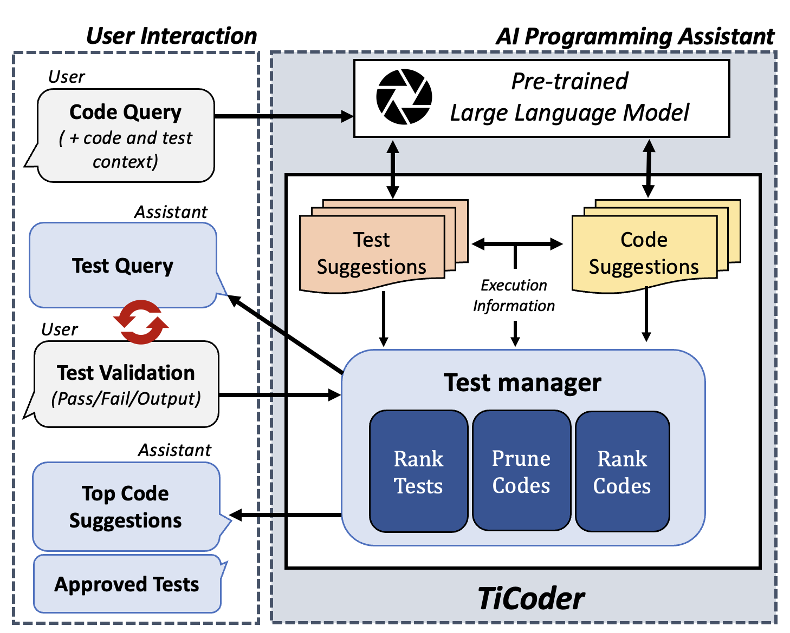
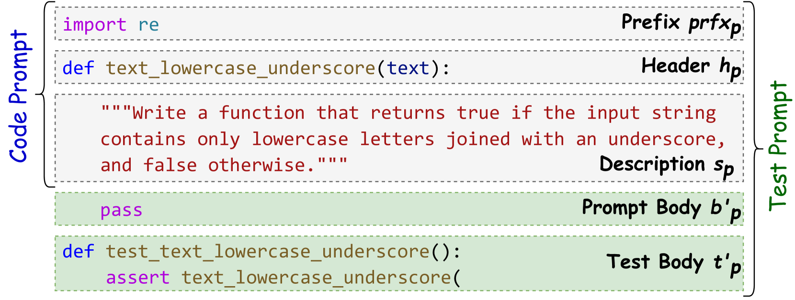
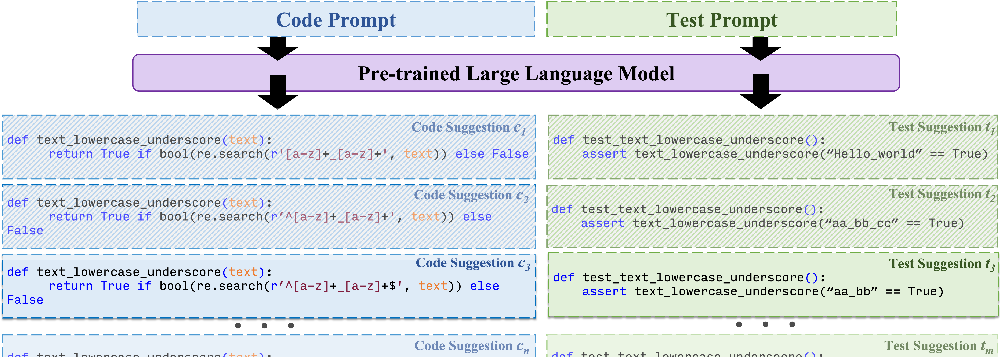
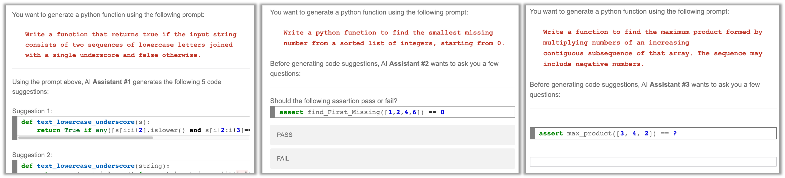

# 基于大型语言模型的测试驱动交互式代码生成：用户研究与实证评估探究

发布时间：2024年04月15日

`LLM应用` `编程自动化` `软件开发`

> LLM-based Test-driven Interactive Code Generation: User Study and Empirical Evaluation

# 摘要

> 大型语言模型（LLMs）展现出通过将非正式的自然语言（NL）意图转化为自然代码，从而在编码自动化领域的巨大应用潜力。但自然语言的非正式性使得验证生成代码是否准确实现用户意图变得具有挑战性。本文提出了一个创新的交互式工作流程TiCoder，它通过测试引导用户对意图进行部分形式化，以提升代码建议的准确性。在一项包含15名程序员的混合方法用户研究中，我们实证评估了该工作流程在提升代码生成精确度方面的有效性。研究发现，采用该工作流程的参与者在正确评估AI生成的代码方面表现显著更佳，且感受到的任务相关认知负荷显著降低。此外，我们还通过在两个Python数据集上使用四种不同的前沿LLMs进行了大规模测试，并采用理想化的用户反馈代理，结果显示在5次用户交互后，所有LLMs在两个数据集上的pass@1代码生成准确率平均提升了38.43%，并且还能自动生成相应的单元测试。

> Large language models (LLMs) have shown great potential in automating significant aspects of coding by producing natural code from informal natural language (NL) intent. However, given NL is informal, it does not lend easily to checking that the generated code correctly satisfies the user intent. In this paper, we propose a novel interactive workflow TiCoder for guided intent clarification (i.e., partial formalization) through tests to support the generation of more accurate code suggestions. Through a mixed methods user study with 15 programmers, we present an empirical evaluation of the effectiveness of the workflow to improve code generation accuracy. We find that participants using the proposed workflow are significantly more likely to correctly evaluate AI generated code, and report significantly less task-induced cognitive load. Furthermore, we test the potential of the workflow at scale with four different state-of-the-art LLMs on two python datasets, using an idealized proxy for a user feedback. We observe an average absolute improvement of 38.43% in the pass@1 code generation accuracy for both datasets and across all LLMs within 5 user interactions, in addition to the automatic generation of accompanying unit tests.

[Arxiv](https://arxiv.org/abs/2404.10100)