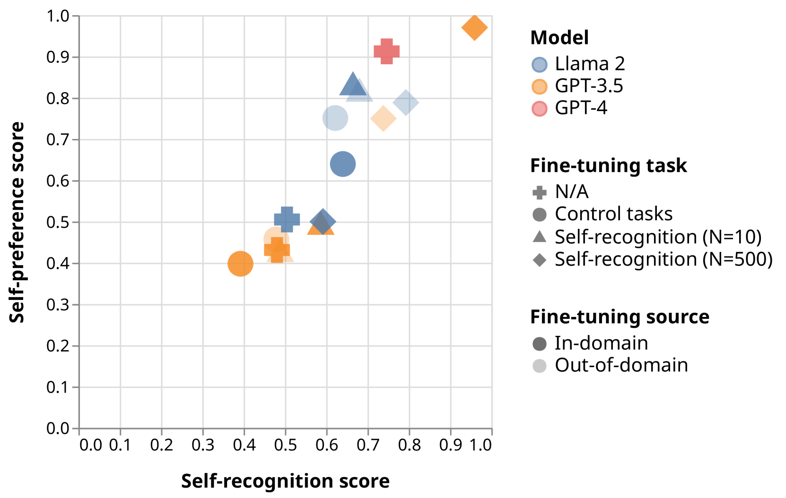
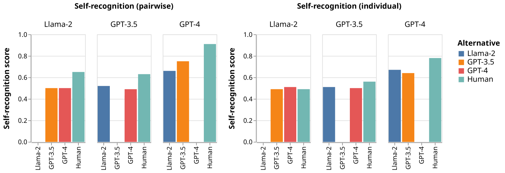
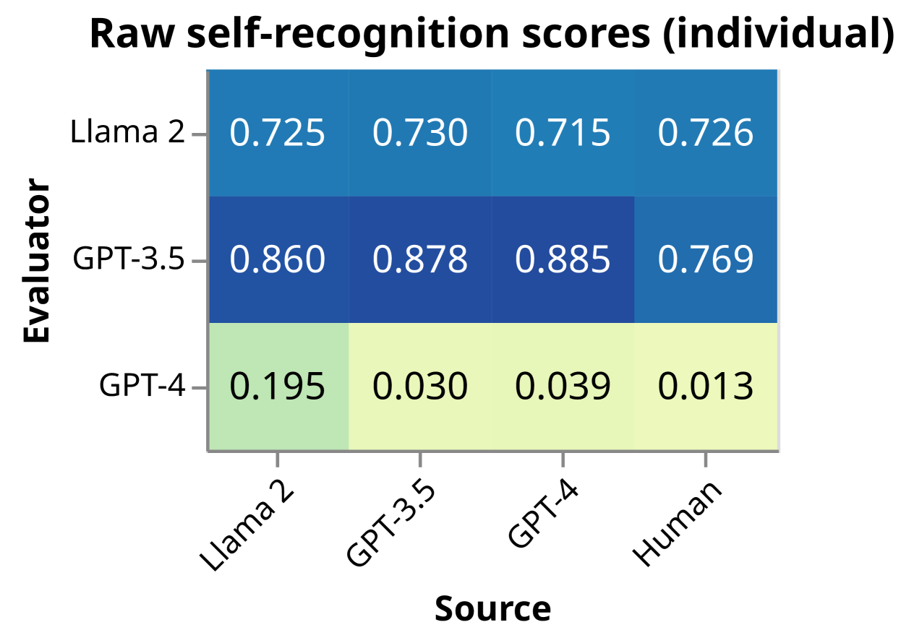
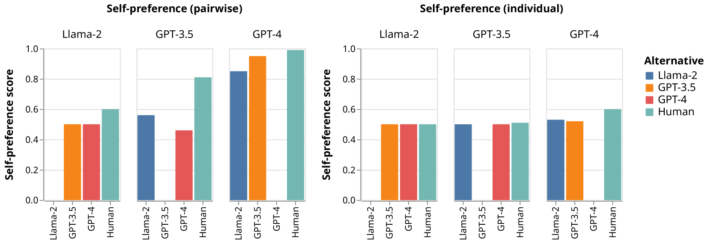
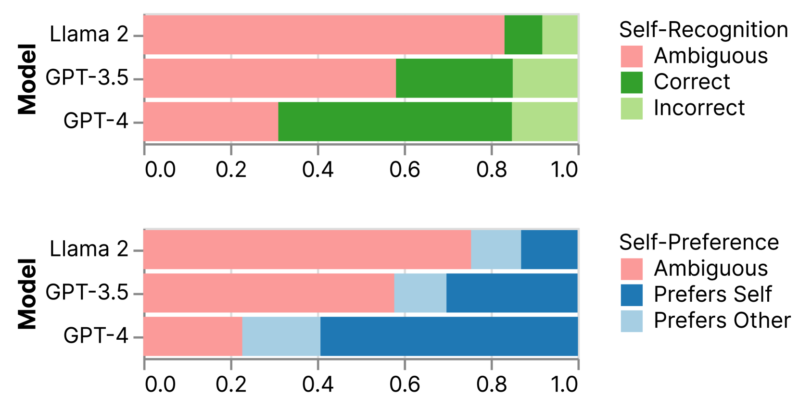
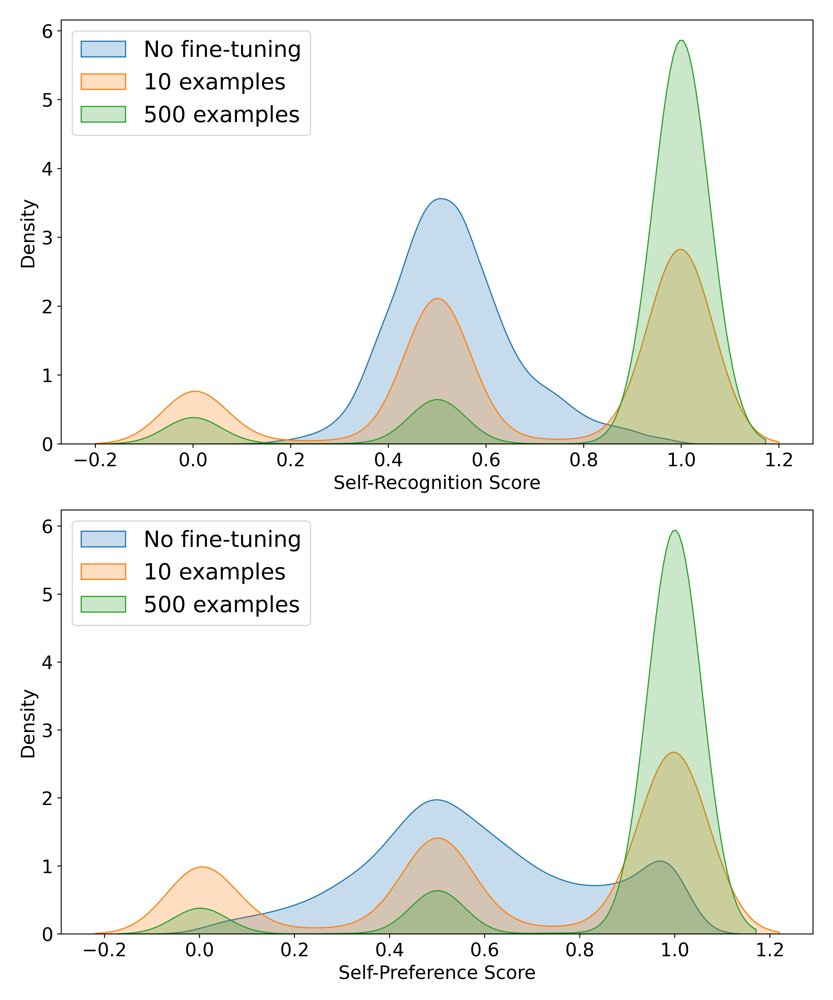
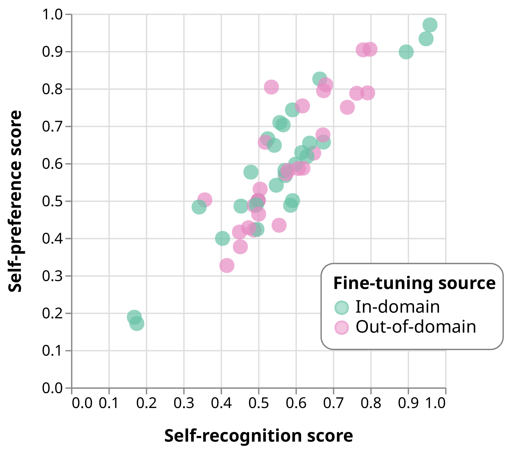
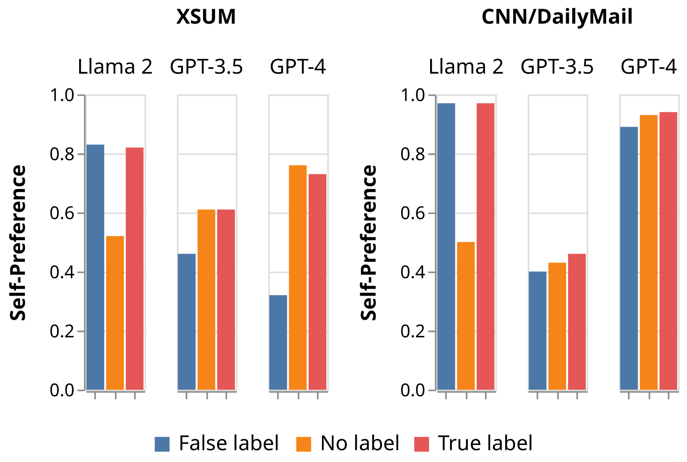

# 大型语言模型的评估者们能够辨识并倾向于偏好自己产出的结果。

发布时间：2024年04月15日

`分类：LLM理论` `人工智能` `性能评估`

> LLM Evaluators Recognize and Favor Their Own Generations

# 摘要

> 大型语言模型（LLMs）的自我评估在性能基准、奖励建模、宪法AI和自我精炼等领域显示出其价值。然而，当LLMs既作为评价者也作为被评价对象时，便会产生新的偏见，例如自我偏好——LLM评估器倾向于给自己的输出打高分，而人类评审则认为这些输出与其他输出质量相当。本文探究了LLMs是否真正能够在打分时识别出自己的输出，或者这只是一种偶然现象。研究发现，未经训练的LLMs，如GPT-4和Llama 2，能够以非平凡的准确度从其他LLMs和人类中识别出自己。通过微调这些模型，我们观察到自我识别能力与自我偏好偏见之间存在线性相关性；控制实验进一步证实了这种因果关系的稳健性。文章还讨论了自我识别如何可能影响公正评估和AI安全。

> Self-evaluation using large language models (LLMs) has proven valuable not only in benchmarking but also methods like reward modeling, constitutional AI, and self-refinement. But new biases are introduced due to the same LLM acting as both the evaluator and the evaluatee. One such bias is self-preference, where an LLM evaluator scores its own outputs higher than others' while human annotators consider them of equal quality. But do LLMs actually recognize their own outputs when they give those texts higher scores, or is it just a coincidence? In this paper, we investigate if self-recognition capability contributes to self-preference. We discover that, out of the box, LLMs such as GPT-4 and Llama 2 have non-trivial accuracy at distinguishing themselves from other LLMs and humans. By fine-tuning LLMs, we discover a linear correlation between self-recognition capability and the strength of self-preference bias; using controlled experiments, we show that the causal explanation resists straightforward confounders. We discuss how self-recognition can interfere with unbiased evaluations and AI safety more generally.

[Arxiv](https://arxiv.org/abs/2404.13076)