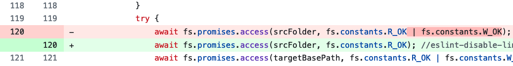
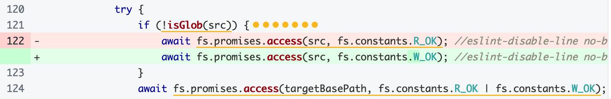
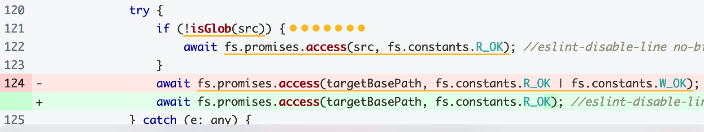
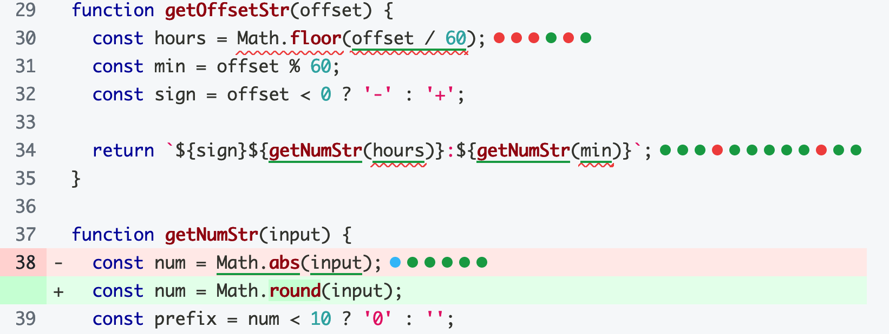
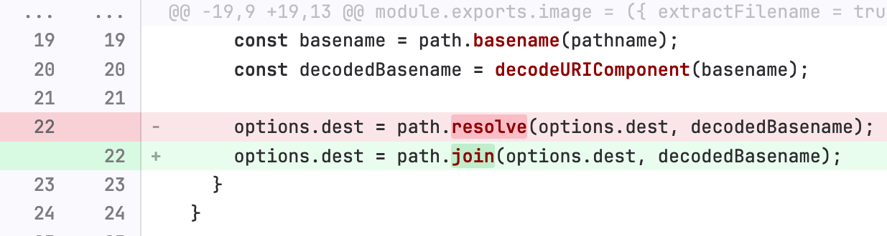
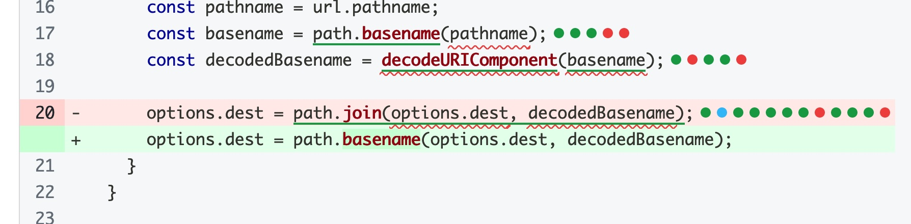
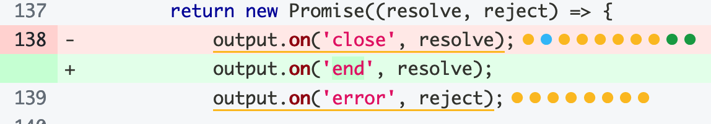
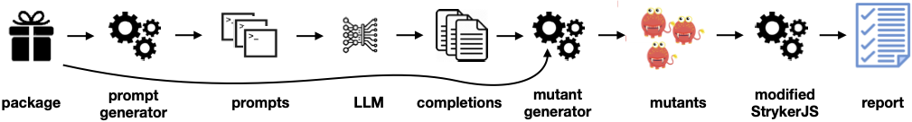

# LLMorpheus：借助大型语言模型进行变异测试研究

发布时间：2024年04月15日

`LLM应用` `软件工程` `变异测试`

> LLMorpheus: Mutation Testing using Large Language Models

# 摘要

> 变异测试通过植入程序故障并检验测试是否能捕捉到它们来衡量测试套件的优劣。传统方法通常使用固定变异操作，如将“+”换为“-”或删除函数主体，但这些难以模拟真实世界的某些错误，降低了效果。本研究提出了一种新技巧，让大型语言模型（LLM）指出源代码中可替换的占位符，以生成变异。这一技术已在LLMorpheus工具中得以应用，它是一个针对JavaScript的变异测试工具。我们在13个软件包上对其进行了测试，尝试了不同的提示策略，并利用了多个LLM。结果表明，LLMorpheus能够产生与现有漏洞相似的变异，而这些是StrykerJS等先进工具无法做到的。我们还评估了LLMorpheus的执行时间、成本和变异体产出数量，显示了其实用性。

> In mutation testing, the quality of a test suite is evaluated by introducing faults into a program and determining whether the program's tests detect them. Most existing approaches for mutation testing involve the application of a fixed set of mutation operators, e.g., replacing a "+" with a "-" or removing a function's body. However, certain types of real-world bugs cannot easily be simulated by such approaches, limiting their effectiveness. This paper presents a technique where a Large Language Model (LLM) is prompted to suggest mutations by asking it what placeholders that have been inserted in source code could be replaced with. The technique is implemented in LLMorpheus, a mutation testing tool for JavaScript, and evaluated on 13 subject packages, considering several variations on the prompting strategy, and using several LLMs. We find LLMorpheus to be capable of producing mutants that resemble existing bugs that cannot be produced by StrykerJS, a state-of-the-art mutation testing tool. Moreover, we report on the running time, cost, and number of mutants produced by LLMorpheus, demonstrating its practicality.

[Arxiv](https://arxiv.org/abs/2404.09952)