# 本文提出了一种语言无关的方法，用于评估维基百科文章的内容质量，该方法适用于不同语言。

发布时间：2024年04月15日

`Agent` `知识管理` `自动评估`

> Language-Agnostic Modeling of Wikipedia Articles for Content Quality Assessment across Languages

# 摘要

> 维基百科，作为全球最大的免费知识库，依赖志愿者编辑们不懈地编写和扩充着300多种语言的条目。鉴于条目质量良莠不齐，编辑们还需投入大量时间进行评估。但维基百科内容日新月异，要想保持评估的时效性与完整性几乎是一项不可能完成的任务。为此，我们设计了一种创新的计算框架，旨在对维基百科条目质量进行建模。与传统依赖机器学习及语言特定特征的方法不同，我们的框架着眼于从条目中提取的通用结构特征，并采用一套普适的权重和针对不同语言版本的规范化标准。这样一来，即使是那些尚未建立独立质量评估体系的语言版本，也能从我们的框架中受益。利用此框架，我们已经构建了涵盖维基百科所有现存语言版本中每条条目的所有修订版本的特色值和质量得分的数据集。我们对这些资源进行了描述性分析，并对我们的框架进行了基准测试。同时，我们也探讨了这些公开数据集可能支持的下游任务。

> Wikipedia is the largest web repository of free knowledge. Volunteer editors devote time and effort to creating and expanding articles in more than 300 language editions. As content quality varies from article to article, editors also spend substantial time rating articles with specific criteria. However, keeping these assessments complete and up-to-date is largely impossible given the ever-changing nature of Wikipedia. To overcome this limitation, we propose a novel computational framework for modeling the quality of Wikipedia articles.
  State-of-the-art approaches to model Wikipedia article quality have leveraged machine learning techniques with language-specific features. In contrast, our framework is based on language-agnostic structural features extracted from the articles, a set of universal weights, and a language version-specific normalization criterion. Therefore, we ensure that all language editions of Wikipedia can benefit from our framework, even those that do not have their own quality assessment scheme. Using this framework, we have built datasets with the feature values and quality scores of all revisions of all articles in the existing language versions of Wikipedia. We provide a descriptive analysis of these resources and a benchmark of our framework. In addition, we discuss possible downstream tasks to be addressed with these datasets, which are released for public use.

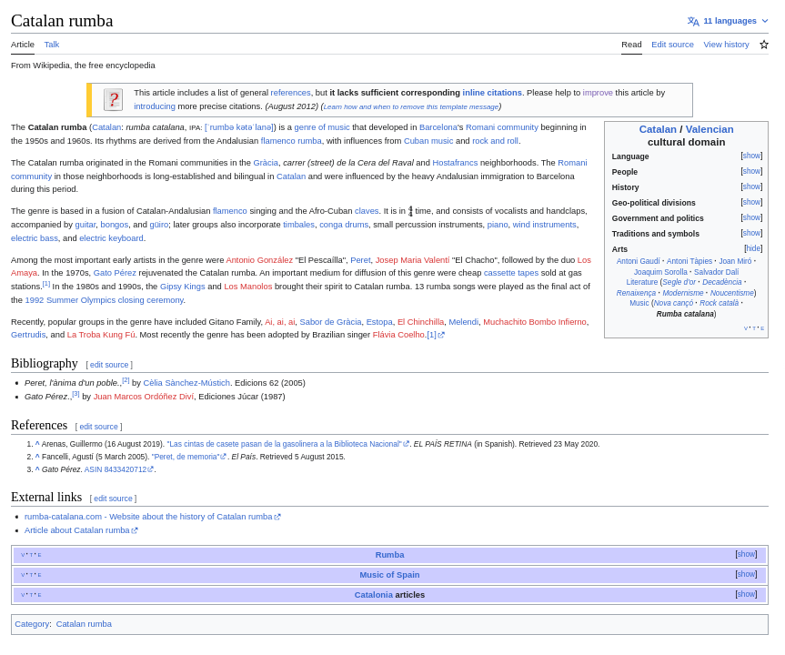

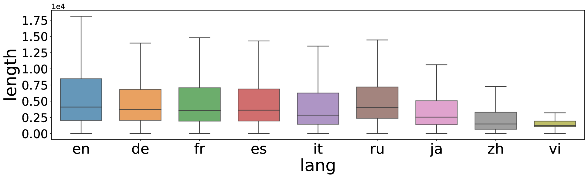

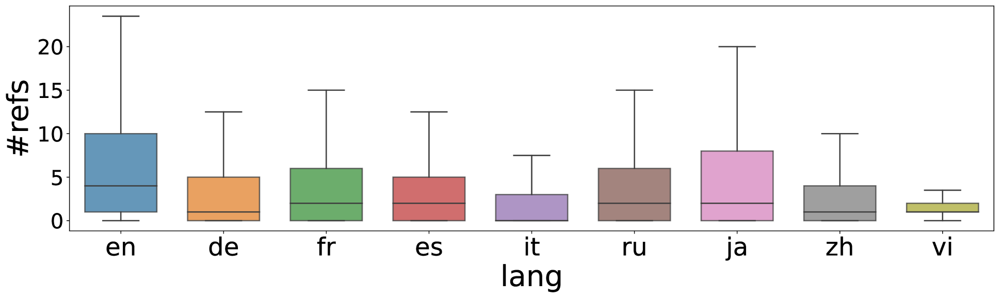

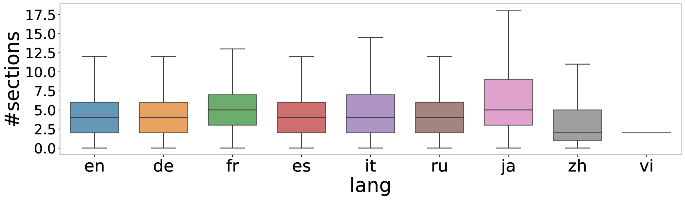

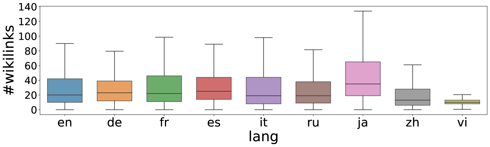

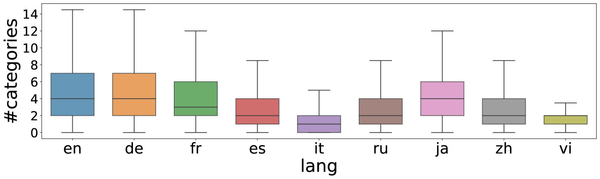

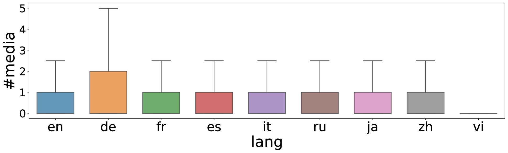

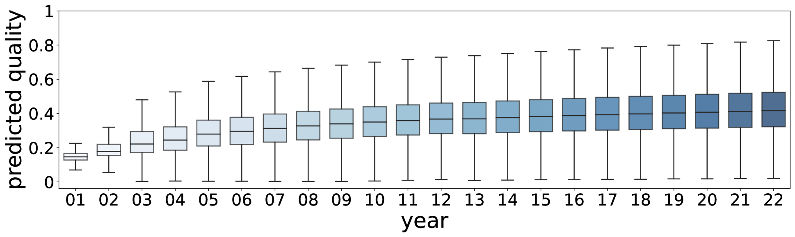

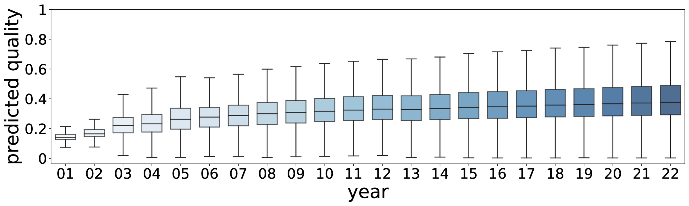

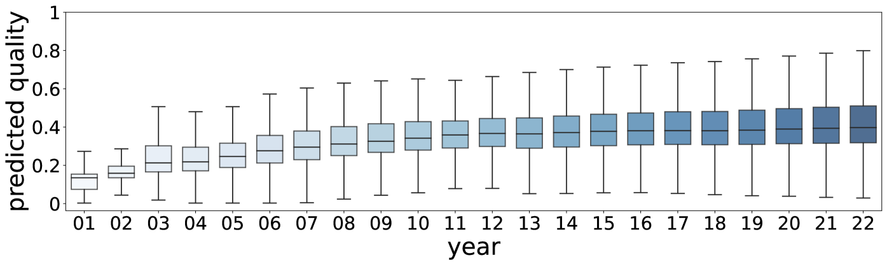

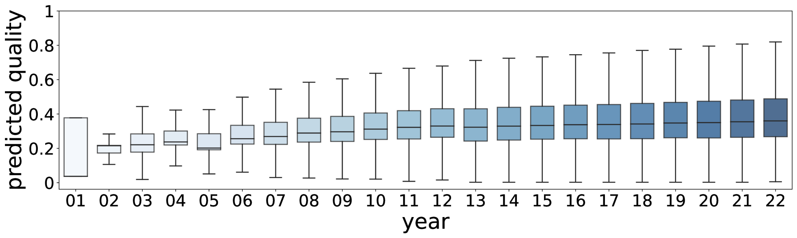

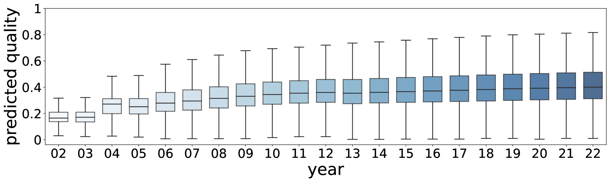

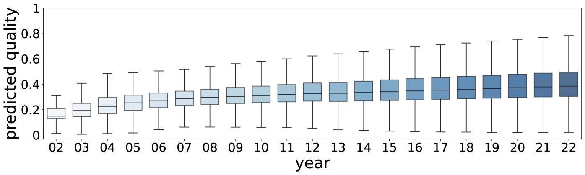

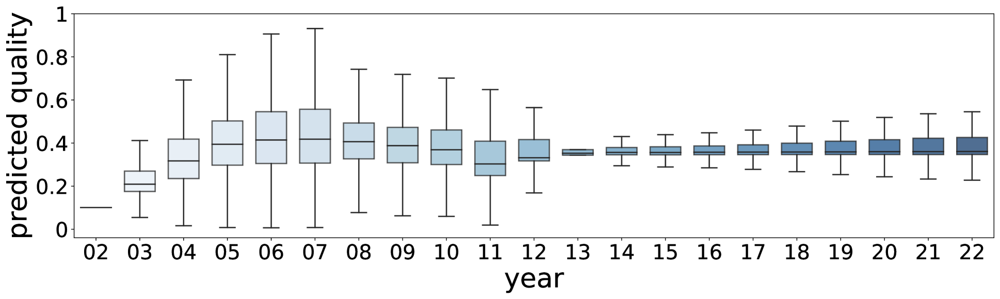

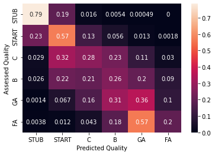

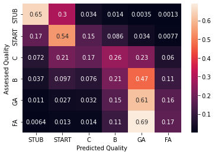

[Arxiv](https://arxiv.org/abs/2404.09764)