# 语言模型级联：探究Token层级的不确定性及其更深层次的影响

发布时间：2024年04月15日

`LLM应用` `语言模型`

> Language Model Cascades: Token-level uncertainty and beyond

# 摘要

> 近期语言模型的进步极大提升了复杂NLP任务的处理质量，但这背后是推理成本的增加。级联策略通过巧妙分配任务，实现了成本与质量的更佳平衡：简单任务交由小型模型处理，而复杂任务则留给大型模型。尽管分类任务中的级联原理已广为人知，但生成性LM任务却缺少相应的理解。本研究对LM级联的推迟规则进行了系统性探索。我们首先尝试将预测类别不确定性的概念扩展到生成性LM任务中，即预测序列不确定性。然而，这种方法存在长度偏见问题，因为LMs为每个输出标记生成一个不确定性值，而不同示例的输出标记数量又各不相同。为了解决这一问题，我们提出利用生成性LMs中隐含的更细致的标记级不确定性信息。我们发现，简单的预测序列不确定性仅仅是这些不确定性的简单聚合。实际上，通过学习后处理的推迟规则来整合标记级的不确定性，可以在一系列自然语言基准测试中显著提升性能，这一点通过FLAN-T5模型的实验得到了证实。此外，我们还发现，结合小型模型的嵌入和大型模型的中间层可以进一步优化整体的成本-质量平衡。

> Recent advances in language models (LMs) have led to significant improvements in quality on complex NLP tasks, but at the expense of increased inference costs. Cascading offers a simple strategy to achieve more favorable cost-quality tradeoffs: here, a small model is invoked for most "easy" instances, while a few "hard" instances are deferred to the large model. While the principles underpinning cascading are well-studied for classification tasks - with deferral based on predicted class uncertainty favored theoretically and practically - a similar understanding is lacking for generative LM tasks. In this work, we initiate a systematic study of deferral rules for LM cascades. We begin by examining the natural extension of predicted class uncertainty to generative LM tasks, namely, the predicted sequence uncertainty. We show that this measure suffers from the length bias problem, either over- or under-emphasizing outputs based on their lengths. This is because LMs produce a sequence of uncertainty values, one for each output token; and moreover, the number of output tokens is variable across examples. To mitigate this issue, we propose to exploit the richer token-level uncertainty information implicit in generative LMs. We argue that naive predicted sequence uncertainty corresponds to a simple aggregation of these uncertainties. By contrast, we show that incorporating token-level uncertainty through learned post-hoc deferral rules can significantly outperform such simple aggregation strategies, via experiments on a range of natural language benchmarks with FLAN-T5 models. We further show that incorporating embeddings from the smaller model and intermediate layers of the larger model can give an additional boost in the overall cost-quality tradeoff.

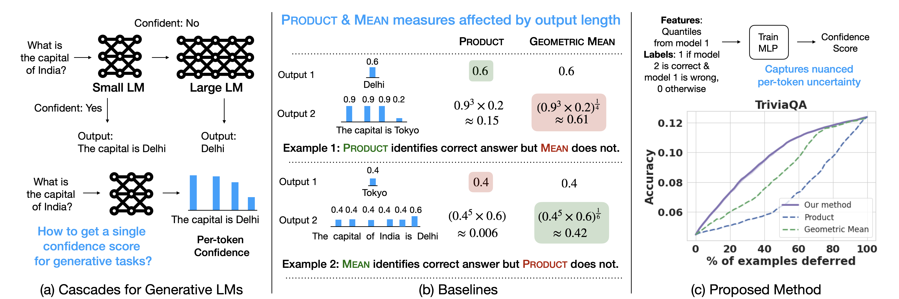

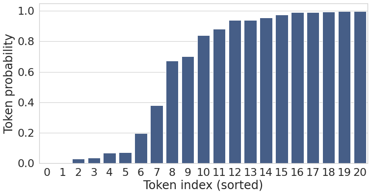

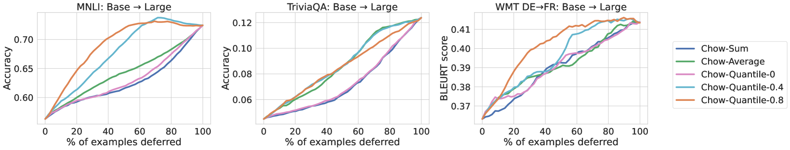

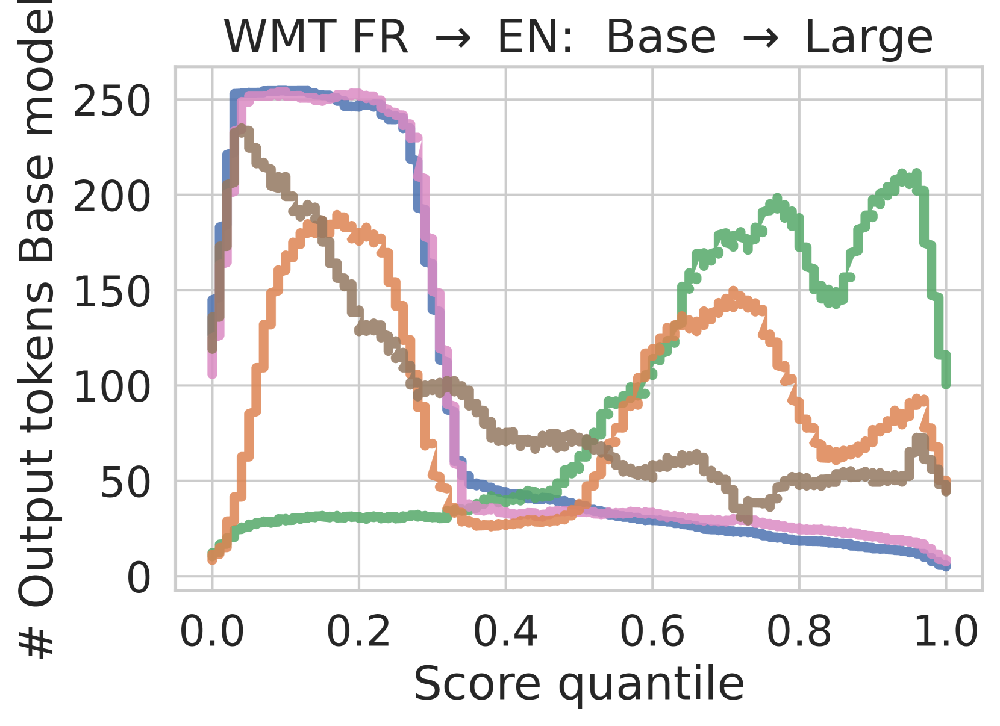

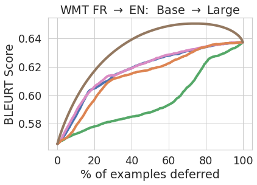

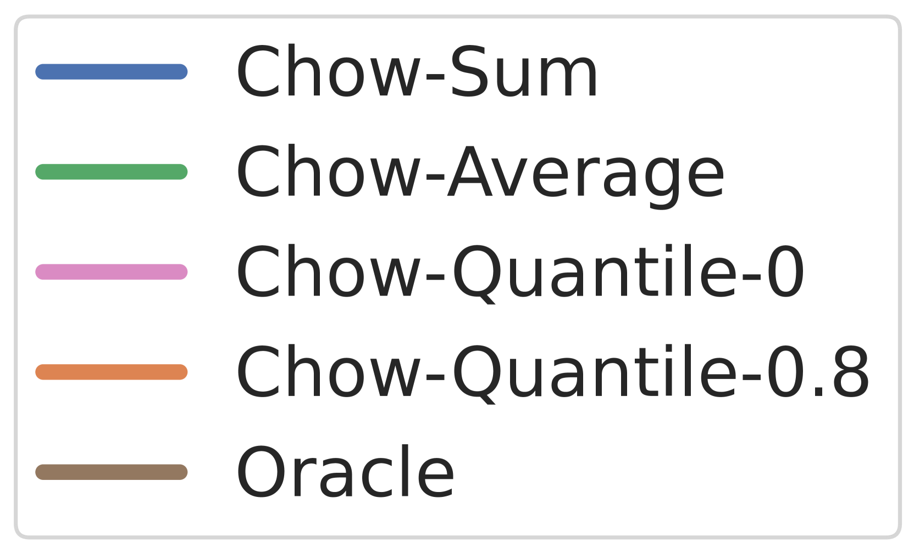

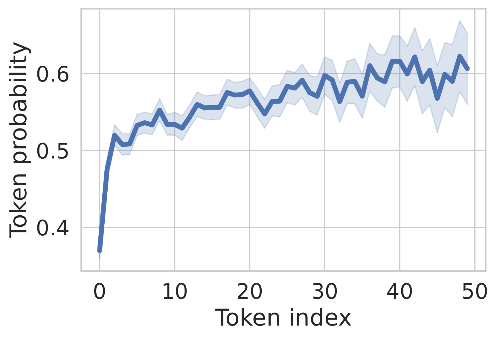

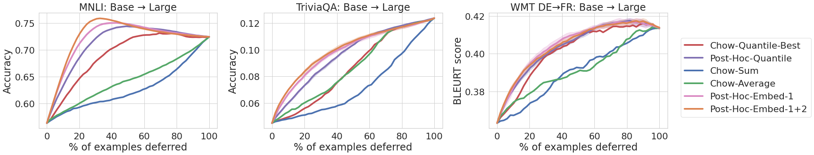

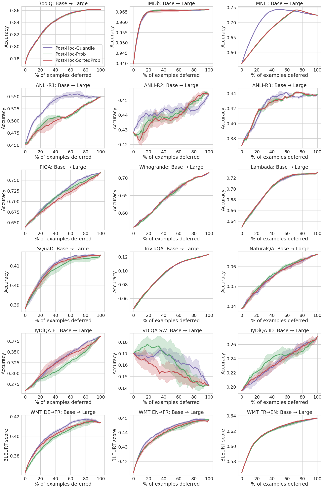

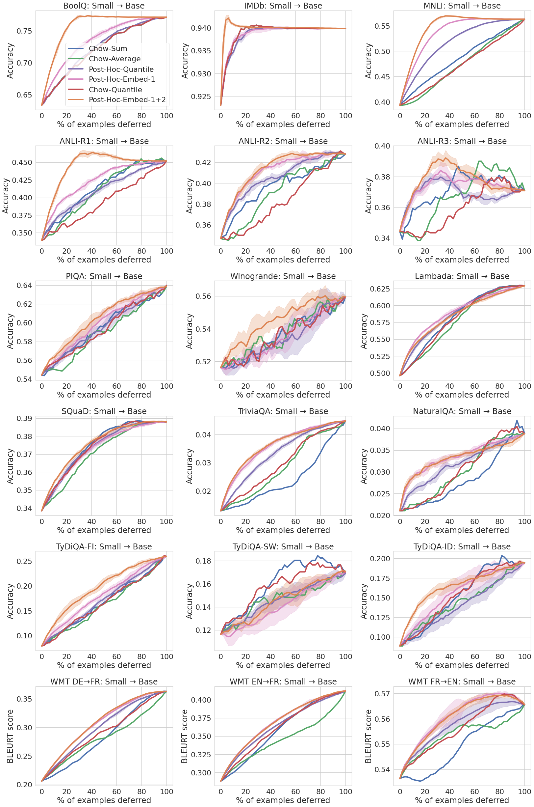

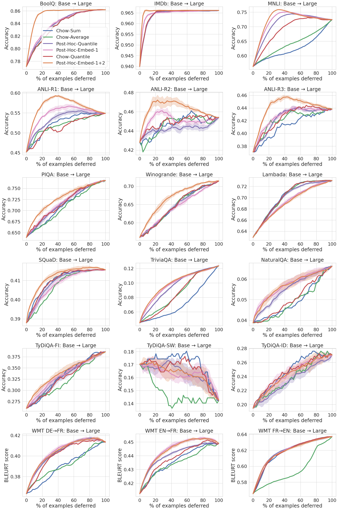

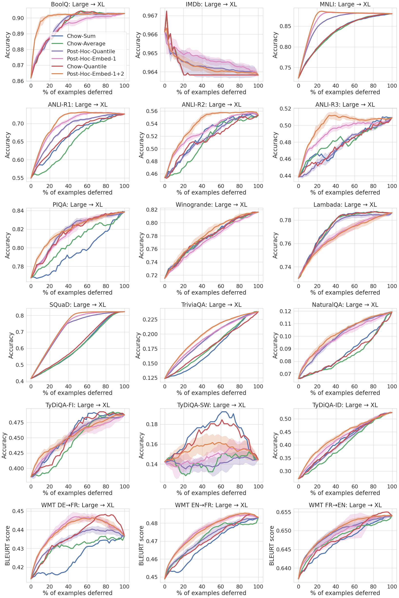

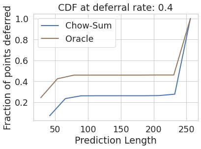

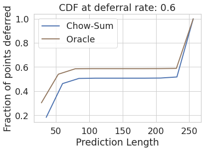

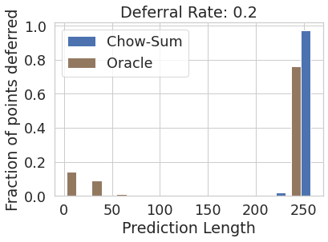

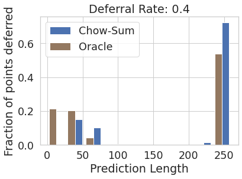

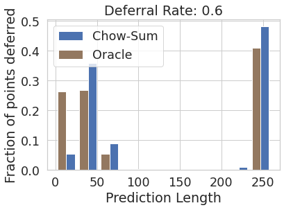

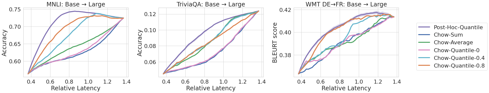

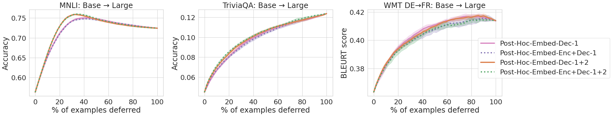

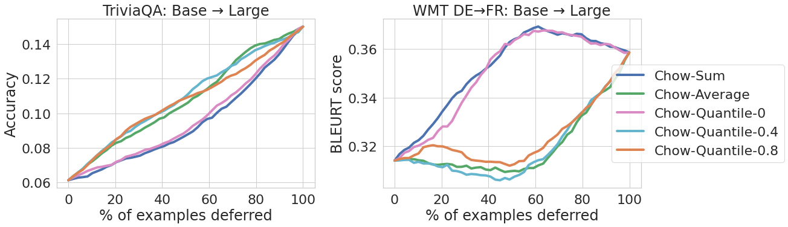

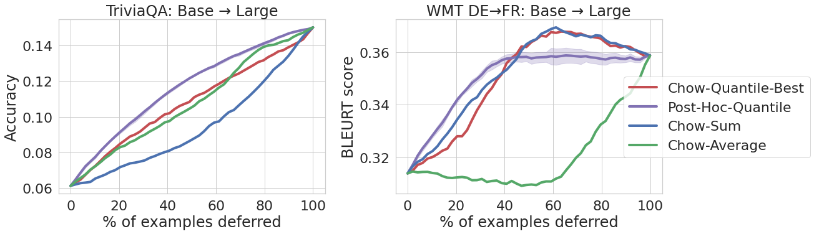

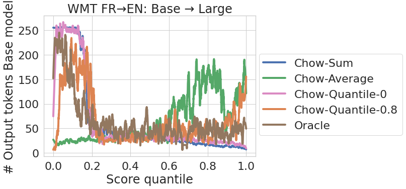

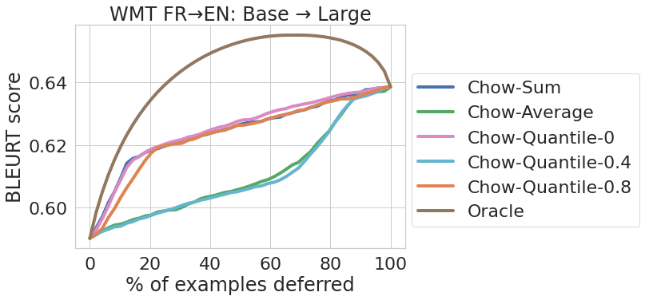

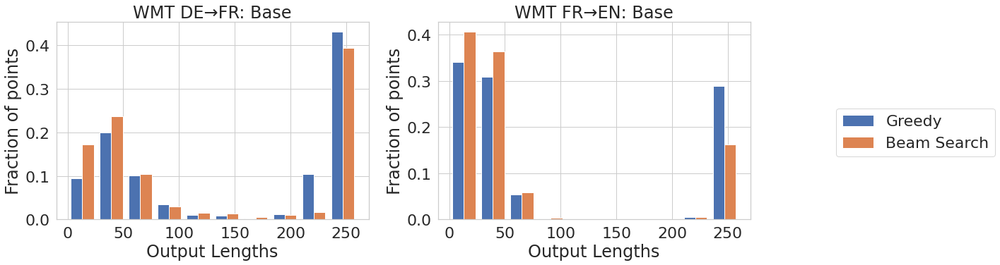

[Arxiv](https://arxiv.org/abs/2404.10136)