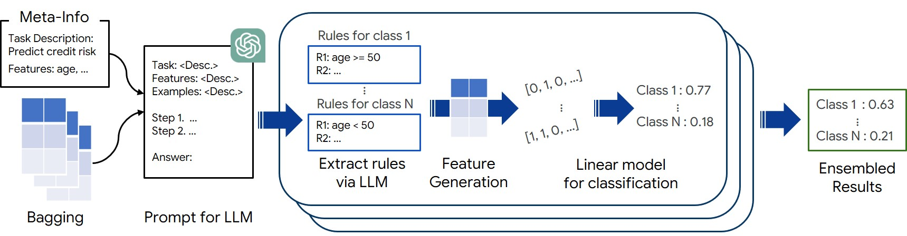
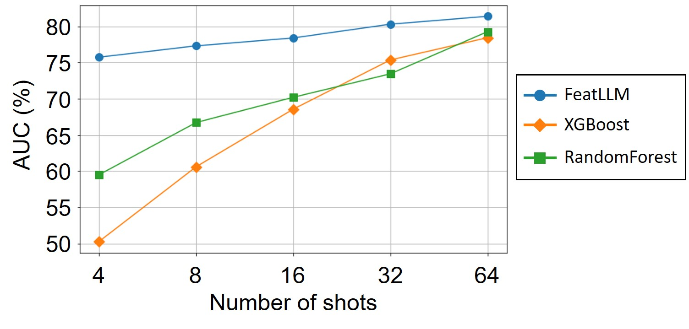
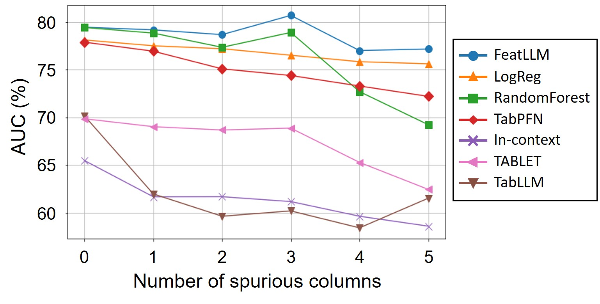
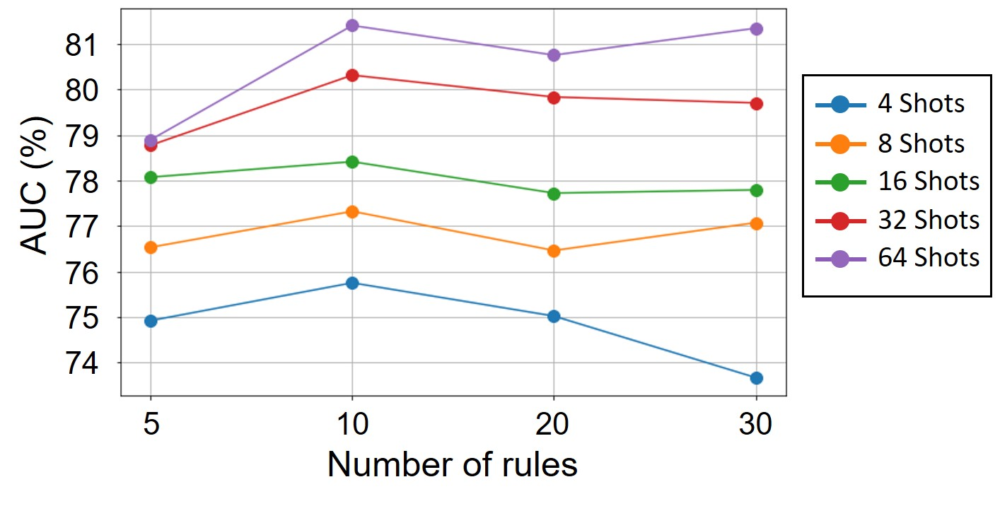
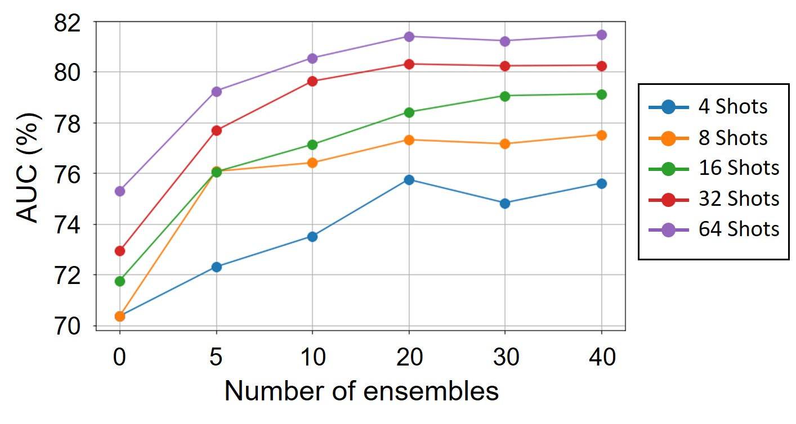
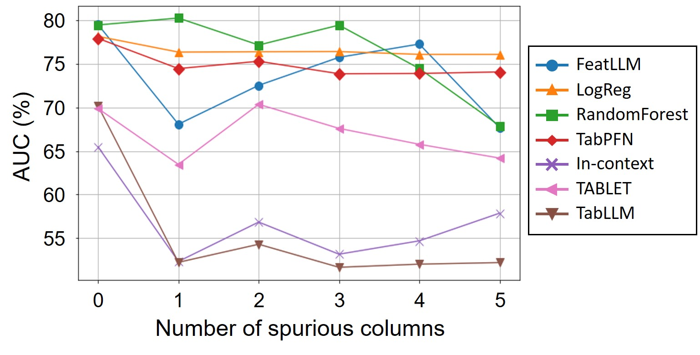

# 大型语言模型能够自动设计特征，以助力少次表格学习任务。

发布时间：2024年04月15日

`LLM应用` `表格学习` `机器学习`

> Large Language Models Can Automatically Engineer Features for Few-Shot Tabular Learning

# 摘要

> 大型语言模型（LLMs）以其卓越的解决复杂和新颖推理问题的能力，对于表格学习具有巨大的潜力，这对于众多现实世界的应用至关重要。本文提出了一种创新的上下文学习框架——FeatLLM，它将LLMs作为特征工程师，创造出最适合进行表格预测的输入数据集。这些生成的特征用于通过简单的下游机器学习模型（如线性回归）推断类别可能性，实现了高效的少次学习。FeatLLM框架在推理阶段仅使用这些简单模型和发掘出的特征。与传统基于LLM的方法相比，FeatLLM避免了在推理时对LLM进行逐样本查询的需求，仅需API级别的LLM访问权限，同时解决了提示尺寸限制的问题。在多个领域的众多表格数据集上验证，FeatLLM生成的高质量规则在性能上显著超越了如TabLLM和STUNT等其他方法，平均提高了10%。

> Large Language Models (LLMs), with their remarkable ability to tackle challenging and unseen reasoning problems, hold immense potential for tabular learning, that is vital for many real-world applications. In this paper, we propose a novel in-context learning framework, FeatLLM, which employs LLMs as feature engineers to produce an input data set that is optimally suited for tabular predictions. The generated features are used to infer class likelihood with a simple downstream machine learning model, such as linear regression and yields high performance few-shot learning. The proposed FeatLLM framework only uses this simple predictive model with the discovered features at inference time. Compared to existing LLM-based approaches, FeatLLM eliminates the need to send queries to the LLM for each sample at inference time. Moreover, it merely requires API-level access to LLMs, and overcomes prompt size limitations. As demonstrated across numerous tabular datasets from a wide range of domains, FeatLLM generates high-quality rules, significantly (10% on average) outperforming alternatives such as TabLLM and STUNT.

[Arxiv](https://arxiv.org/abs/2404.09491)