# LoRAP: 针对大型语言模型，Transformer子层需差异化结构压缩技术

发布时间：2024年04月15日

`LLM理论` `人工智能` `模型压缩`

> LoRAP: Transformer Sub-Layers Deserve Differentiated Structured Compression for Large Language Models

# 摘要

> 大型语言模型（LLMs）在处理复杂任务时表现优异，却常因庞大的内存和计算需求而受限。探索如何缩减LLMs的参数规模，已成为研究界的焦点。本研究发现Transformer架构中的多头自注意力（MHA）层具有显著的低秩结构特征，而前馈网络（FFN）层则不然。据此，我们构建了一个融合低秩矩阵近似和结构化剪枝技术的混合压缩模型（LoRAP）。针对MHA层，我们引入了一种基于输入激活的加权奇异值分解法，以增强其低秩特性。我们还发现，MHA层中的权重矩阵存在不同程度的低秩性，因此，我们根据这一差异性设计了创新的参数分配策略。在FFN层，我们采用了一种无需梯度的结构化通道剪枝技术。剪枝过程中的一个意外发现是，那1%最不重要的参数对模型性能有着决定性的影响。经过一系列严格的评估，包括零样本困惑度和零样本任务分类，我们的模型在多种压缩比例下均展现出超越先前技术的优势。

> Large language models (LLMs) show excellent performance in difficult tasks, but they often require massive memories and computational resources. How to reduce the parameter scale of LLMs has become research hotspots. In this study, we make an important observation that the multi-head self-attention (MHA) sub-layer of Transformer exhibits noticeable low-rank structure, while the feed-forward network (FFN) sub-layer does not. With this regard, we design a mixed compression model, which organically combines Low-Rank matrix approximation And structured Pruning (LoRAP). For the MHA sub-layer, we propose an input activation weighted singular value decomposition method to strengthen the low-rank characteristic. Furthermore, we discover that the weight matrices in MHA sub-layer have different low-rank degrees. Thus, a novel parameter allocation scheme according to the discrepancy of low-rank degrees is devised. For the FFN sub-layer, we propose a gradient-free structured channel pruning method. During the pruning, we get an interesting finding that the least important 1% of parameter actually play a vital role in model performance. Extensive evaluations on zero-shot perplexity and zero-shot task classification indicate that our proposal is superior to previous structured compression rivals under multiple compression ratios.

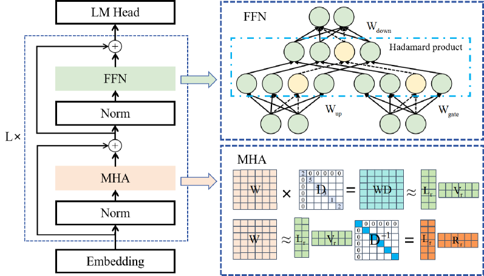

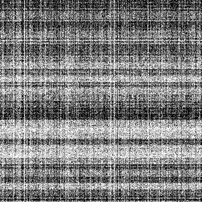

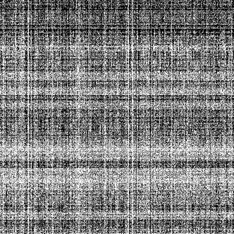

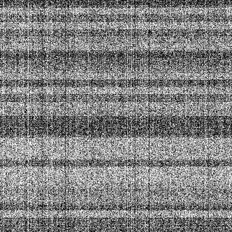

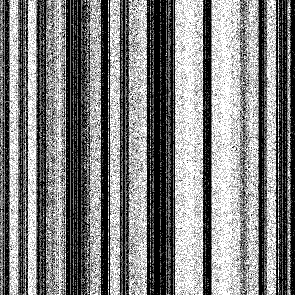

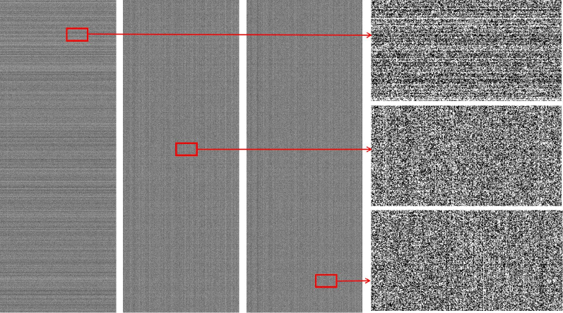

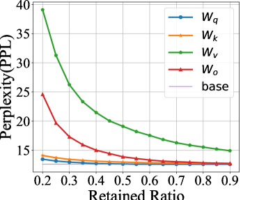

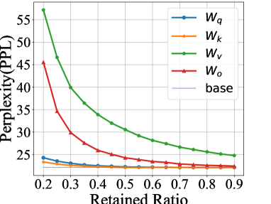

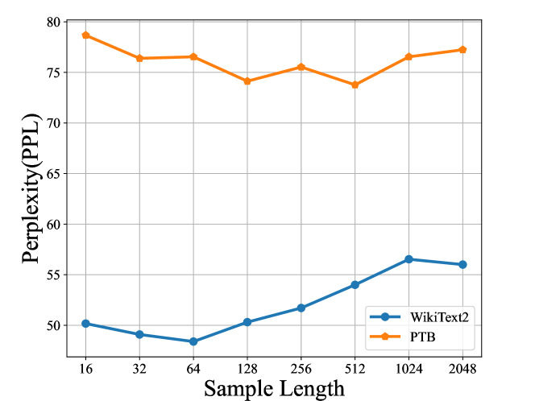

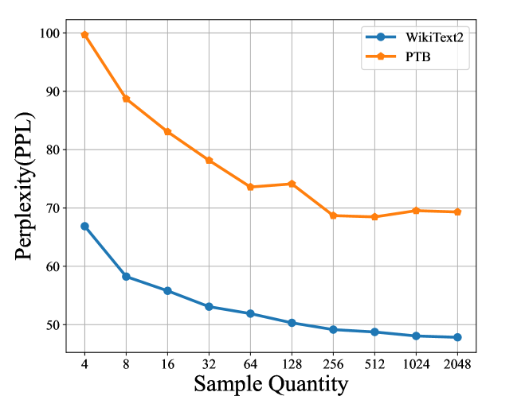

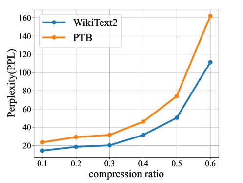

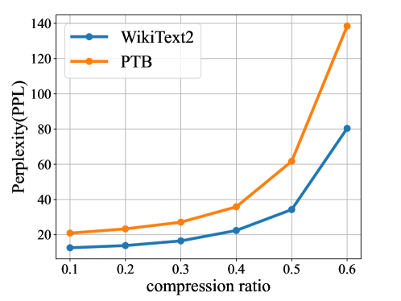

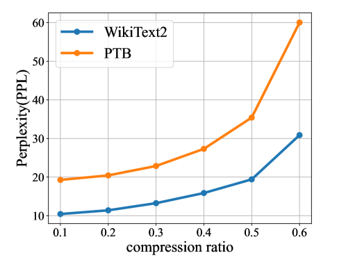

[Arxiv](https://arxiv.org/abs/2404.09695)