# LoongServe 通过灵活的序列并行技术，高效地处理长文本的大型语言模型，以满足不同的需求。

发布时间：2024年04月15日

`LLM应用` `分布式计算` `系统优化`

> LoongServe: Efficiently Serving Long-context Large Language Models with Elastic Sequence Parallelism

# 摘要

> 随着大型语言模型的上下文窗口不断扩展，不同任务和同一任务的不同阶段对资源的需求差异巨大。面对这一挑战，我们提出了弹性序列并行（ESP）这一创新并行策略，以灵活应对请求和阶段之间的变化。依托ESP，我们打造了LoongServe系统，该系统通过实时调整并行级别提升了计算效率，通过降低键值缓存迁移成本和同步部分解码与计算通信提高了通信效率，并通过减少跨实例的缓存碎片化增强了GPU内存的使用效率。在真实世界数据集的测试中，LoongServe在最大吞吐量上实现了高达3.85倍的提升，相比传统的分块预填充方法，以及5.81倍的提升，相比预填充-解码解耦方法。

> The context window of large language models (LLMs) is rapidly increasing, leading to a huge variance in resource usage between different requests as well as between different phases of the same request. Restricted by static parallelism strategies, existing LLM serving systems cannot efficiently utilize the underlying resources to serve variable-length requests in different phases. To address this problem, we propose a new parallelism paradigm, elastic sequence parallelism (ESP), to elastically adapt to the variance between different requests and phases. Based on ESP, we design and build LoongServe, an LLM serving system that (1) improves computation efficiency by elastically adjusting the degree of parallelism in real-time, (2) improves communication efficiency by reducing key-value cache migration overhead and overlapping partial decoding communication with computation, and (3) improves GPU memory efficiency by reducing key-value cache fragmentation across instances. Our evaluation under diverse real-world datasets shows that LoongServe improves the maximum throughput by up to 3.85$\times$ compared to the chunked prefill and 5.81$\times$ compared to the prefill-decoding disaggregation.

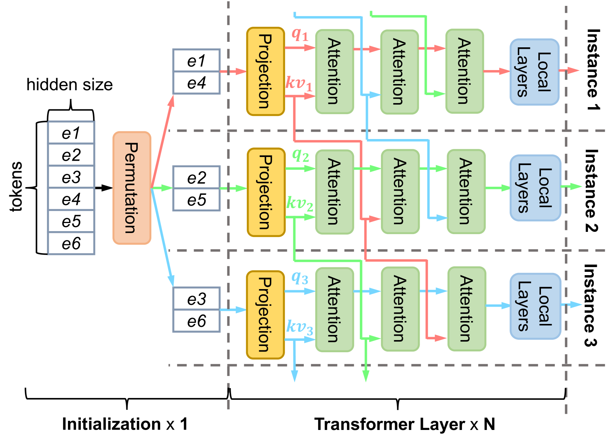

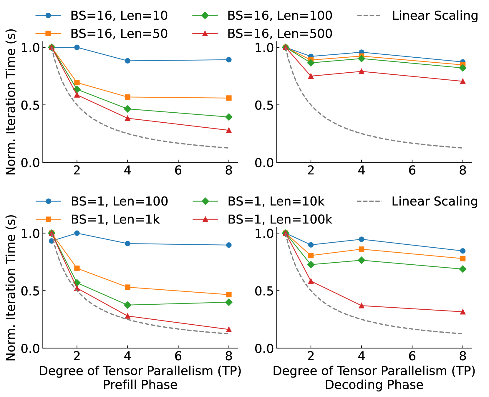

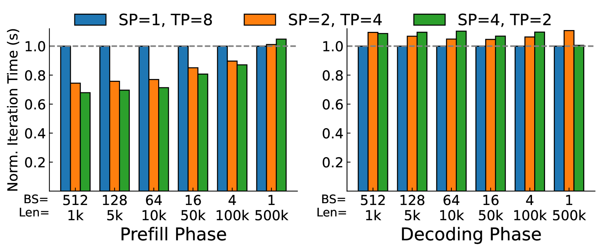

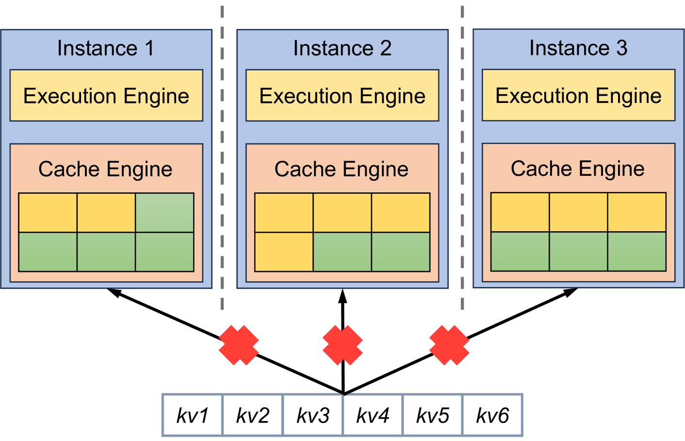

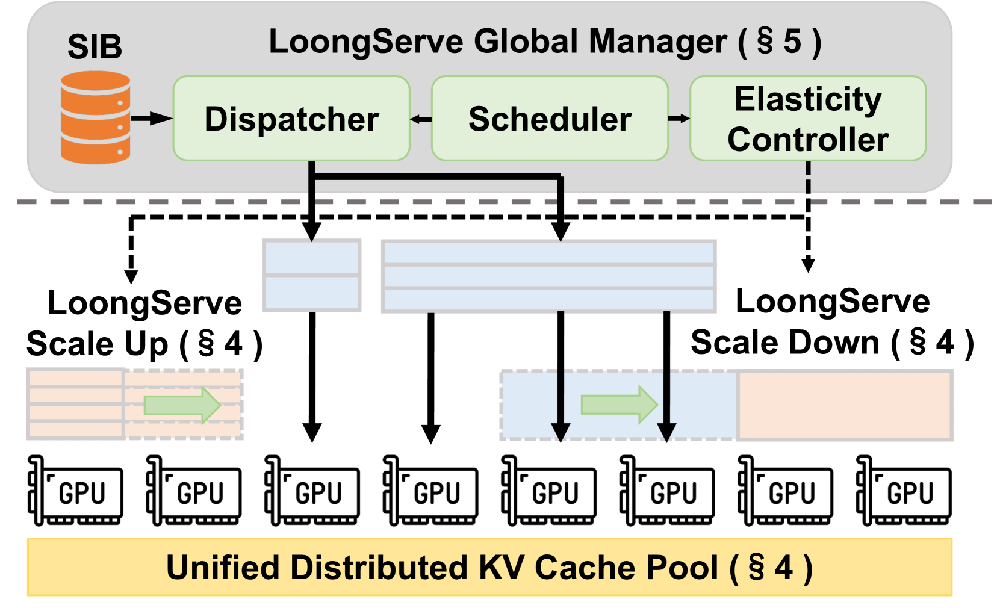

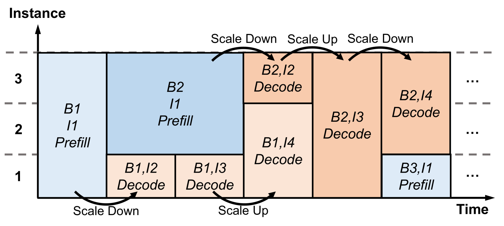

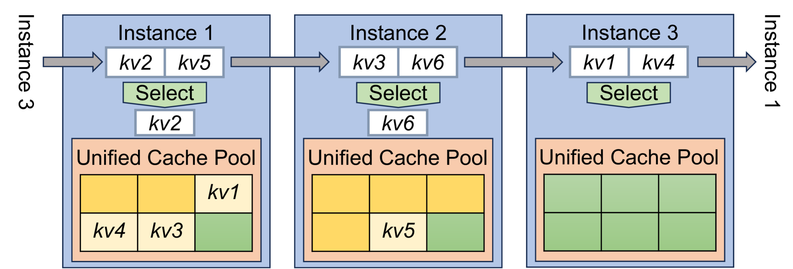

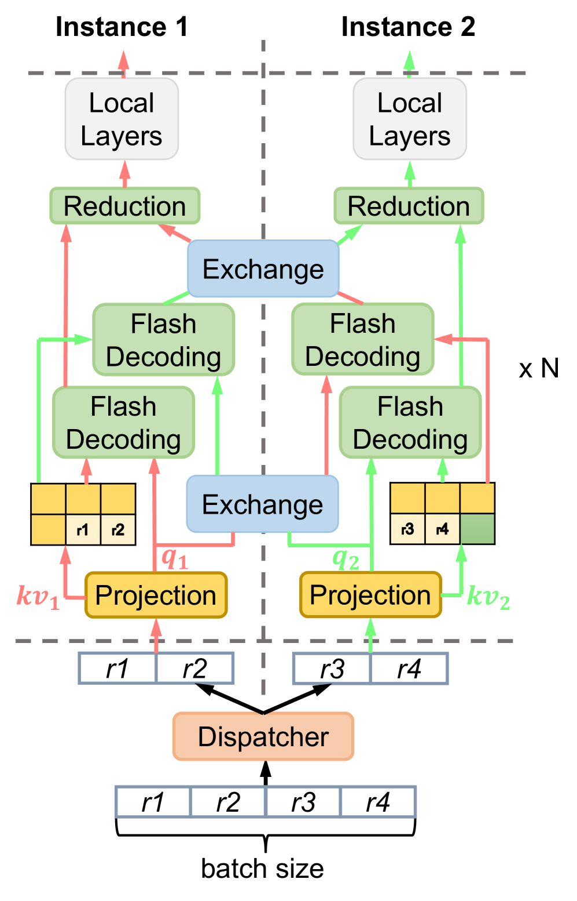

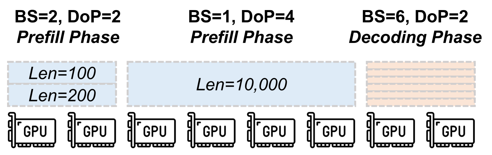

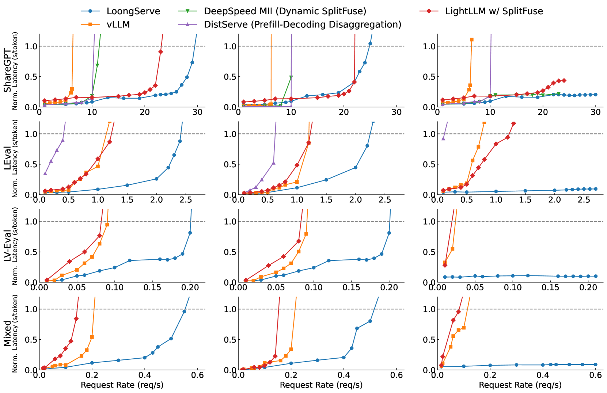

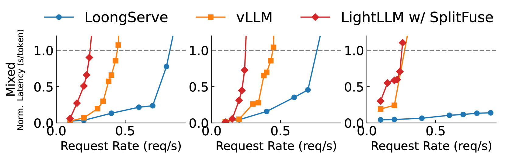

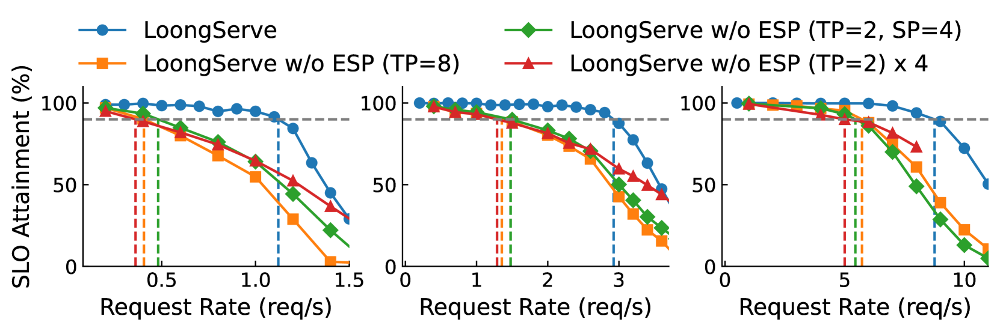

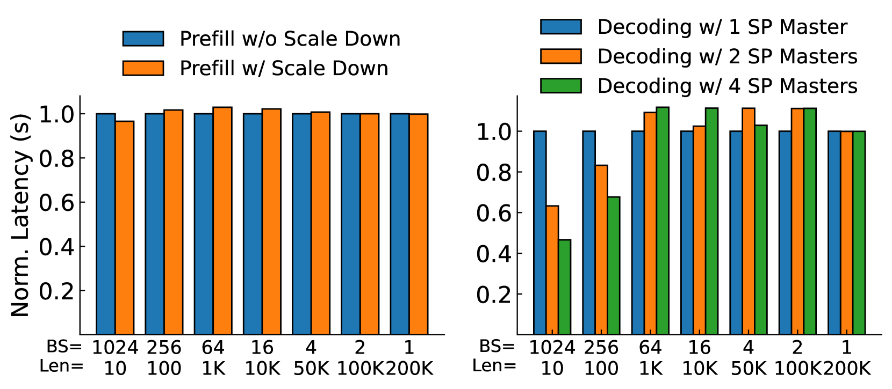

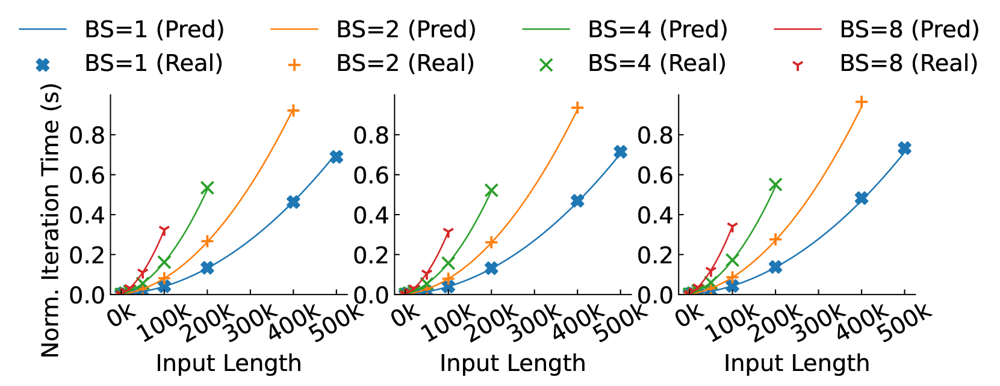

[Arxiv](https://arxiv.org/abs/2404.09526)