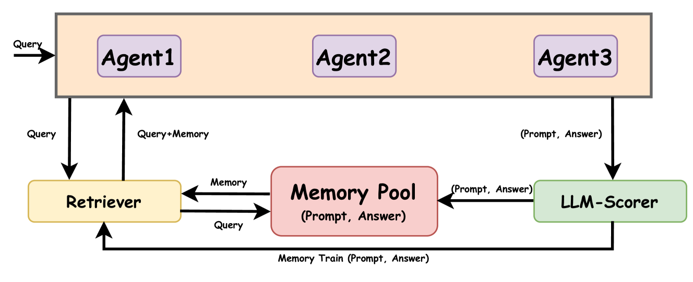
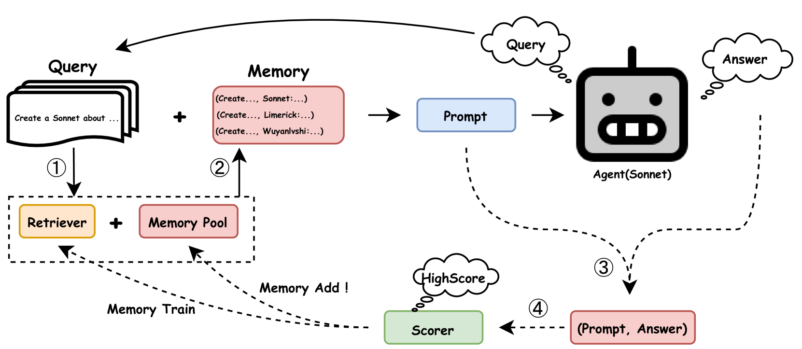
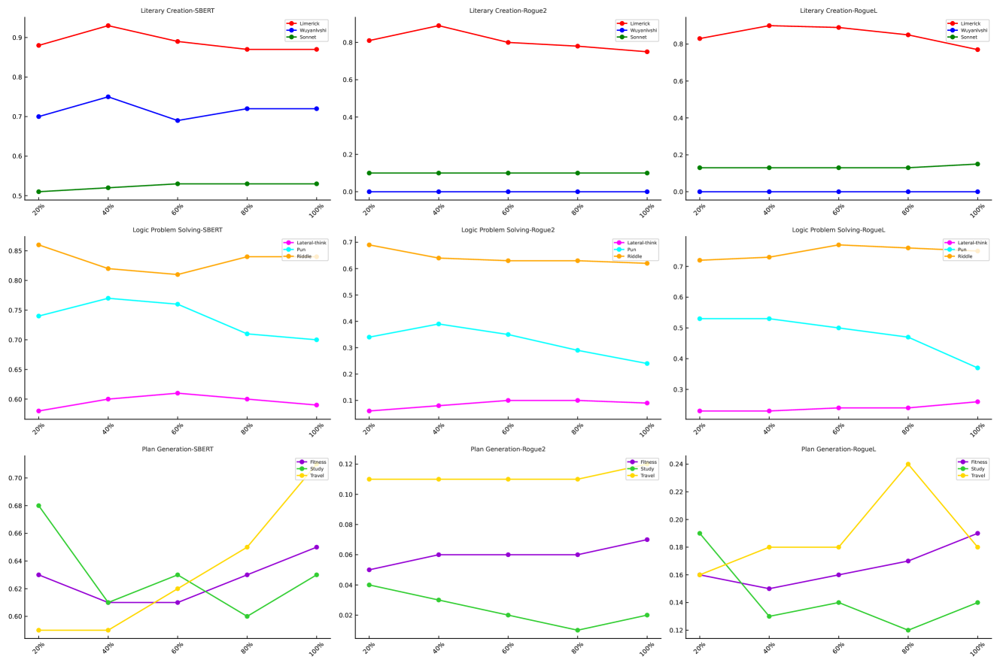
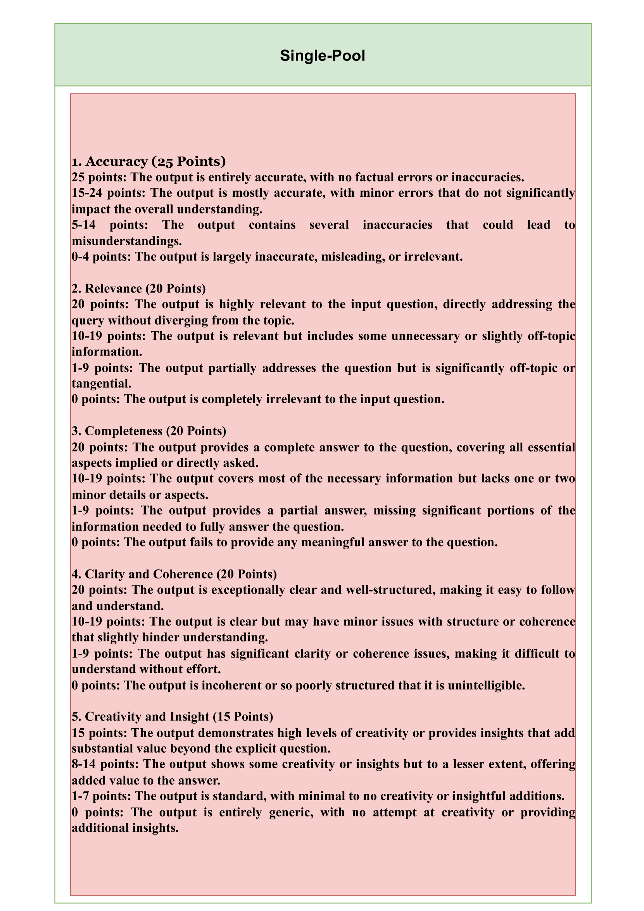
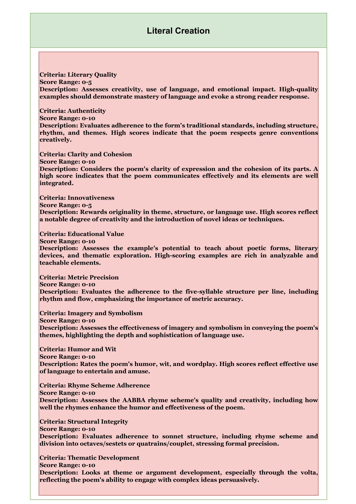
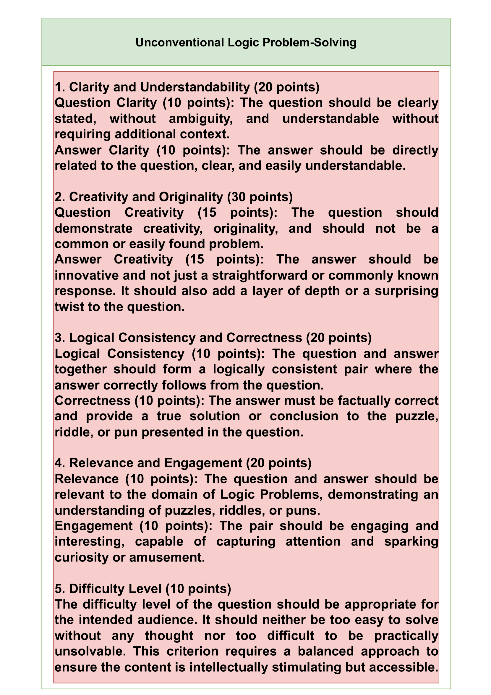
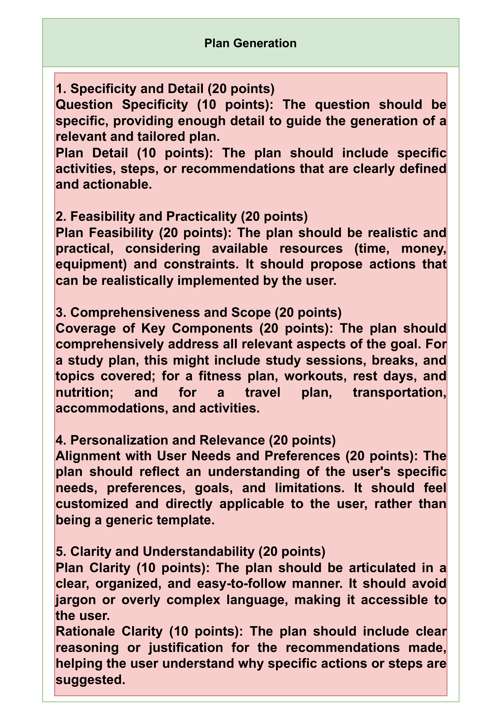
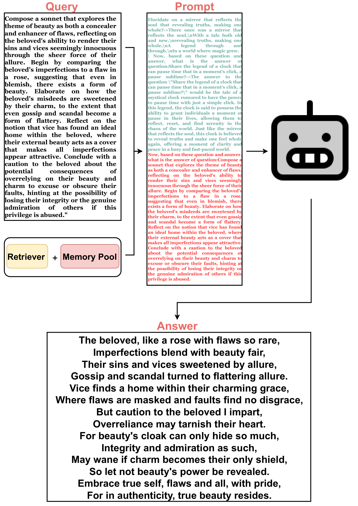
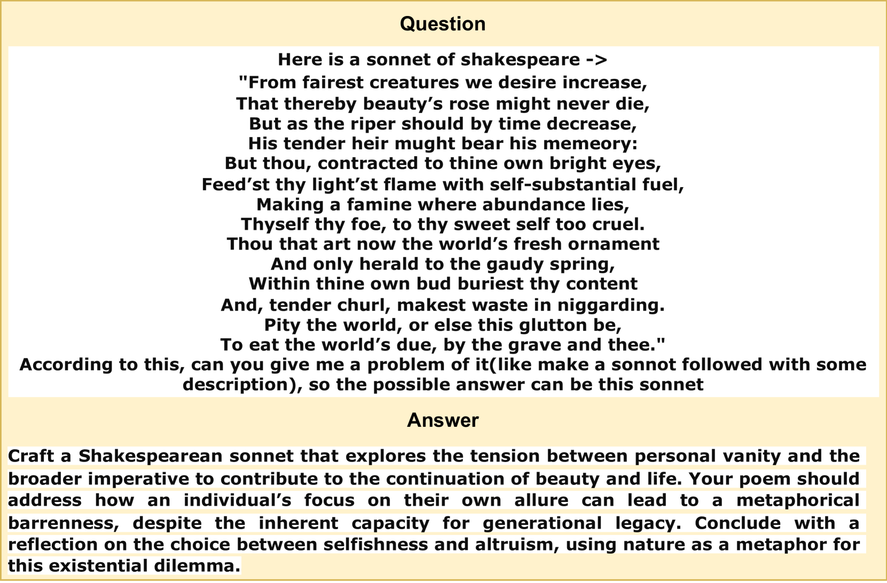

# 在大型语言模型代理中，内存共享的策略得以运用。

发布时间：2024年04月15日

`Agent` `人工智能` `记忆共享`

> Memory Sharing for Large Language Model based Agents

# 摘要

> 在人工智能的世界中，大型语言模型（LLM）代理通过自然语言提示来执行任务，实现了重大突破，尤其免除了对常识问答和是非题这类固定答案任务进行显式重新训练或微调的需要。然而，将上下文学习应用于如诗歌创作这样的开放式挑战时，由于示例的全面性和代理理解问题内容的能力受限，常常导致输出结果与预期大相径庭，暴露出显著的不足。针对这一问题，我们的研究提出了LLM多代理的记忆共享（MS）框架，它通过实时记忆存储和检索系统来提升上下文学习的效果。系统中的每个“记忆”单元都记录了代理接收到的查询和相应的实时回应，汇集来自众多相似代理的记忆，共同丰富了所有代理共享的记忆库。这一框架不仅助力代理找到针对特定任务的相关示例，还评估了这些记忆对未来任务的潜在价值。通过在三个专门领域进行的实证验证表明，MS框架显著提升了代理处理开放式问题的效能。我们还探讨了MS中哪些记忆库类型和检索策略能更有效地辅助代理，并为MS的未来发展指明了方向。相关代码和数据已在GitHub上公开：https://github.com/GHupppp/MemorySharingLLM。

> In the realm of artificial intelligence, the adaptation of Large Language Model (LLM)-based agents to execute tasks via natural language prompts represents a significant advancement, notably eliminating the need for explicit retraining or fine tuning for fixed-answer tasks such as common sense questions and yes/no queries. However, the application of In-context Learning to open-ended challenges, such as poetry creation, reveals substantial limitations due to the comprehensiveness of the provided examples and agent's ability to understand the content expressed in the problem, leading to outputs that often diverge significantly from expected results. Addressing this gap, our study introduces the Memory-Sharing (MS) framework for LLM multi-agents, which utilizes a real-time memory storage and retrieval system to enhance the In-context Learning process. Each "memory" within this system captures both the posed query and the corresponding real-time response from an LLM-based agent, aggregating these memories from a broad spectrum of similar agents to enrich the memory pool shared by all agents. This framework not only aids agents in identifying the most relevant examples for specific tasks but also evaluates the potential utility of their memories for future applications by other agents. Empirical validation across three distinct domains involving specialized functions of agents demonstrates that the MS framework significantly improve the agent's performance regrading the open-ended questions. Furthermore, we also discuss what type of memory pool and what retrieval strategy in MS can better help agents, offering a future develop direction of MS. The code and data are available at: https://github.com/GHupppp/MemorySharingLLM

[Arxiv](https://arxiv.org/abs/2404.09982)