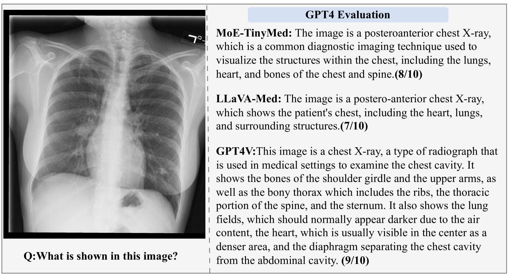
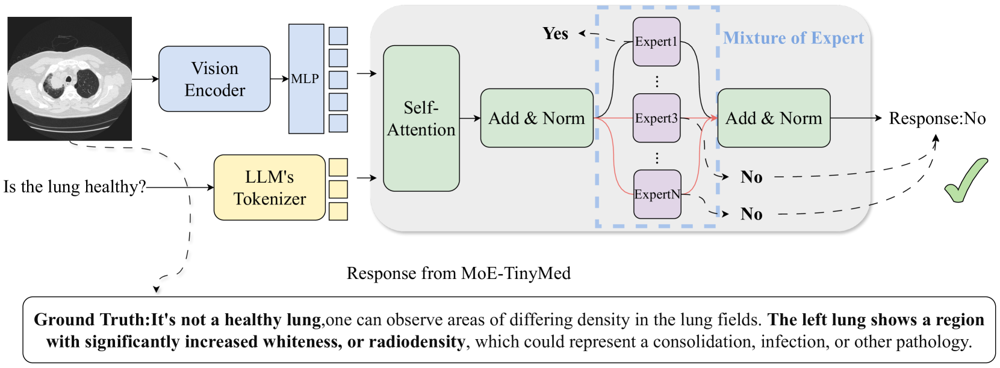
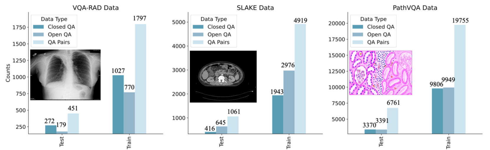
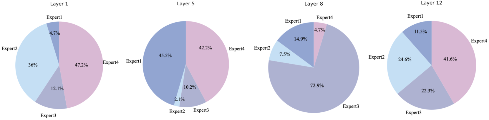
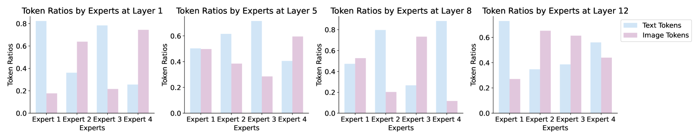

# MoE-TinyMed：面向小型医疗领域的大型视觉-语言模型的专家融合方法

发布时间：2024年04月15日

`LLM应用` `资源受限`

> MoE-TinyMed: Mixture of Experts for Tiny Medical Large Vision-Language Models

# 摘要

> MoE-Tuning技术显著提升了参数更少的通用MLLMs的性能。但其在资源受限的医疗场景下的应用还未充分挖掘。为此，我们量身打造了MoE-TinyMed模型，专为医疗场景设计，大幅减少了参数消耗。在VQA-RAD、SLAKE和Path-VQA数据集上的测试结果显示，MoE-TinyMed仅凭3.6B参数就在所有Med-VQA封闭环境中超越了LLaVA-Med。更令人振奋的是，一个仅含2B参数的简化版MoE-TinyMed在PathVQA任务中也实现了对LLaVA-Med性能的超越，证明了其在资源受限的医疗领域中的高效性。

> Mixture of Expert Tuning (MoE-Tuning) has effectively enhanced the performance of general MLLMs with fewer parameters, yet its application in resource-limited medical settings has not been fully explored. To address this gap, we developed MoE-TinyMed, a model tailored for medical applications that significantly lowers parameter demands. In evaluations on the VQA-RAD, SLAKE, and Path-VQA datasets, MoE-TinyMed outperformed LLaVA-Med in all Med-VQA closed settings with just 3.6B parameters. Additionally, a streamlined version with 2B parameters surpassed LLaVA-Med's performance in PathVQA, showcasing its effectiveness in resource-limited healthcare settings.

[Arxiv](https://arxiv.org/abs/2404.10237)