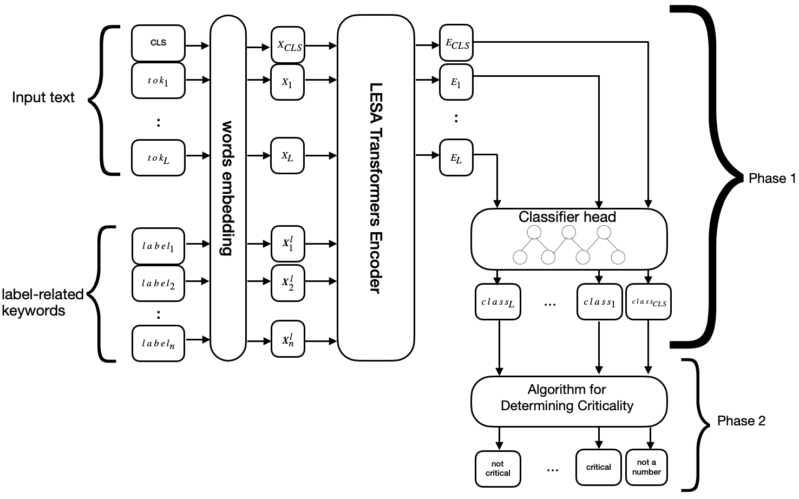
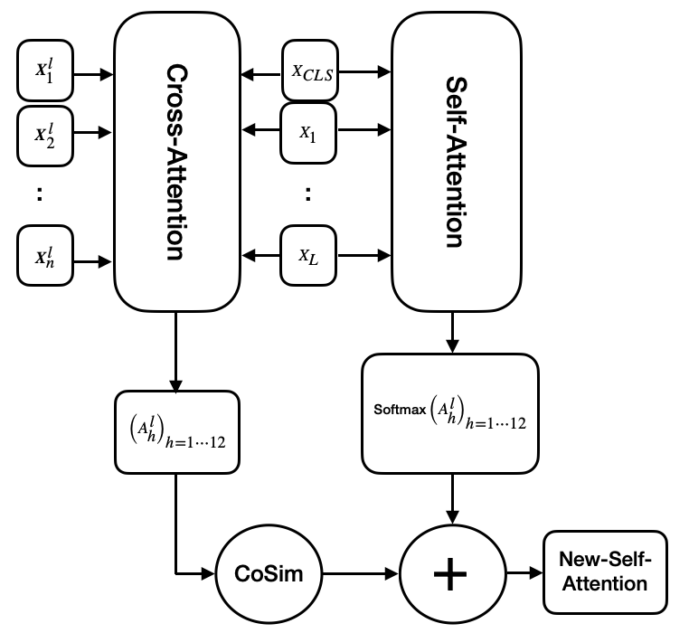
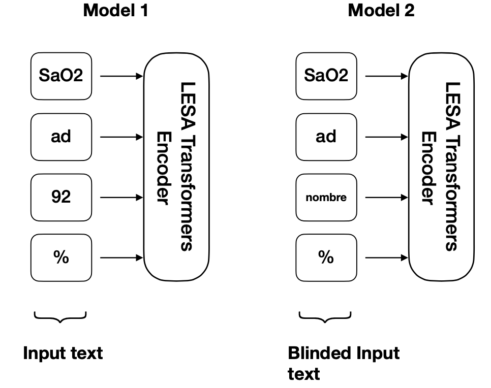
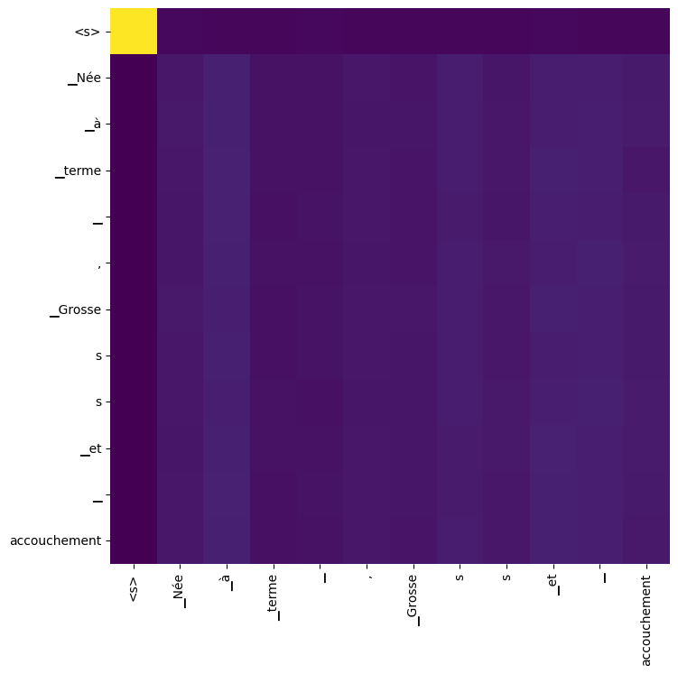
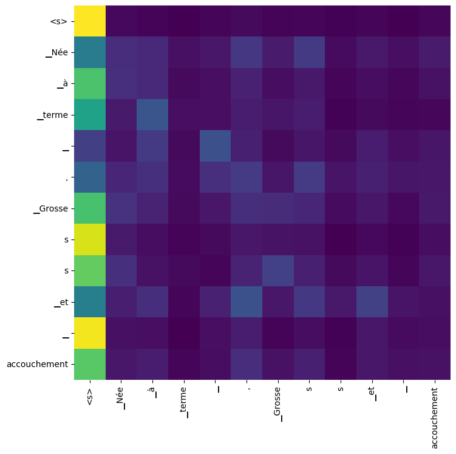
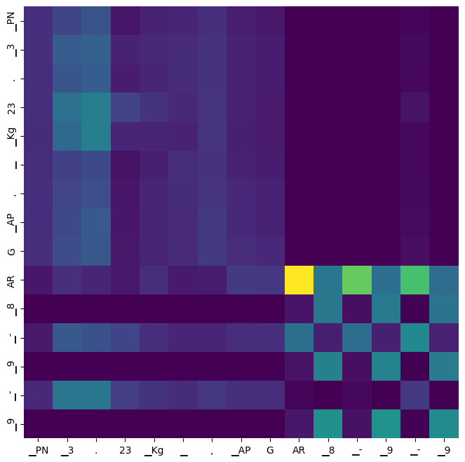
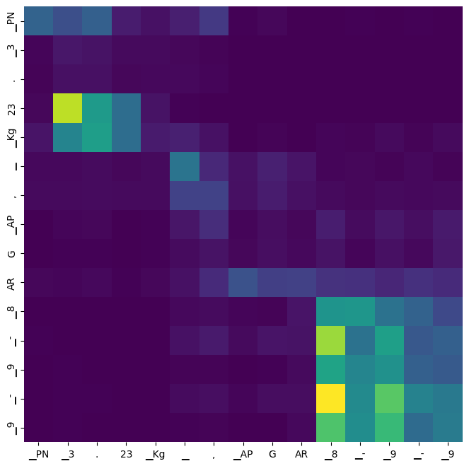
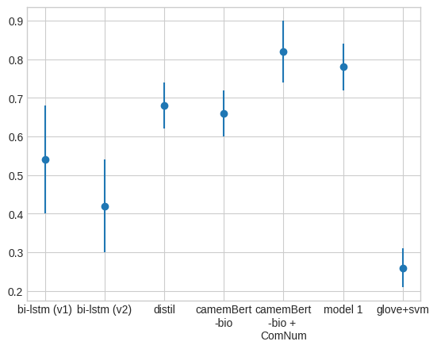
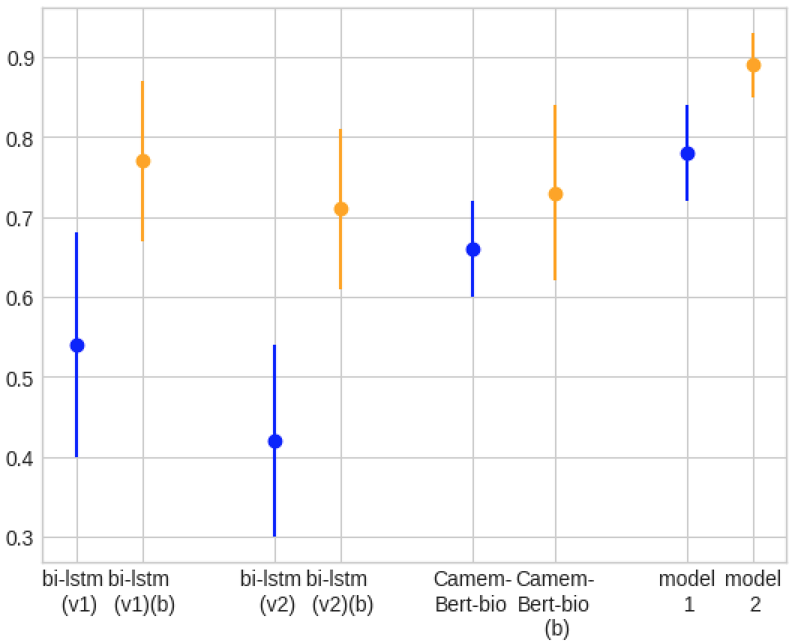

# 利用 LESA-CamemBERT-bio 方法，通过临床叙述学习数值属性以诊断心脏衰竭

发布时间：2024年04月15日

`LLM应用`

> Numerical Attributes Learning for Cardiac Failure Diagnostic from Clinical Narratives - A LESA-CamemBERT-bio Approach

# 摘要

> 医护人员记录的病历蕴含丰富的诊断关键信息，但受限于专业术语复杂性、大型语言模型对数值理解不足及训练数据集规模限制，其价值尚未完全显现。本研究致力于利用CamemBERT-bio模型对医疗文档中的数值数据进行分类，覆盖七种生理类别。尽管先前研究认为变换器模型在此类任务上的表现可能不及传统NLP模型，我们通过两项创新性改进提升了模型性能：一是将关键词嵌入整合入模型，二是采取排除所有数值数据的策略，使模型对数字不敏感。我们实施标签嵌入技术以优化注意力机制，并通过“数值忽略”数据集强化上下文学习。此外，我们还评估了数值数据的重要性，通过验证其是否符合标准范围来实现。研究结果显示，CamemBERT-bio的效能显著提升，F1得分达到0.89，较传统方法的0.73提高了逾20%，相较于最先进方法的0.82也提升了9%以上。

> Medical records created by healthcare professionals upon patient admission are rich in details critical for diagnosis. Yet, their potential is not fully realized because of obstacles such as complex medical language, inadequate comprehension of medical numerical data by state-of-the-art Large Language Models (LLMs), and the limitations imposed by small annotated training datasets. This research aims to classify numerical values extracted from medical documents across seven distinct physiological categories, employing CamemBERT-bio. Previous studies suggested that transformer-based models might not perform as well as traditional NLP models in such tasks. To enhance CamemBERT-bio's performances, we introduce two main innovations: integrating keyword embeddings into the model and adopting a number-agnostic strategy by excluding all numerical data from the text. The implementation of label embedding techniques refines the attention mechanisms, while the technique of using a `numerical-blind' dataset aims to bolster context-centric learning. Another key component of our research is determining the criticality of extracted numerical data. To achieve this, we utilized a simple approach that involves verifying if the value falls within the established standard ranges Our findings are encouraging, showing substantial improvements in the effectiveness of CamemBERT-bio, surpassing conventional methods with an F1 score of 0.89. This represents an over 20\% increase over the 0.73 $F_1$ score of traditional approaches and an over 9\% increase over the 0.82 $F_1$ score of state-of-the-art approaches.

[Arxiv](https://arxiv.org/abs/2404.10171)