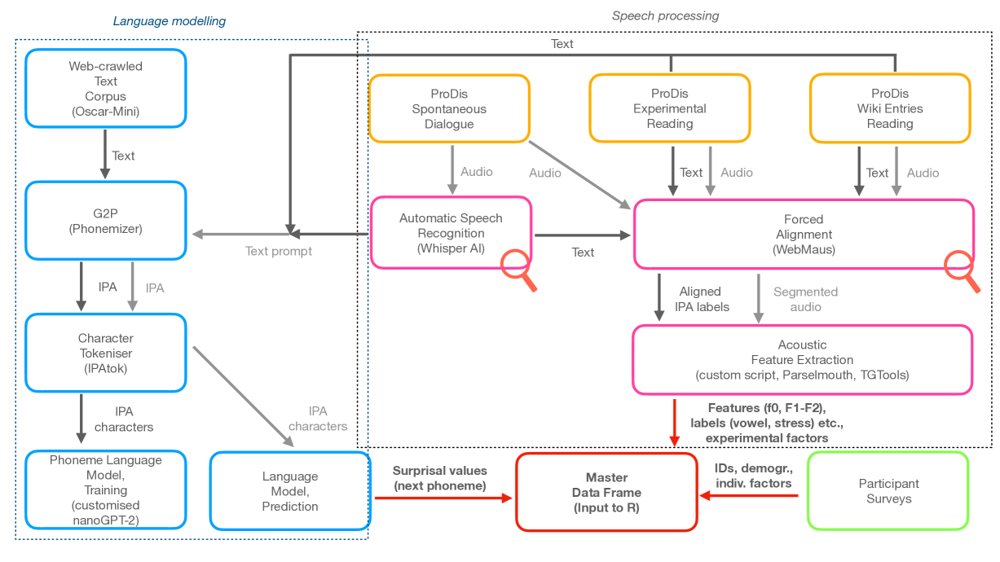

# PRODIS 是一个语音数据库，它配备了基于音素的语言模型，专门用于探究波兰语中的可预测性效应。

发布时间：2024年04月15日

`Agent` `语音识别` `语音合成`

> PRODIS - a speech database and a phoneme-based language model for the study of predictability effects in Polish

# 摘要

> 我们推出了一个波兰语语音数据库和音素级语言模型，专为探究韵律和话语因素及其与可预测性效应互动时对声学参数的作用而设计。这是首个大规模、公开获取且音质卓越的波兰语语料库，适用于进行语音分析和训练多说话人语音技术系统。该数据库的语音处理流程自动化程度高达90%，并融合了最先进的免费工具，便于数据库扩展或适配其他语言。

> We present a speech database and a phoneme-level language model of Polish. The database and model are designed for the analysis of prosodic and discourse factors and their impact on acoustic parameters in interaction with predictability effects. The database is also the first large, publicly available Polish speech corpus of excellent acoustic quality that can be used for phonetic analysis and training of multi-speaker speech technology systems. The speech in the database is processed in a pipeline that achieves a 90% degree of automation. It incorporates state-of-the-art, freely available tools enabling database expansion or adaptation to additional languages.

[Arxiv](https://arxiv.org/abs/2404.10112)