# 针对移动设备的大型语言模型，采用个性化协同微调技术

发布时间：2024年04月15日

`LLM应用` `联邦学习` `移动计算`

> Personalized Collaborative Fine-Tuning for On-Device Large Language Models

# 摘要

> 本研究针对本地数据有限的挑战，提出了一种在设备上对大型语言模型进行自监督协作微调的新方法。借鉴协作学习的理念，我们设计了三种信任加权梯度聚合策略：权重相似、预测相似和验证性能驱动。通过整合低秩适应技术（LoRA）并仅交换LoRA权重更新，我们大幅降低了通信成本。在多样化本地数据的真实场景中，我们的方案在预测和性能指标的驱动下，不仅超越了传统的FedAvg方法，也优于本地微调，有效应对了数据集内部的异质性和数据稀缺问题。

> We explore on-device self-supervised collaborative fine-tuning of large language models with limited local data availability. Taking inspiration from the collaborative learning community, we introduce three distinct trust-weighted gradient aggregation schemes: weight similarity-based, prediction similarity-based and validation performance-based. To minimize communication overhead, we integrate Low-Rank Adaptation (LoRA) and only exchange LoRA weight updates. Our protocols, driven by prediction and performance metrics, surpass both FedAvg and local fine-tuning methods, which is particularly evident in realistic scenarios with more diverse local data distributions. The results underscore the effectiveness of our approach in addressing heterogeneity and scarcity within local datasets.

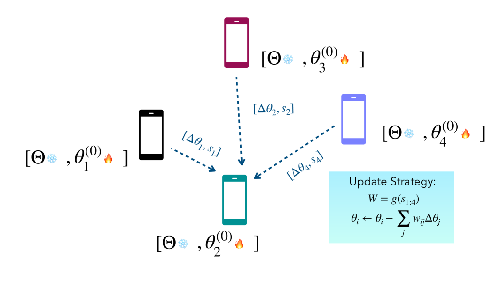

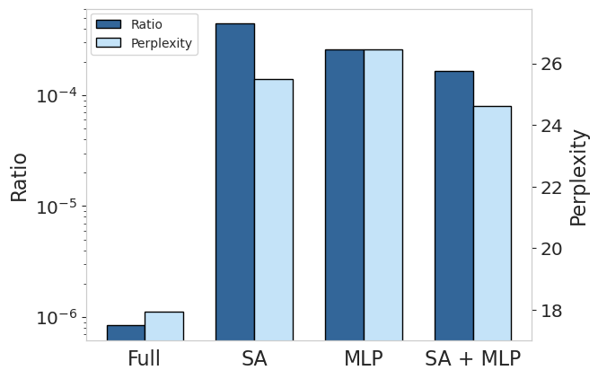

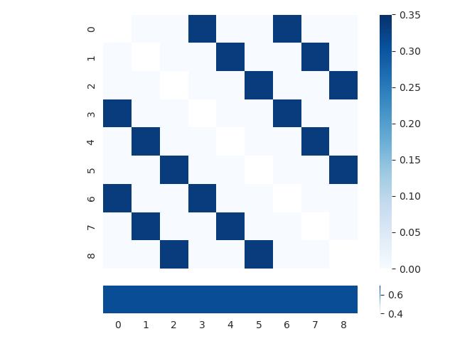

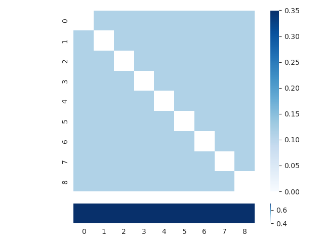

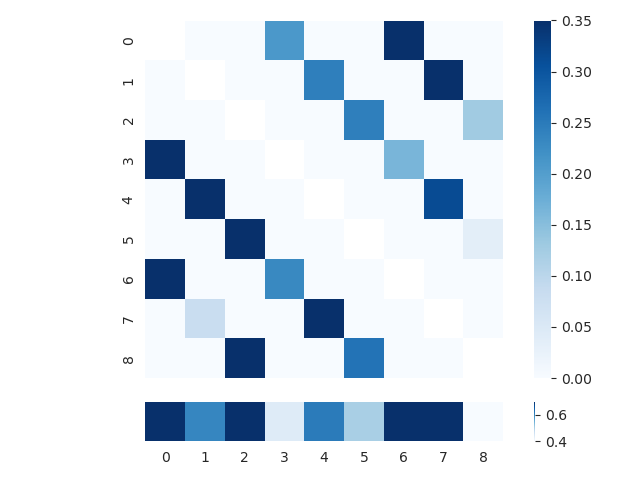

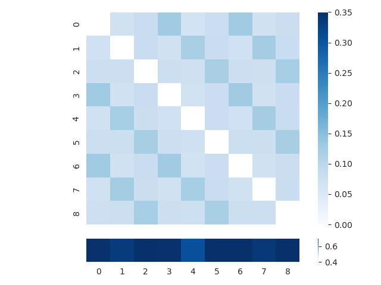

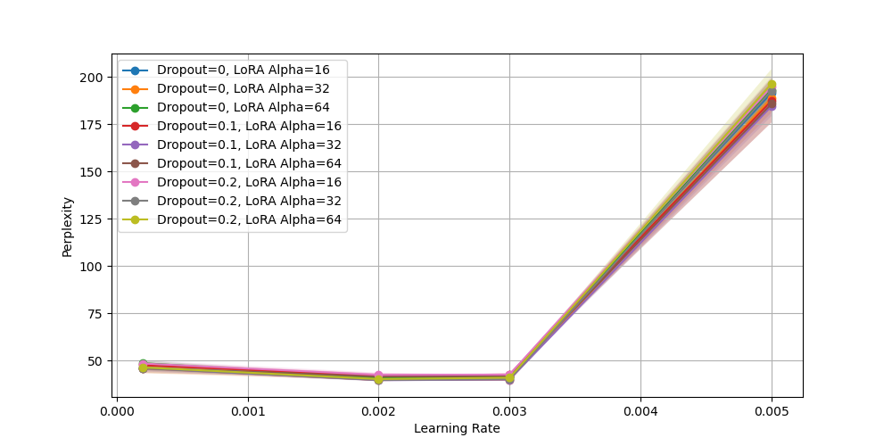

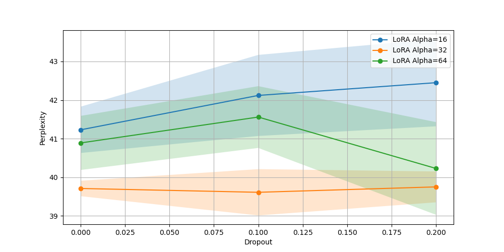

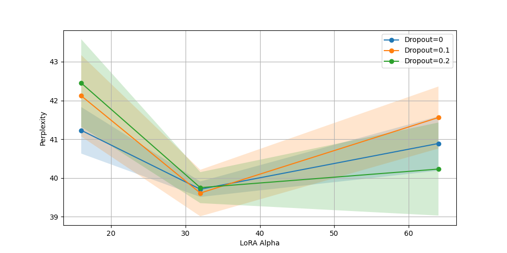

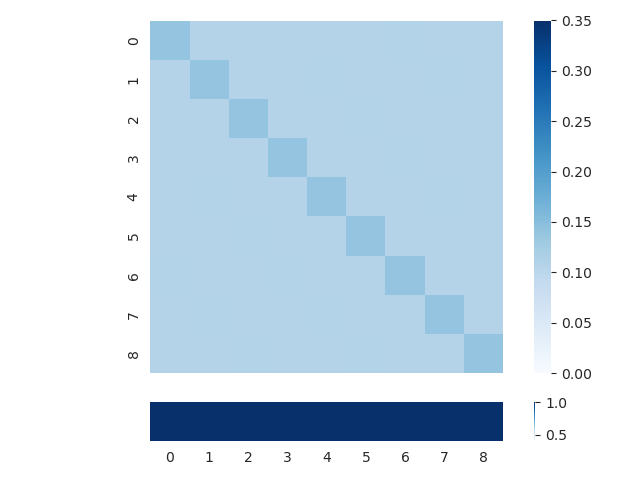

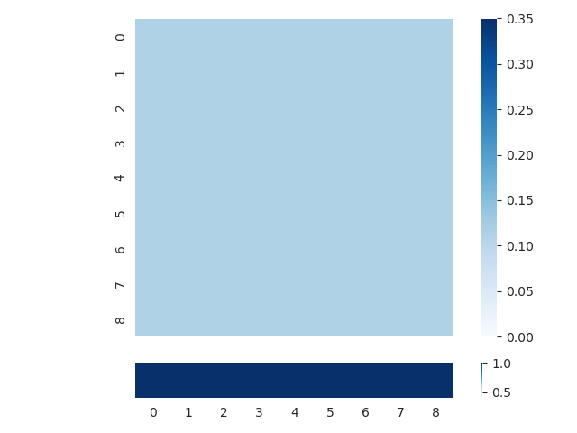

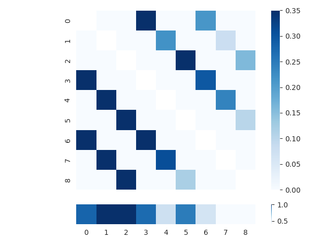

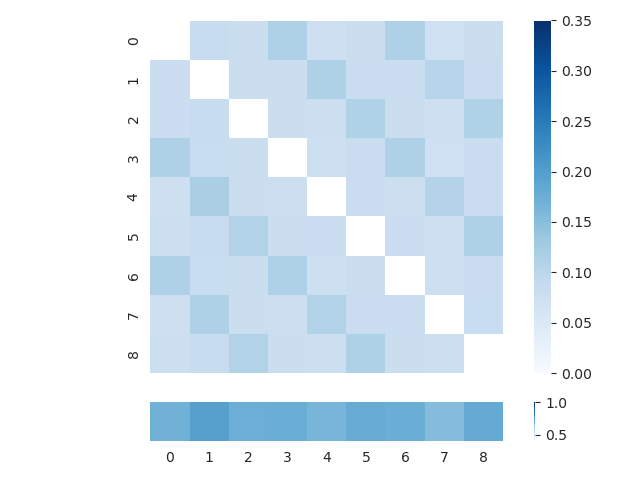

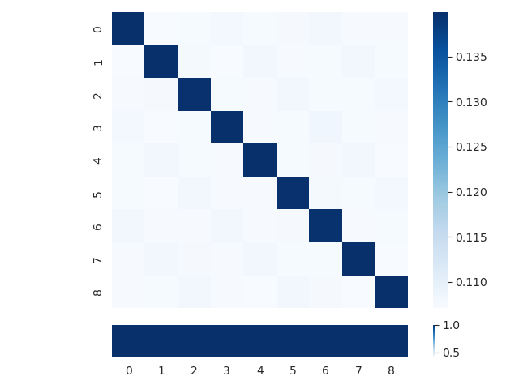

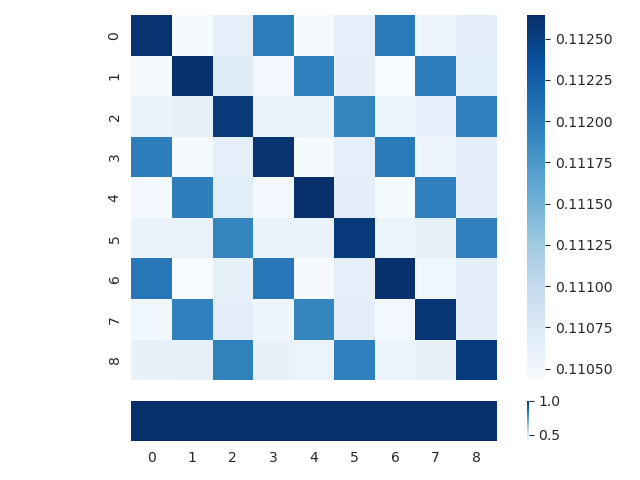

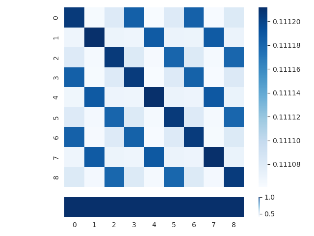

[Arxiv](https://arxiv.org/abs/2404.09753)