# 预打包技术：轻松实现大型语言模型的快速填充与吞吐量提升

发布时间：2024年04月15日

`LLM应用` `变换器驱动` `大型语言模型`

> Prepacking: A Simple Method for Fast Prefilling and Increased Throughput in Large Language Models

# 摘要

> 在变换器驱动的大型语言模型（LLM）推理阶段，预填充即是在自动生成文本前，为提示中的输入标记预先计算键值（KV）缓存。然而，面对较长的输入提示，预填充会带来显著的时间成本。本研究揭示了预填充的一个主要问题：在处理提示长度差异较大的批次时，传统的序列填充至最长度做法会导致大量计算资源的浪费。随着LLM能够处理的上下文长度不断增加，甚至可能达到千万级别，批次内提示长度的不一致性问题愈发凸显。为应对这一挑战，我们提出了一种名为“预打包”的优化方法，它简单却效果显著。预打包通过装箱算法将不同长度的提示合并为一个序列，并避免在填充标记上进行重复计算，从而在单个序列中为多个提示生成多个预填充的KV缓存。我们对标准数据集中长度不一的提示进行了测试，结果显示，与Huggingface的默认填充方法相比，预打包在多种基础模型配置和推理服务场景下，都显著提升了速度和内存效率。

> During inference for transformer-based large language models (LLM), prefilling is the computation of the key-value (KV) cache for input tokens in the prompt prior to autoregressive generation. For longer input prompt lengths, prefilling will incur a significant overhead on decoding time. In this work, we highlight the following pitfall of prefilling: for batches containing high-varying prompt lengths, significant computation is wasted by the standard practice of padding sequences to the maximum length. As LLMs increasingly support longer context lengths, potentially up to 10 million tokens, variations in prompt lengths within a batch become more pronounced. To address this, we propose Prepacking, a simple yet effective method to optimize prefilling computation. To avoid redundant computation on pad tokens, prepacking combines prompts of varying lengths into a sequence and packs multiple sequences into a compact batch using a bin-packing algorithm. It then modifies the attention mask and positional encoding to compute multiple prefilled KV-caches for multiple prompts within a single sequence. On standard curated dataset containing prompts with varying lengths, we obtain a significant speed and memory efficiency improvements as compared to the default padding-based prefilling computation within Huggingface across a range of base model configurations and inference serving scenarios.

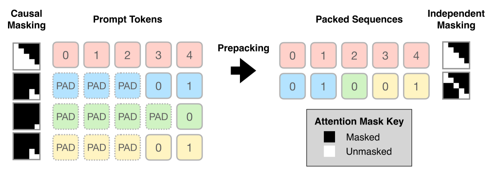

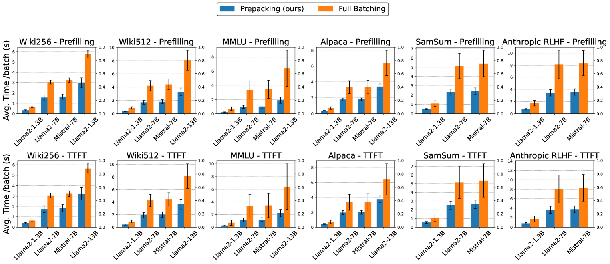

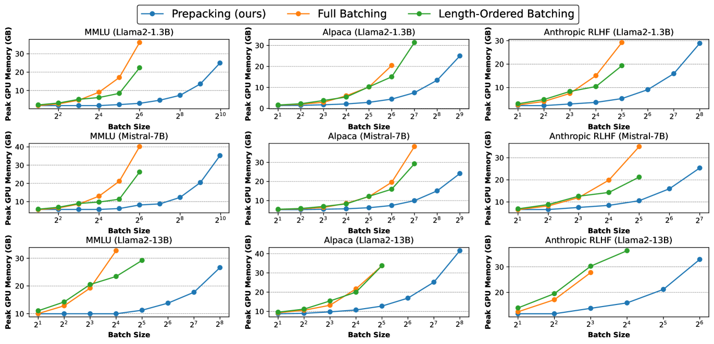

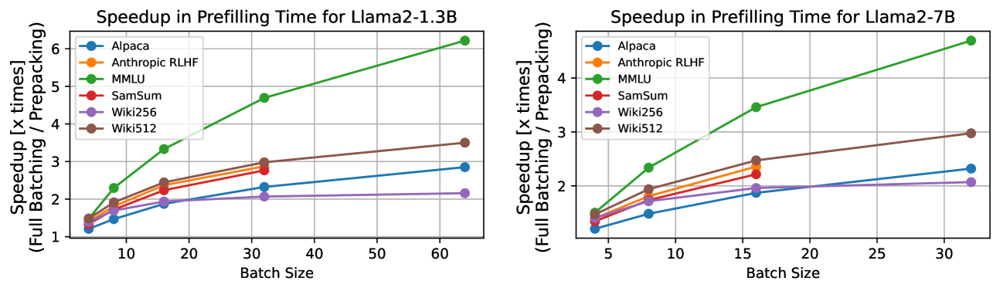

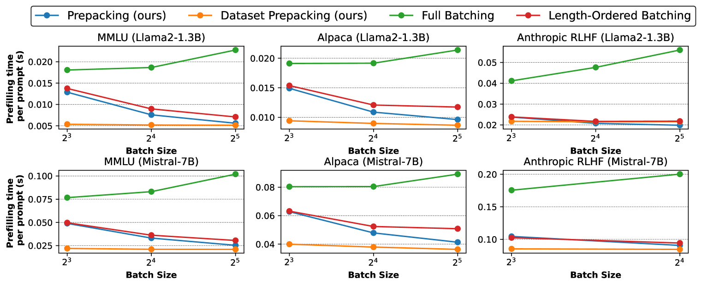

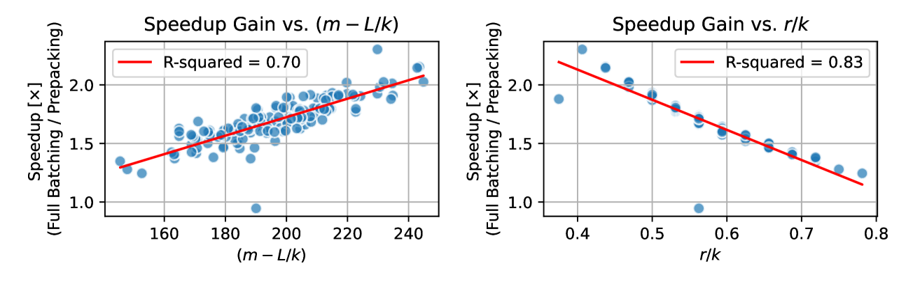

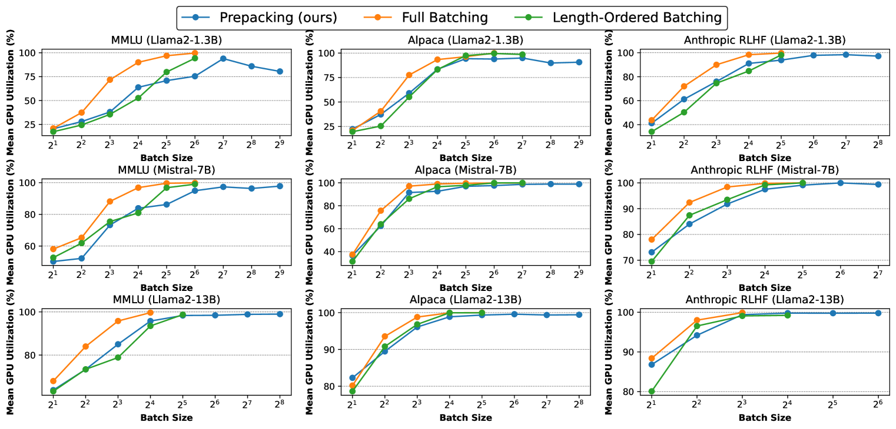

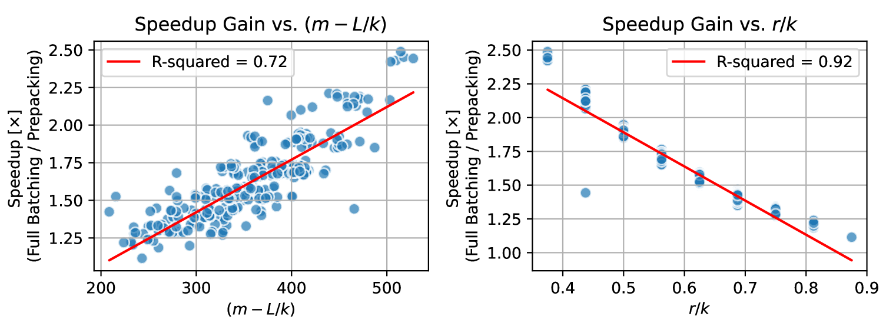

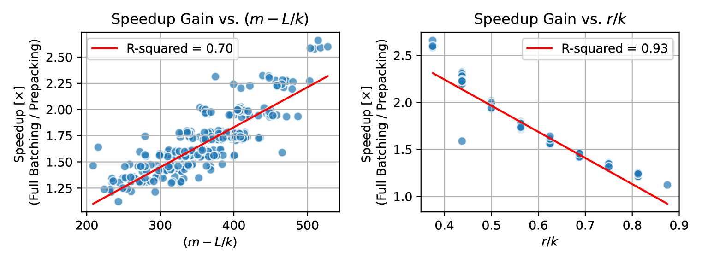

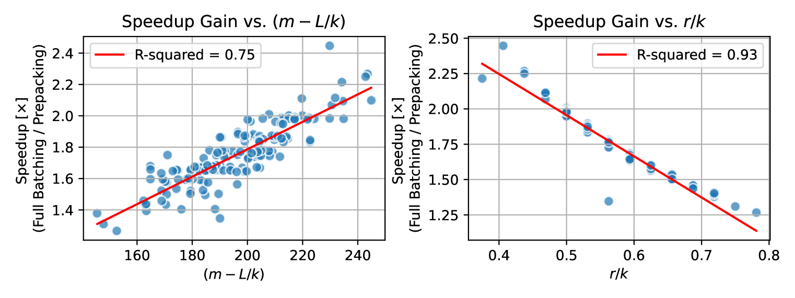

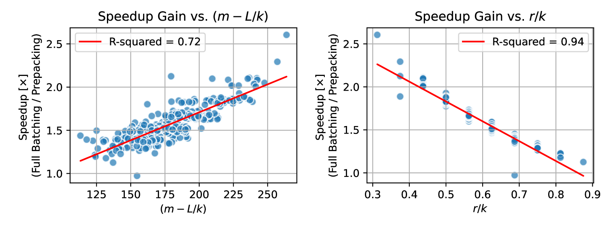

[Arxiv](https://arxiv.org/abs/2404.09529)