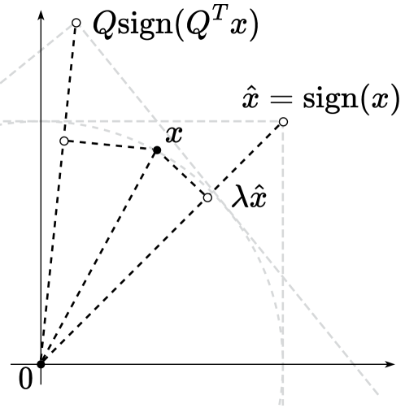
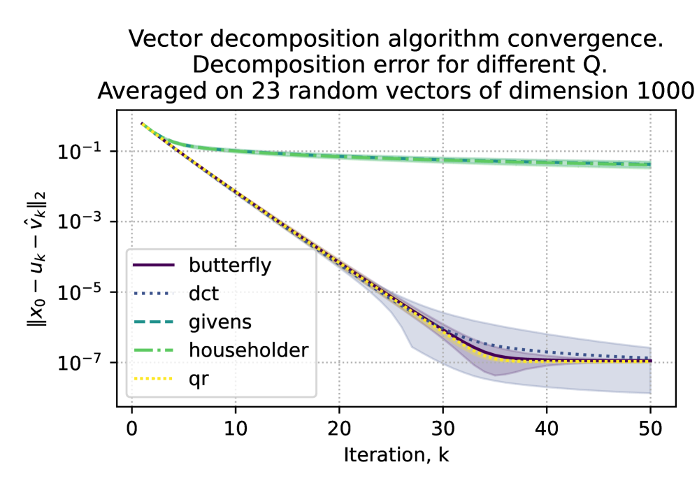
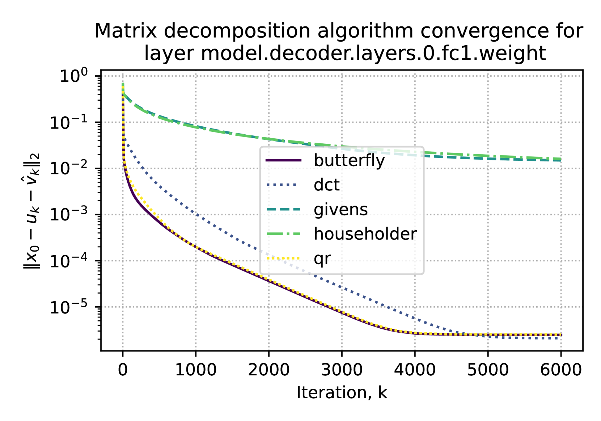
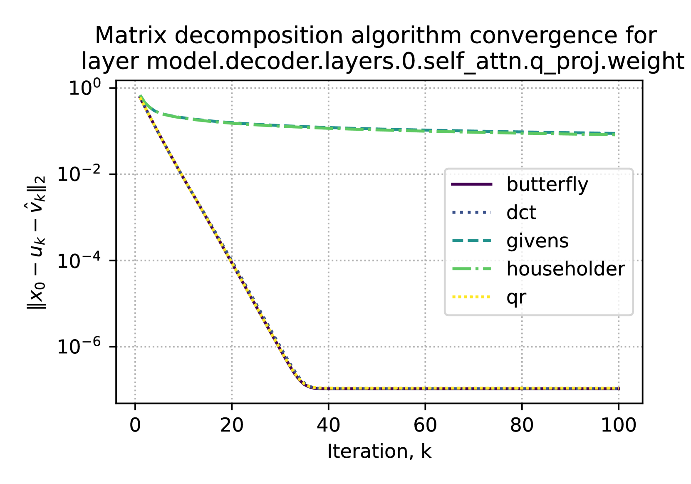
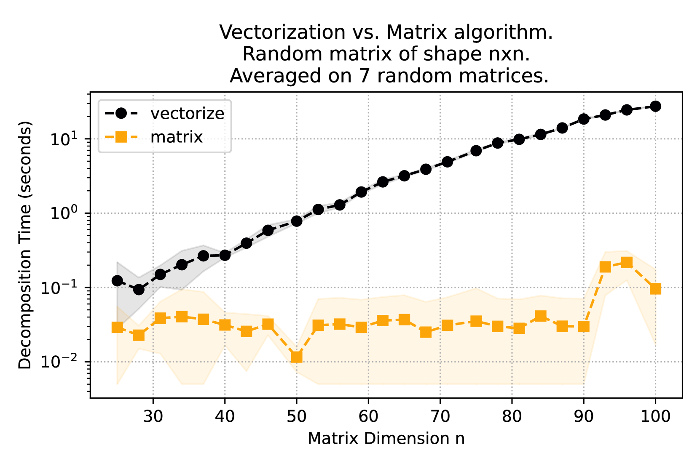
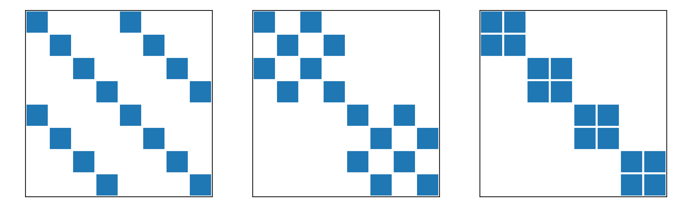
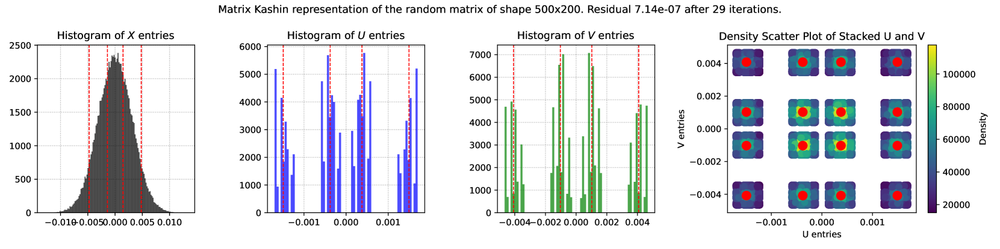
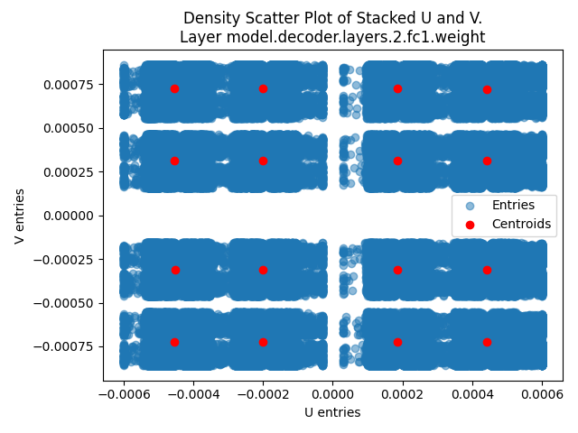
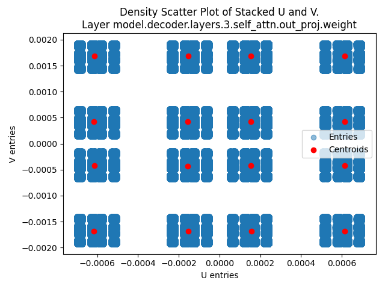
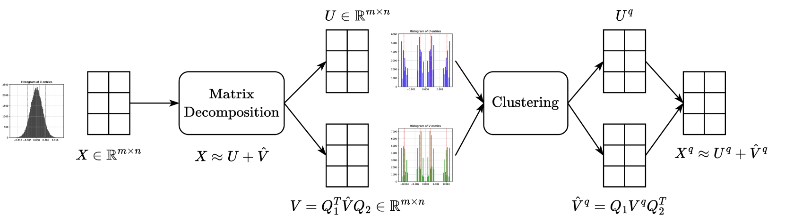

# 通过过定基数基实现大型语言模型的量化

发布时间：2024年04月15日

`LLM理论` `数据压缩`

> Quantization of Large Language Models with an Overdetermined Basis

# 摘要

> 本文提出了一种新颖的数据量化算法，其灵感源自Kashin表示法。该算法通过将向量、矩阵或张量分解为两个特定因子来实现，其中第一个因子具有较小的无穷范数，第二个因子在与正交矩阵相乘后也展现出受限的范数。有趣的是，分解后的因子值在若干高峰值附近高度聚集，这便于我们用质心进行有效替换，实现量化。我们对这一方法的理论特性进行了深入研究，并通过下一词预测任务及一系列文本分类任务，对我们的压缩算法进行了严格验证。研究结果显示，Kashin量化技术在保障数据压缩的同时，能够带来与现有技术相媲美甚至更优的模型性能，这在数据量化领域无疑是一大突破。

> In this paper, we introduce an algorithm for data quantization based on the principles of Kashin representation. This approach hinges on decomposing any given vector, matrix, or tensor into two factors. The first factor maintains a small infinity norm, while the second exhibits a similarly constrained norm when multiplied by an orthogonal matrix. Surprisingly, the entries of factors after decomposition are well-concentrated around several peaks, which allows us to efficiently replace them with corresponding centroids for quantization purposes. We study the theoretical properties of the proposed approach and rigorously evaluate our compression algorithm in the context of next-word prediction tasks and on a set of downstream tasks for text classification. Our findings demonstrate that Kashin Quantization achieves competitive or superior quality in model performance while ensuring data compression, marking a significant advancement in the field of data quantization.

[Arxiv](https://arxiv.org/abs/2404.09737)