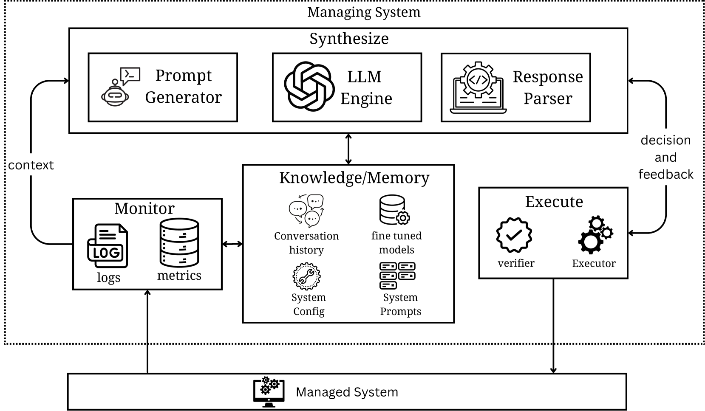
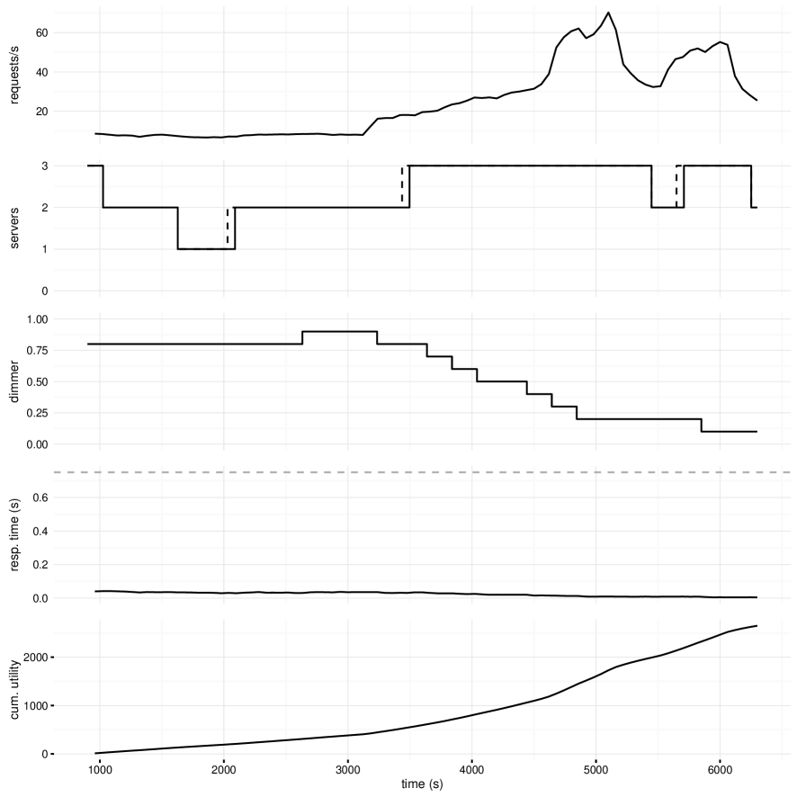

# 在大型语言模型时代，重新构想自我适应的概念

发布时间：2024年04月15日

`RAG` `软件工程` `自适应系统`

> Reimagining Self-Adaptation in the Age of Large Language Models

# 摘要

> 现代软件系统常遭遇环境变化等不确定性挑战，自我适应技术因此成为解决之道。尽管机器学习技术在自我适应方面取得了进展，但仍受限于训练样本需求和泛化能力等约束。生成性人工智能（GenAI）的最新发展，尤其是基于海量数据训练的大型语言模型（LLMs），为解释不确定性和制定适应策略带来了新机遇。本文展望了利用LLMs提升软件架构适应性的有效性和效率。借鉴人类操作员的能力，我们认为LLMs能通过其卓越的自然语言处理功能，自主生成适应性强的策略。这使得软件系统能够洞悉自身运行状态，并根据架构需求及环境变化进行适应调整。通过融合LLMs至自适应系统架构，我们实现了类似人类的细致决策过程。SWIM示范系统的案例研究显示，LLMs有望应对多样化的适应场景。研究结果揭示，GenAI在增强软件系统的动态适应性和韧性方面大有可为。

> Modern software systems are subjected to various types of uncertainties arising from context, environment, etc. To this end, self-adaptation techniques have been sought out as potential solutions. Although recent advances in self-adaptation through the use of ML techniques have demonstrated promising results, the capabilities are limited by constraints imposed by the ML techniques, such as the need for training samples, the ability to generalize, etc. Recent advancements in Generative AI (GenAI) open up new possibilities as it is trained on massive amounts of data, potentially enabling the interpretation of uncertainties and synthesis of adaptation strategies. In this context, this paper presents a vision for using GenAI, particularly Large Language Models (LLMs), to enhance the effectiveness and efficiency of architectural adaptation. Drawing parallels with human operators, we propose that LLMs can autonomously generate similar, context-sensitive adaptation strategies through its advanced natural language processing capabilities. This method allows software systems to understand their operational state and implement adaptations that align with their architectural requirements and environmental changes. By integrating LLMs into the self-adaptive system architecture, we facilitate nuanced decision-making that mirrors human-like adaptive reasoning. A case study with the SWIM exemplar system provides promising results, indicating that LLMs can potentially handle different adaptation scenarios. Our findings suggest that GenAI has significant potential to improve software systems' dynamic adaptability and resilience.

[Arxiv](https://arxiv.org/abs/2404.09866)