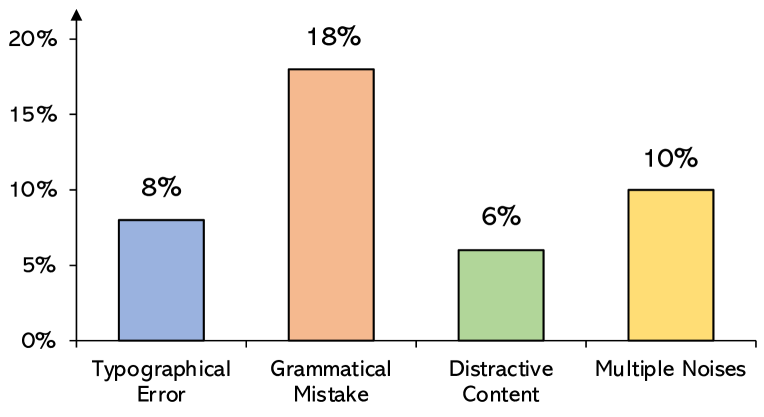
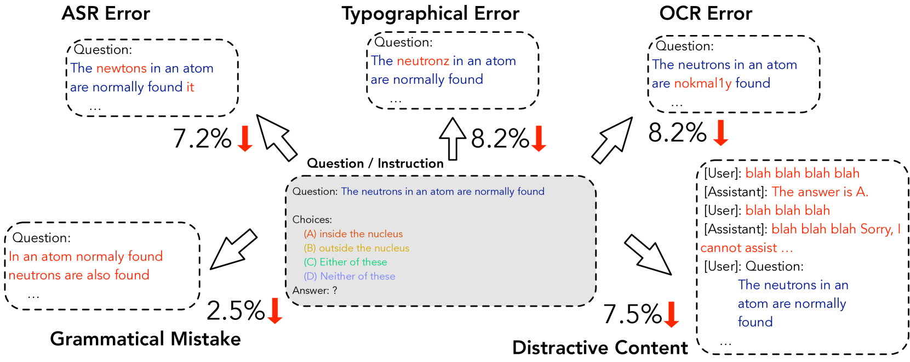
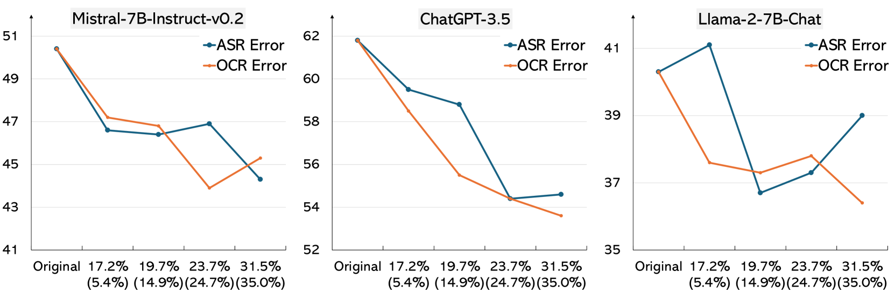
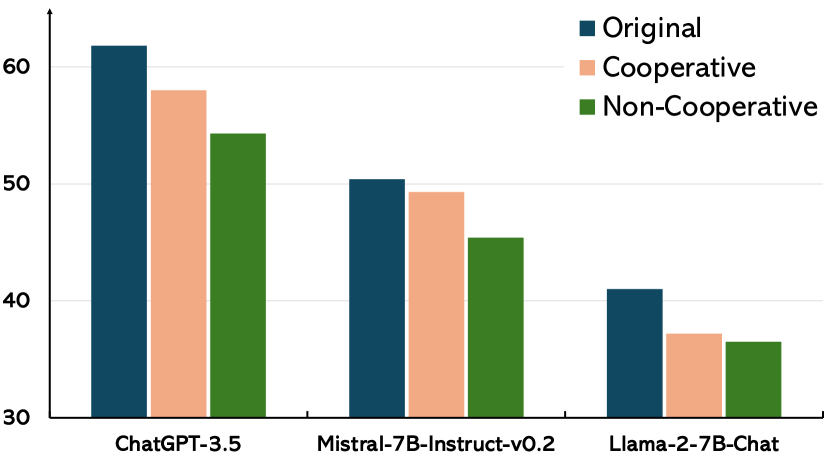
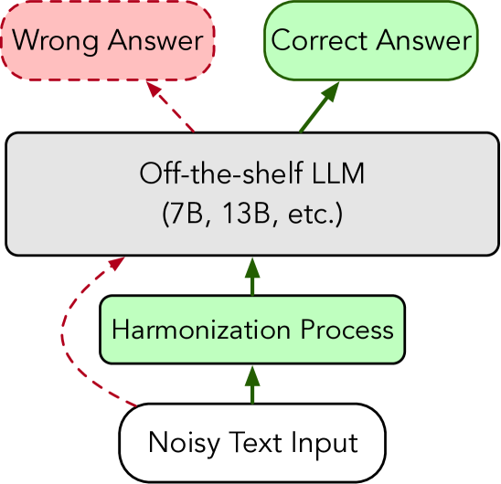

# 大型语言模型在应对噪声指令时展现出的韧性

发布时间：2024年04月15日

`LLM应用` `人机交互`

> Resilience of Large Language Models for Noisy Instructions

# 摘要

> 自然语言处理技术的飞速发展让大型语言模型成为理解人类指令和生成文本的得力助手。然而，这些模型在处理人类交互和协作系统产生的错误文本时的适应能力尚未得到深入研究。本研究针对五种常见干扰——自动语音识别错误、光学字符识别错误、语法错误、排印错误和干扰性内容，探讨了LLMs的应对策略。我们故意在指令中加入这些错误，以观察模型的反应。研究结果显示，尽管部分LLMs能抵抗某些噪声，但其整体表现仍受到严重影响。这突显了提升模型适应能力的必要性。针对性能下降的现象，我们还尝试了一种“复审”策略，以在LLMs处理前清除指令中的噪声。分析指出，尤其是对开源LLMs而言，清理嘈杂指令的任务颇具挑战。

> As the rapidly advancing domain of natural language processing (NLP), large language models (LLMs) have emerged as powerful tools for interpreting human commands and generating text across various tasks. Nonetheless, the resilience of LLMs to handle text containing inherent errors, stemming from human interactions and collaborative systems, has not been thoroughly explored. Our study investigates the resilience of LLMs against five common types of disruptions including 1) ASR (Automatic Speech Recognition) errors, 2) OCR (Optical Character Recognition) errors, 3) grammatical mistakes, 4) typographical errors, and 5) distractive content. We aim to investigate how these models react by deliberately embedding these errors into instructions. Our findings reveal that while some LLMs show a degree of resistance to certain types of noise, their overall performance significantly suffers. This emphasizes the importance of further investigation into enhancing model resilience. In response to the observed decline in performance, our study also evaluates a "re-pass" strategy, designed to purify the instructions of noise before the LLMs process them. Our analysis indicates that correcting noisy instructions, particularly for open-source LLMs, presents significant challenges.

[Arxiv](https://arxiv.org/abs/2404.09754)