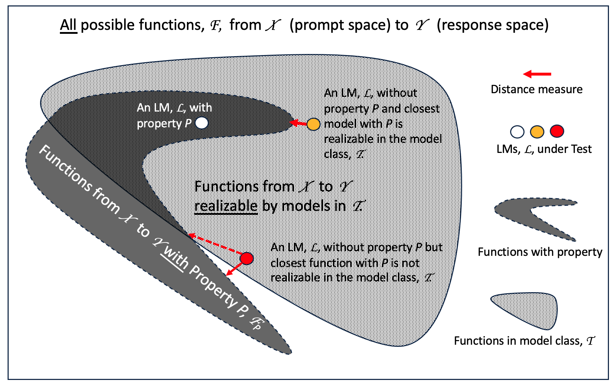
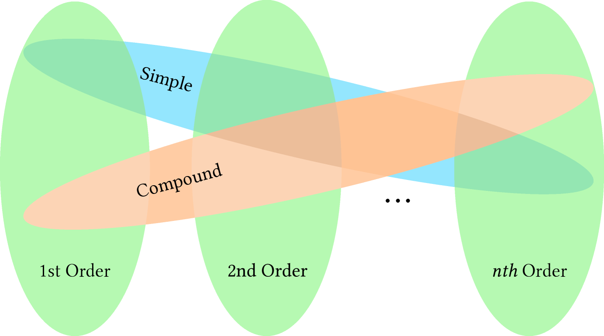
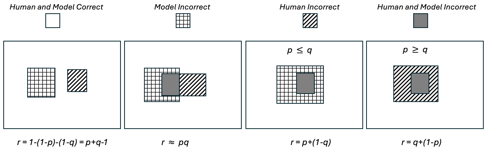
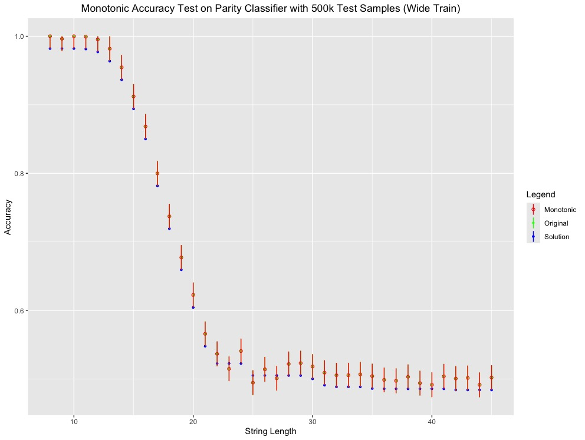
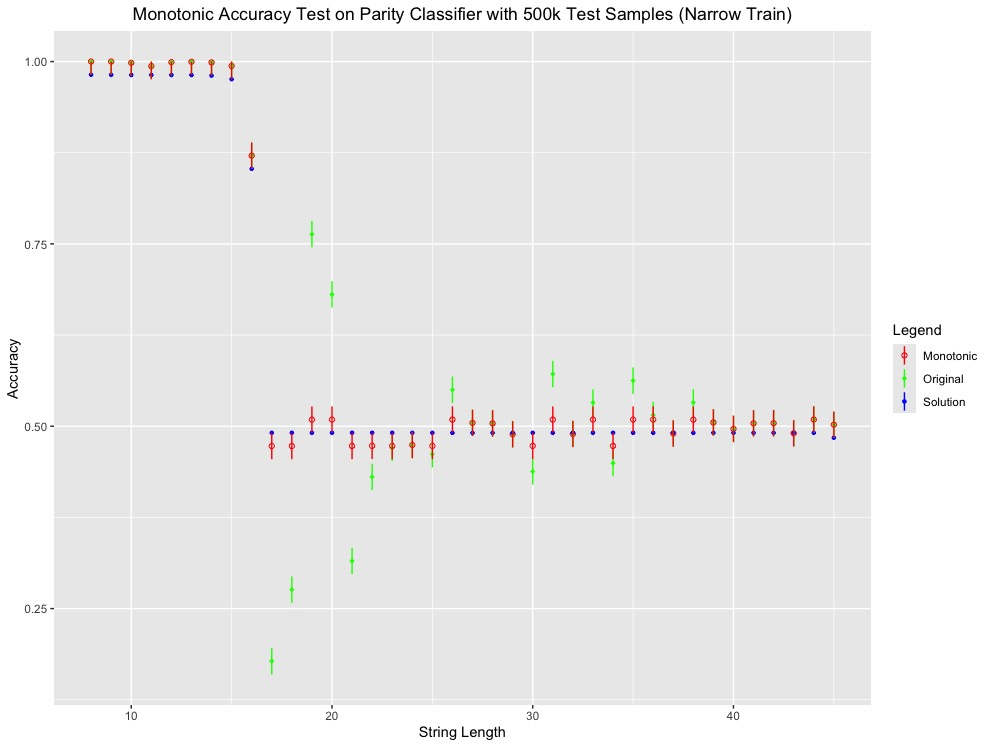

# TEL'M：对语言模型进行测试与评价的研究

发布时间：2024年04月15日

`LLM理论` `语言模型评估` `AI技术应用`

> TEL'M: Test and Evaluation of Language Models

# 摘要

> 语言模型在特定任务上展现了卓越才能，却在其他方面遭遇重大挫败。这种现象激发了对语言模型能力进行深入理解和比较的广泛兴趣，但目前的研究尝试多是临时性的，所得结论往往流于轶事。这与医疗、雷达等领域严谨的测试评估体系大相径庭。本文提出了一种名为“语言模型测试与评估”（TEL'M）的原则性评估框架，旨在全面审视语言模型在商业、政府及国家安全等关键领域的价值。我们认为，这一方法论亦可推广至其他AI技术领域，助力实现AI技术的“工业化”。

> Language Models have demonstrated remarkable capabilities on some tasks while failing dramatically on others. The situation has generated considerable interest in understanding and comparing the capabilities of various Language Models (LMs) but those efforts have been largely ad hoc with results that are often little more than anecdotal. This is in stark contrast with testing and evaluation processes used in healthcare, radar signal processing, and other defense areas. In this paper, we describe Test and Evaluation of Language Models (TEL'M) as a principled approach for assessing the value of current and future LMs focused on high-value commercial, government and national security applications. We believe that this methodology could be applied to other Artificial Intelligence (AI) technologies as part of the larger goal of "industrializing" AI.

[Arxiv](https://arxiv.org/abs/2404.10200)