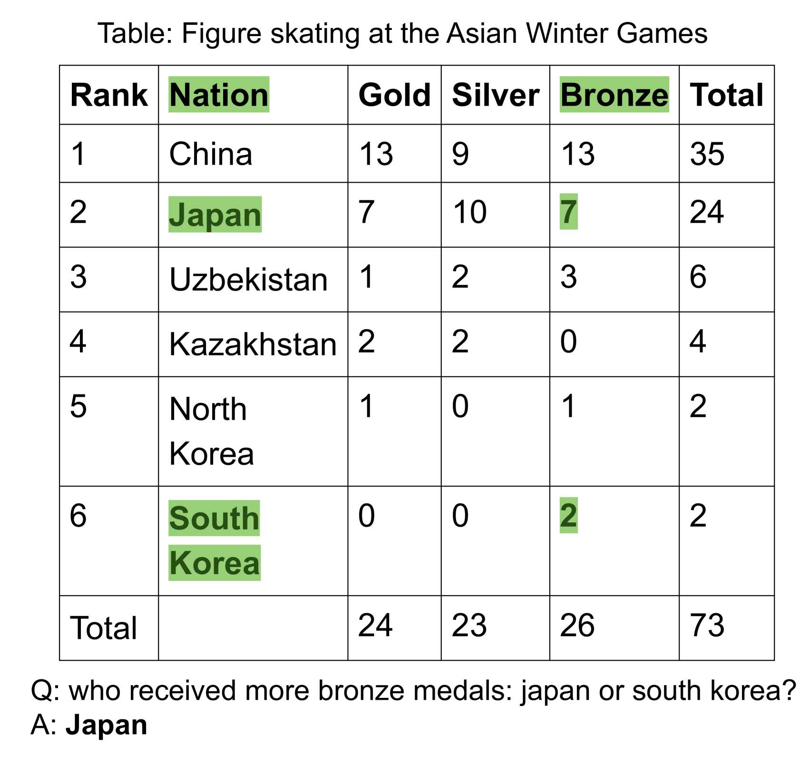
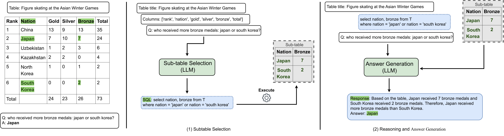
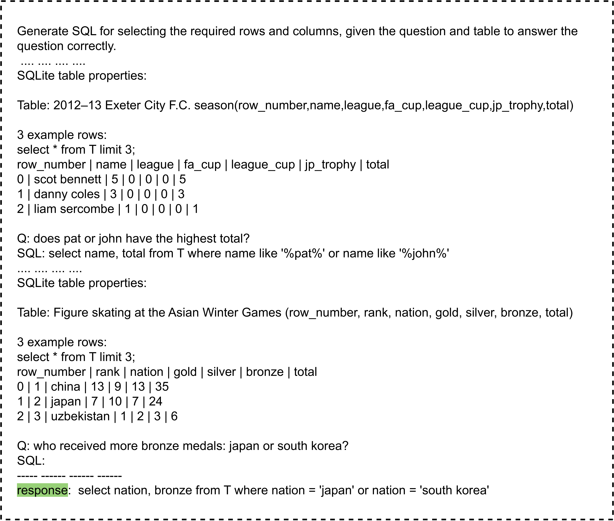
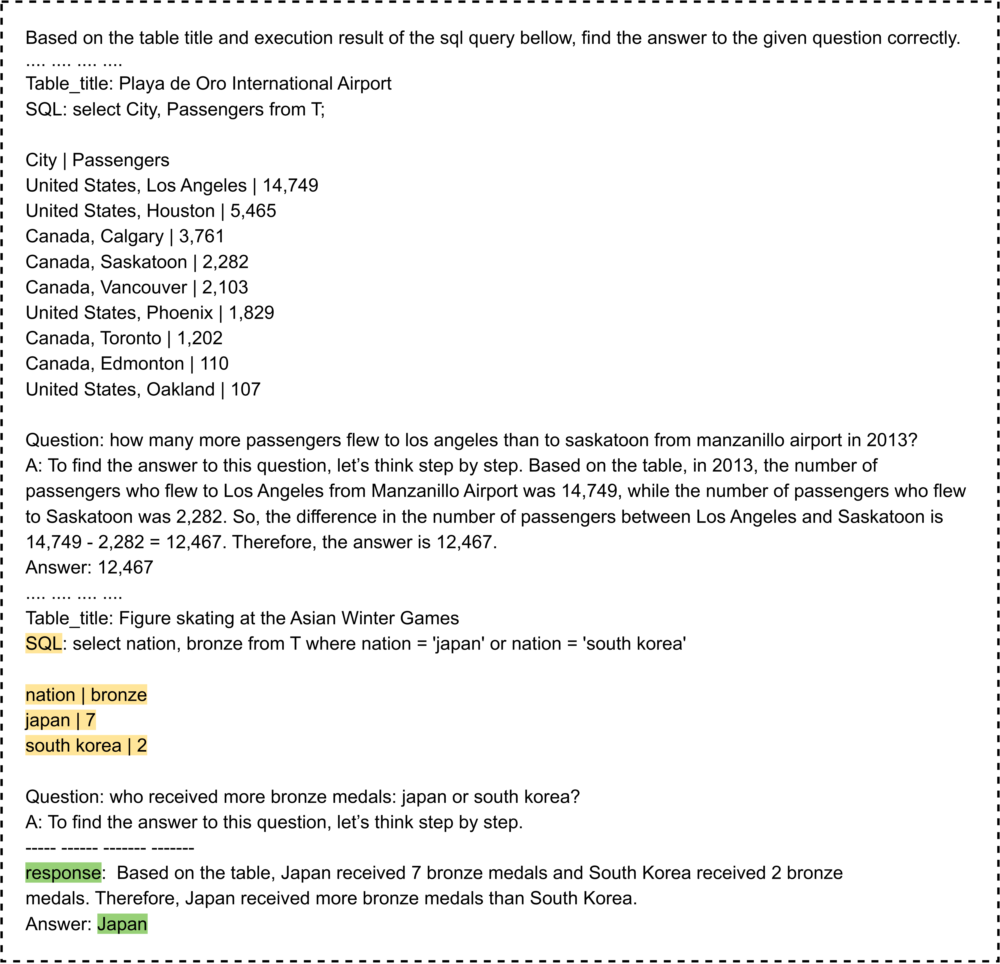
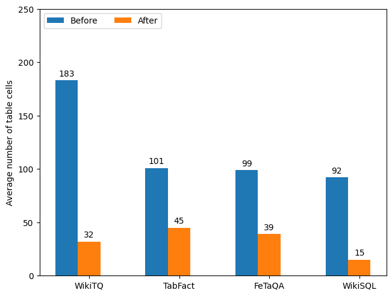

# TabSQLify：通过表格解构，提升大型语言模型的推理技能

发布时间：2024年04月15日

`LLM应用` `数据库管理`

> TabSQLify: Enhancing Reasoning Capabilities of LLMs Through Table Decomposition

# 摘要

> 表格推理任务考验着对自然语言和结构化数据的理解能力。尽管大型语言模型（LLMs）在语言理解与生成方面表现卓越，面对庞大的表格数据却因输入限制而力不从心。本文介绍了TabSQLify，一种创新方法，通过文本转SQL技术，将大表格拆解为只含关键信息的小型子表格，以便于回答问题或验证陈述。在对四大挑战性数据集的评估中，该方法与使用完整表格的现有方法相比，表现出不相上下甚至更优的性能。此外，它大幅缩短了输入长度，提高了大规模表格推理应用的可扩展性和效率。在WikiTQ基准测试中，TabSQLify的准确度达到了64.7%，在TabFact基准测试中更是高达79.5%，超越了基于gpt-3.5-turbo（chatgpt）的其他LLM模型。通过显著缩减表格规模，TabSQLify在不牺牲性能的前提下，有效减轻了LLMs处理大型表格时的计算压力。

> Table reasoning is a challenging task that requires understanding both natural language questions and structured tabular data. Large language models (LLMs) have shown impressive capabilities in natural language understanding and generation, but they often struggle with large tables due to their limited input length. In this paper, we propose TabSQLify, a novel method that leverages text-to-SQL generation to decompose tables into smaller and relevant sub-tables, containing only essential information for answering questions or verifying statements, before performing the reasoning task. In our comprehensive evaluation on four challenging datasets, our approach demonstrates comparable or superior performance compared to prevailing methods reliant on full tables as input. Moreover, our method can reduce the input context length significantly, making it more scalable and efficient for large-scale table reasoning applications. Our method performs remarkably well on the WikiTQ benchmark, achieving an accuracy of 64.7%. Additionally, on the TabFact benchmark, it achieves a high accuracy of 79.5%. These results surpass other LLM-based baseline models on gpt-3.5-turbo (chatgpt). TabSQLify can reduce the table size significantly alleviating the computational load on LLMs when handling large tables without compromising performance.

[Arxiv](https://arxiv.org/abs/2404.10150)