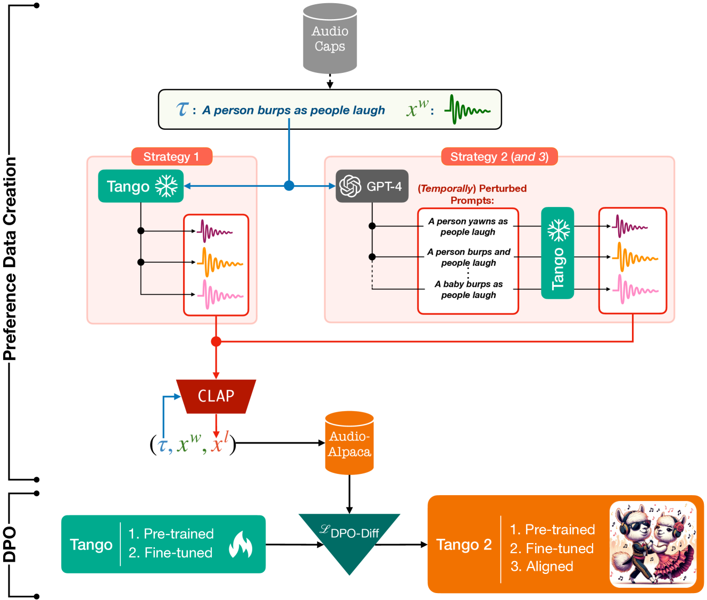
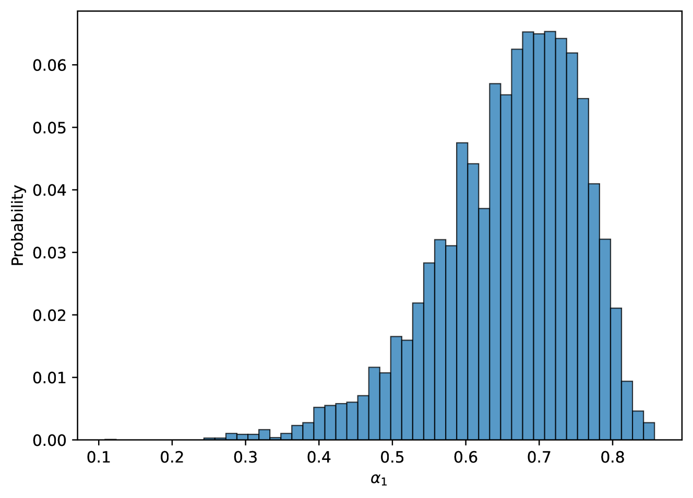
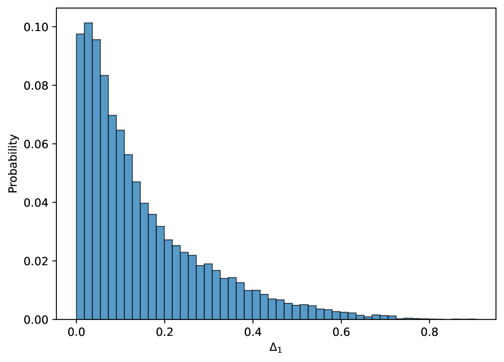
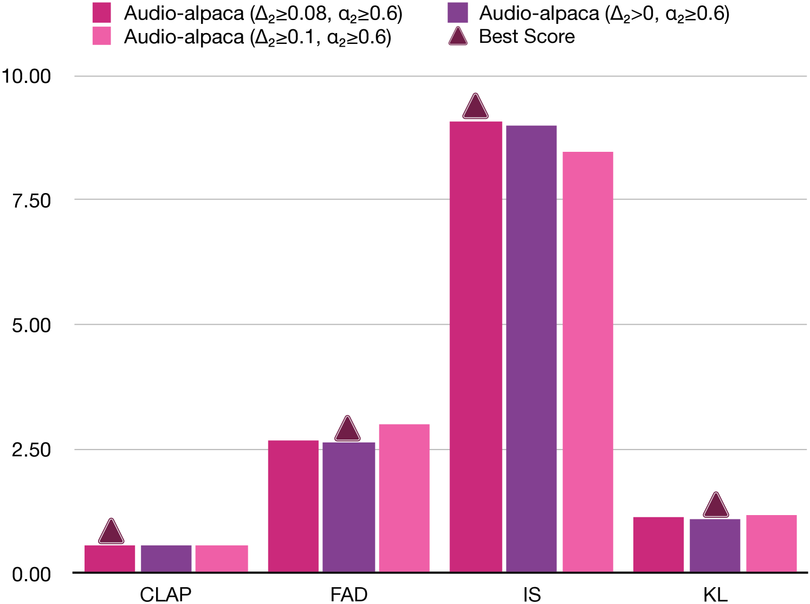

# Tango 2：借助直接偏好优化技术，实现基于扩散模型的文本到音频生成精准对齐

发布时间：2024年04月15日

`LLM应用` `音乐产业` `媒体制作`

> Tango 2: Aligning Diffusion-based Text-to-Audio Generations through Direct Preference Optimization

# 摘要

> 多模态内容生成正逐渐成为内容创作界的新宠，它使得艺术家和媒体工作者能够迅速将创意呈现，提前制作出预生产原型。尤其在音乐和电影产业中，将文本提示转换为音频的技术日益受到重视。当前许多基于扩散的文本转音频模型致力于在大量文本与音频对的数据集上，训练更为精细的模型。但这些模型通常忽略了输出音频中概念或事件的存在及其顺序与输入提示的对应关系。我们假设，关注这些音频生成的细节，能在数据受限的情况下提升音频生成的效果。基于此，本研究利用现成的Tango文本到音频模型，创建了一个合成的偏好数据集，每个文本提示对应一个最佳音频和一个或多个次优音频，供模型学习。这些次优音频可能遗漏了某些概念或顺序错乱。我们采用扩散-DPO（直接偏好优化）损失方法对Tango模型进行微调，并证明了其在自动和人工评估指标上都取得了优于Tango和AudioLDM2的音频输出效果。

> Generative multimodal content is increasingly prevalent in much of the content creation arena, as it has the potential to allow artists and media personnel to create pre-production mockups by quickly bringing their ideas to life. The generation of audio from text prompts is an important aspect of such processes in the music and film industry. Many of the recent diffusion-based text-to-audio models focus on training increasingly sophisticated diffusion models on a large set of datasets of prompt-audio pairs. These models do not explicitly focus on the presence of concepts or events and their temporal ordering in the output audio with respect to the input prompt. Our hypothesis is focusing on how these aspects of audio generation could improve audio generation performance in the presence of limited data. As such, in this work, using an existing text-to-audio model Tango, we synthetically create a preference dataset where each prompt has a winner audio output and some loser audio outputs for the diffusion model to learn from. The loser outputs, in theory, have some concepts from the prompt missing or in an incorrect order. We fine-tune the publicly available Tango text-to-audio model using diffusion-DPO (direct preference optimization) loss on our preference dataset and show that it leads to improved audio output over Tango and AudioLDM2, in terms of both automatic- and manual-evaluation metrics.

[Arxiv](https://arxiv.org/abs/2404.09956)