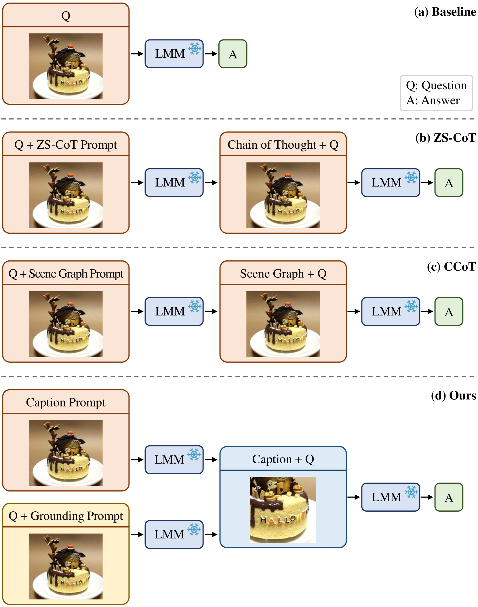
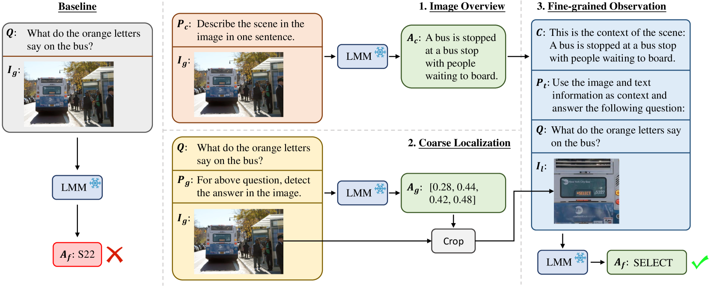
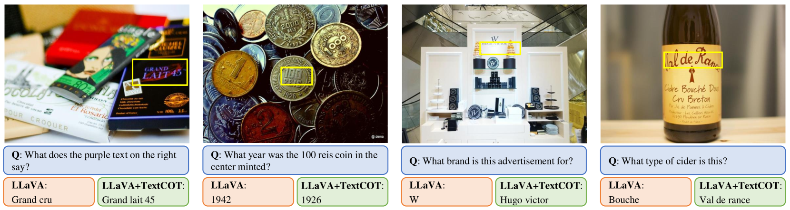
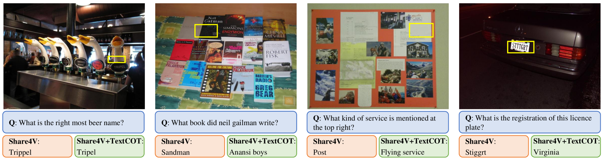
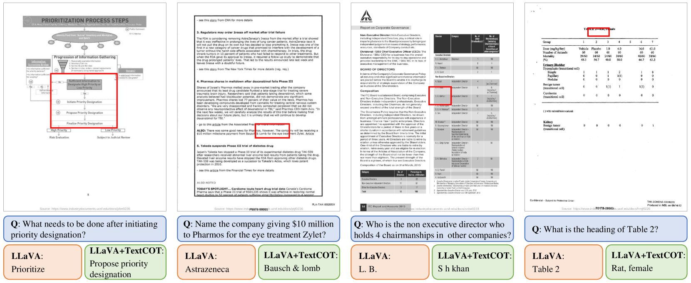
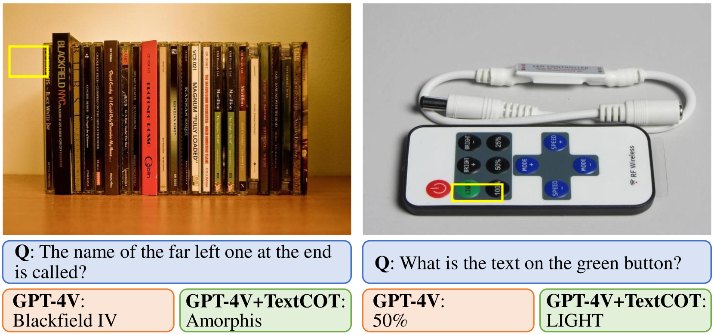

# TextCoT：深入探索，提升图文融合的多模态理解

发布时间：2024年04月15日

`RAG` `图像识别` `问答系统`

> TextCoT: Zoom In for Enhanced Multimodal Text-Rich Image Understanding

# 摘要

> 随着大型多模态模型（LMMs）的兴起，研究者们纷纷探索如何发挥其出色的推理能力。但在解读充满文本信息的图像方面，我们仍面临挑战，难以完全挖掘LMMs的潜力，尤其是在处理高清图像时，现有技术显得力不从心。本研究提出了TextCoT，一种创新的文本理解思维链框架，专为解读文本丰富的图像设计。TextCoT借助LMMs的描述能力捕捉图像的整体语境，并利用其定位功能深入局部文本区域。这样，我们能够提取图像的全局与局部视觉信息，从而更准确地回答问题。技术上，TextCoT分为三个阶段：图像概览、粗略定位和精细观察。首先，图像概览阶段全面理解场景信息；接着，粗略定位阶段根据问题内容确定答案所在的图像区域；最后，结合全局描述，精细观察阶段深入分析特定区域，给出精确答案。TextCoT无需额外训练，即可即插即用。我们在多个基于先进LMMs的文本丰富图像问答数据集上进行了广泛实验，结果表明，TextCoT方法有效且具有很强的泛化能力。相关代码已在 https://github.com/bzluan/TextCoT 上发布。

> The advent of Large Multimodal Models (LMMs) has sparked a surge in research aimed at harnessing their remarkable reasoning abilities. However, for understanding text-rich images, challenges persist in fully leveraging the potential of LMMs, and existing methods struggle with effectively processing high-resolution images. In this work, we propose TextCoT, a novel Chain-of-Thought framework for text-rich image understanding. TextCoT utilizes the captioning ability of LMMs to grasp the global context of the image and the grounding capability to examine local textual regions. This allows for the extraction of both global and local visual information, facilitating more accurate question-answering. Technically, TextCoT consists of three stages, including image overview, coarse localization, and fine-grained observation. The image overview stage provides a comprehensive understanding of the global scene information, and the coarse localization stage approximates the image area containing the answer based on the question asked. Then, integrating the obtained global image descriptions, the final stage further examines specific regions to provide accurate answers. Our method is free of extra training, offering immediate plug-and-play functionality. Extensive experiments are conducted on a series of text-rich image question-answering benchmark datasets based on several advanced LMMs, and the results demonstrate the effectiveness and strong generalization ability of our method. Code is available at https://github.com/bzluan/TextCoT.

[Arxiv](https://arxiv.org/abs/2404.09797)