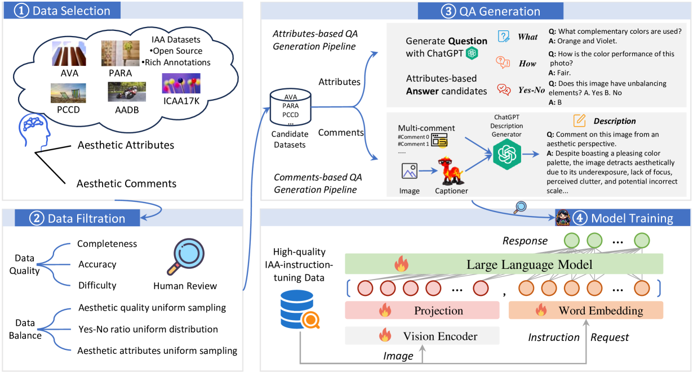
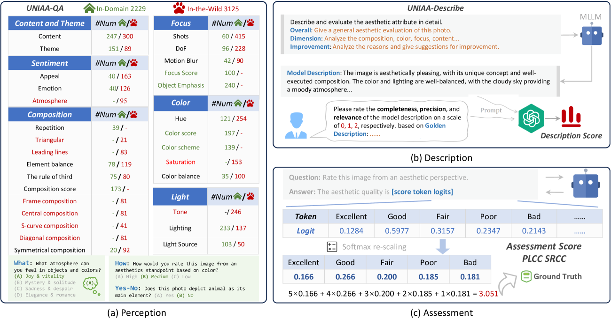
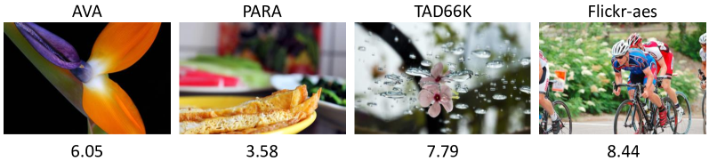
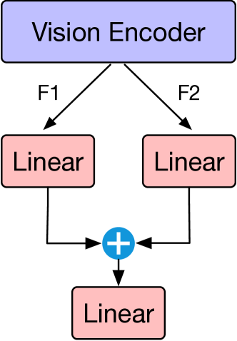
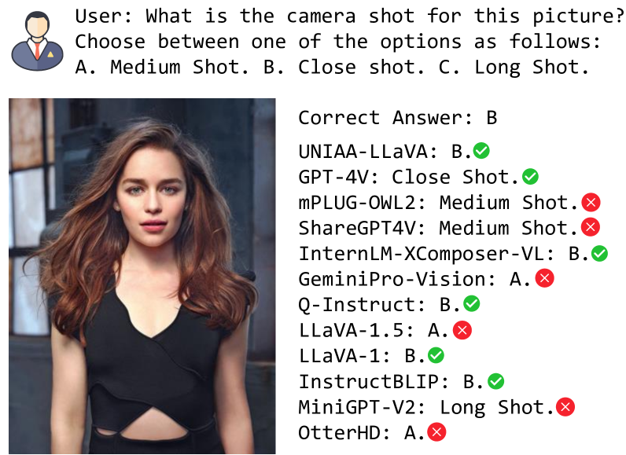

# UNIAA：构建统一的多模态图像审美评估基准与评测标准

发布时间：2024年04月15日

`LLM应用` `图像处理` `人工智能`

> UNIAA: A Unified Multi-modal Image Aesthetic Assessment Baseline and Benchmark

# 摘要

> 图像美学评估（IAA）是计算机视觉领域中一种成本效益高的重要评估方式。为了突破传统IAA方法的局限，我们提出了一种全新的统一多模态图像美学评估框架——UNIAA，它包含一个融合视觉与语言能力的多模态大型语言模型UNIAA-LLaVA，以及一个全面的评估基准UNIAA-Bench。我们利用这些工具，将现有数据集转化为统一、高品质的视觉指令调整数据，进而训练出UNIAA-LLaVA模型。UNIAA-Bench包含感知、描述和评估三个美学层次，通过广泛的实验，我们验证了UNIAA的有效性和合理性。UNIAA-LLaVA在所有评估层次上均展现出与现有模型相媲美的表现，尤其在美学感知方面，其性能甚至接近人类初级水平。尽管MLLMs在IAA领域展现出巨大潜力，但我们认为仍有进步空间。UNIAA-LLaVA和UNIAA-Bench即将发布。

> As an alternative to expensive expert evaluation, Image Aesthetic Assessment (IAA) stands out as a crucial task in computer vision. However, traditional IAA methods are typically constrained to a single data source or task, restricting the universality and broader application. In this work, to better align with human aesthetics, we propose a Unified Multi-modal Image Aesthetic Assessment (UNIAA) framework, including a Multi-modal Large Language Model (MLLM) named UNIAA-LLaVA and a comprehensive benchmark named UNIAA-Bench. We choose MLLMs with both visual perception and language ability for IAA and establish a low-cost paradigm for transforming the existing datasets into unified and high-quality visual instruction tuning data, from which the UNIAA-LLaVA is trained. To further evaluate the IAA capability of MLLMs, we construct the UNIAA-Bench, which consists of three aesthetic levels: Perception, Description, and Assessment. Extensive experiments validate the effectiveness and rationality of UNIAA. UNIAA-LLaVA achieves competitive performance on all levels of UNIAA-Bench, compared with existing MLLMs. Specifically, our model performs better than GPT-4V in aesthetic perception and even approaches the junior-level human. We find MLLMs have great potential in IAA, yet there remains plenty of room for further improvement. The UNIAA-LLaVA and UNIAA-Bench will be released.

[Arxiv](https://arxiv.org/abs/2404.09619)