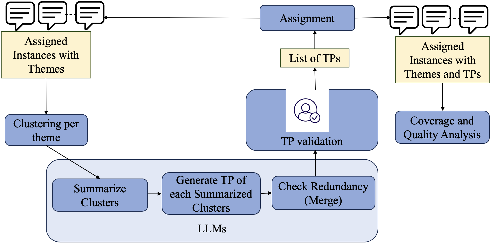
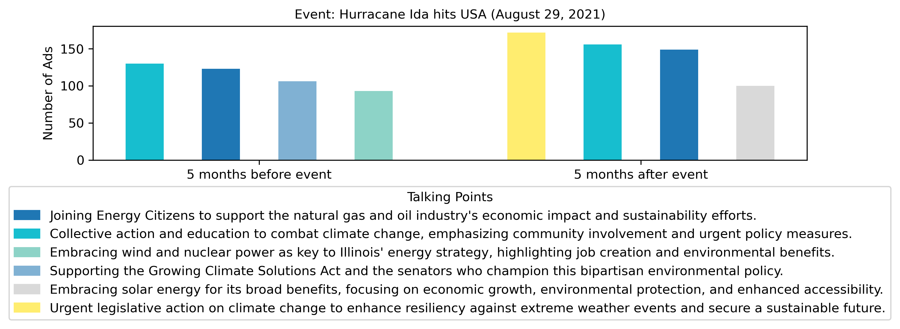
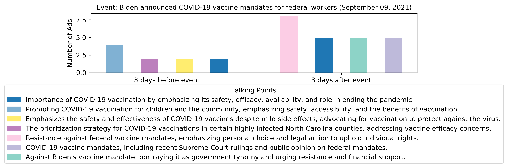
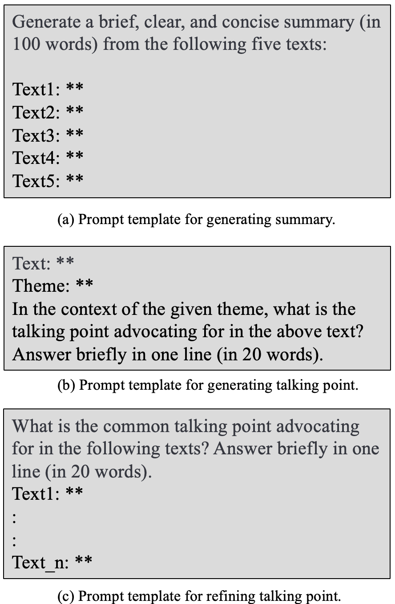

# 利用LLM参与策略，挖掘社交媒体通讯中的隐性争议。

发布时间：2024年04月15日

`LLM应用` `社交媒体分析` `舆论监测`

> Uncovering Latent Arguments in Social Media Messaging by Employing LLMs-in-the-Loop Strategy

# 摘要

> 随着社交媒体的普及，自动化分析公众舆论的方法变得越来越受欢迎。尽管监督学习方法在文本分类方面表现出色，但社交媒体讨论的不断变化特性使得这些方法面临持续挑战。而传统的无监督学习方法，如主题建模，虽能揭示普遍模式，却可能忽略了细节。因此，社交媒体话语研究仍大量依赖于耗时且成本高昂的人工编码和人在循环中的方法。本研究致力于挖掘特定主题相关的争论，提出了一种新型策略，利用大型语言模型（LLMs）的强大功能，从社交媒体信息中挖掘潜在争论。我们选取了两个具有争议性的话题进行实证分析：一是包含14,000条Facebook广告的气候活动数据集，涵盖25个主题；二是包含9,000条Facebook广告的COVID-19疫苗活动数据集，涵盖14个主题。我们还研究了基于真实事件的人口统计定位和信息传播策略的调整。

> The widespread use of social media has led to a surge in popularity for automated methods of analyzing public opinion. Supervised methods are adept at text categorization, yet the dynamic nature of social media discussions poses a continual challenge for these techniques due to the constant shifting of the focus. On the other hand, traditional unsupervised methods for extracting themes from public discourse, such as topic modeling, often reveal overarching patterns that might not capture specific nuances. Consequently, a significant portion of research into social media discourse still depends on labor-intensive manual coding techniques and a human-in-the-loop approach, which are both time-consuming and costly. In this work, we study the problem of discovering arguments associated with a specific theme. We propose a generic LLMs-in-the-Loop strategy that leverages the advanced capabilities of Large Language Models (LLMs) to extract latent arguments from social media messaging. To demonstrate our approach, we apply our framework to contentious topics. We use two publicly available datasets: (1) the climate campaigns dataset of 14k Facebook ads with 25 themes and (2) the COVID-19 vaccine campaigns dataset of 9k Facebook ads with 14 themes. Furthermore, we analyze demographic targeting and the adaptation of messaging based on real-world events.

[Arxiv](https://arxiv.org/abs/2404.10259)