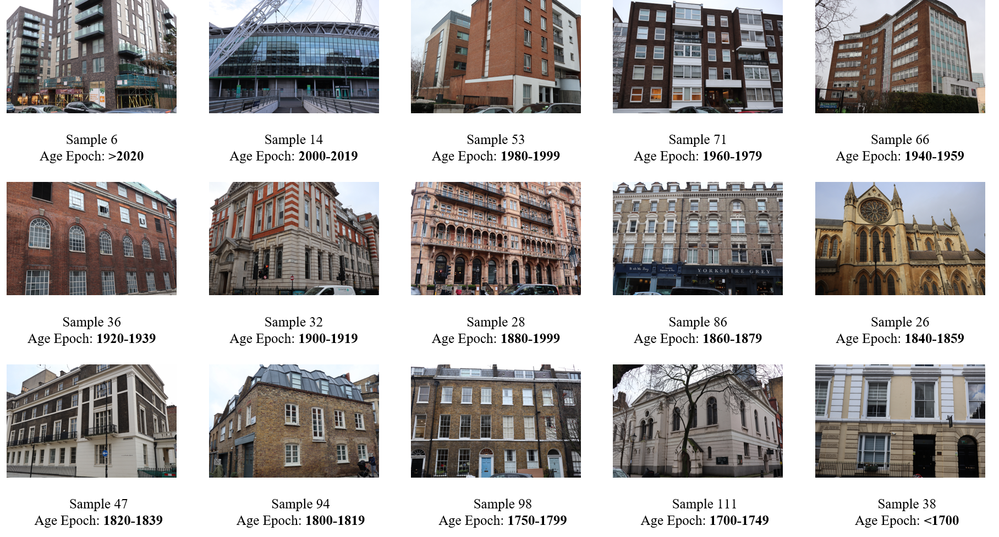
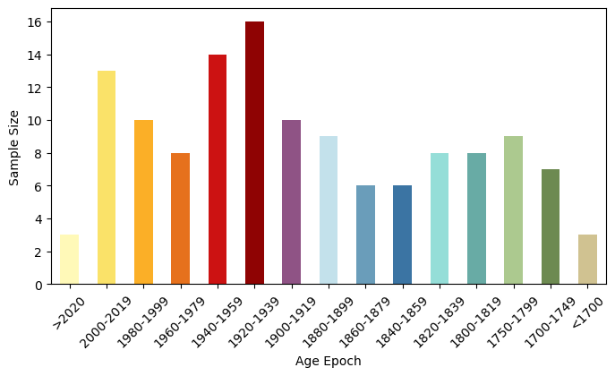
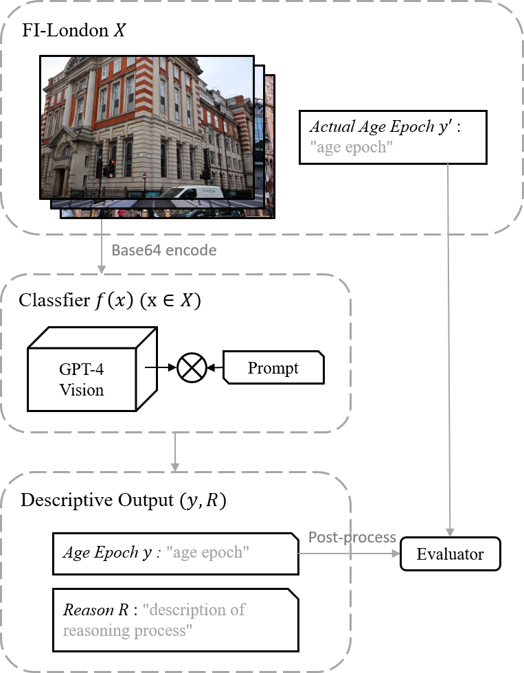
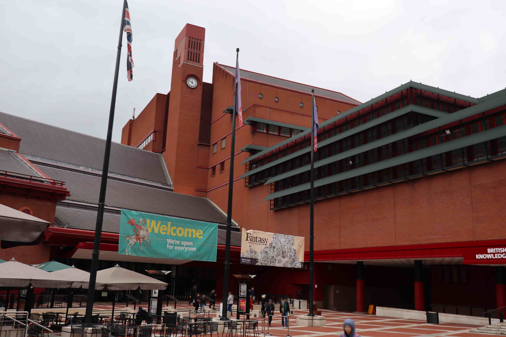
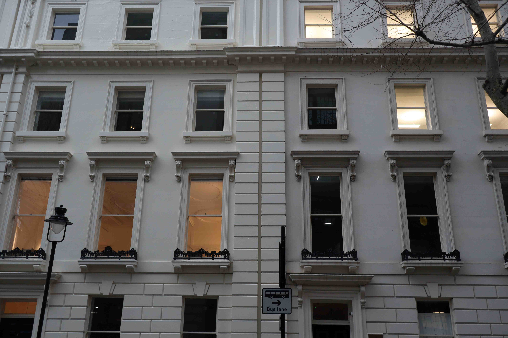
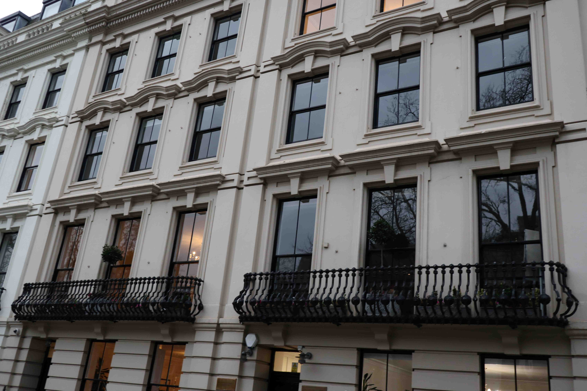
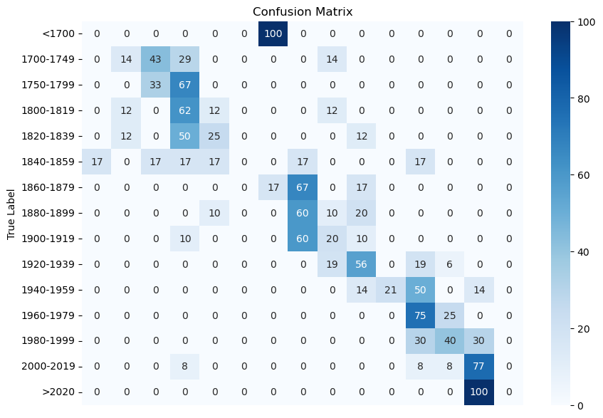
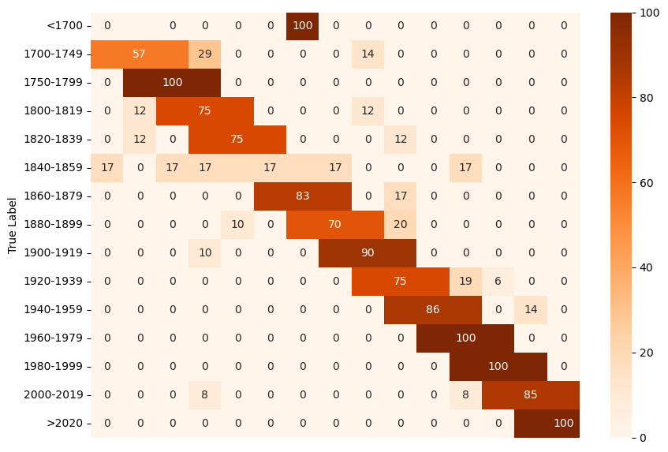
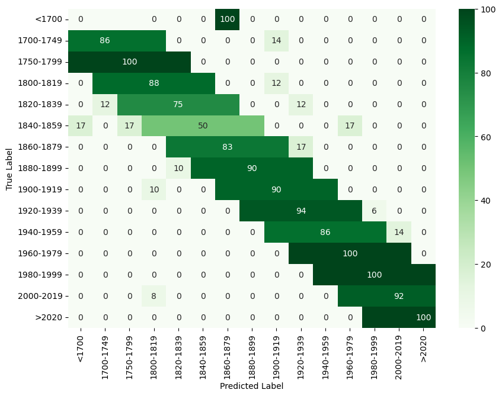

# 借助 GPT-4，我们能够直接从建筑立面图片中判断建筑的年代，无需事先了解具体建筑信息。

发布时间：2024年04月15日

`LLM应用` `地理信息系统`

> Zero-shot Building Age Classification from Facade Image Using GPT-4

# 摘要

> 建筑年代信息对于地理空间应用极为关键。当前研究多致力于运用深度学习技术，通过分析建筑立面图像来推断其建造年份。但要构建精准的深度学习模型，不仅需要大量标注数据，模型还可能受限于特定地理位置。近期，诸如GPT-4 Vision等大型预训练视觉语言模型凭借其出色的泛化能力，成为处理特定视觉任务的有力候选，但其在建筑信息识别上的适用性与可靠性尚待验证。本研究尝试利用这类模型，通过逻辑提示构建了一个无需训练的建筑年代分类器，专门针对立面图像。我们以伦敦为例，创建了一个新的数据集FI-London，收集了立面图像及对应的建筑年代信息。尽管该分类器的准确率仅为39.69%，但其平均绝对误差仅为0.85个年代，显示出模型具备成功预测建筑年代的能力，只是略有偏差。讨论发现，该分类器在判断极老建筑年代时表现不佳，且在预测2个年代内的精确年份时面临挑战。综上，基于GPT-4 Vision的分类器能够在没有任何训练的情况下，从单张立面图像推测出建筑的大致年代。

> A building's age of construction is crucial for supporting many geospatial applications. Much current research focuses on estimating building age from facade images using deep learning. However, building an accurate deep learning model requires a considerable amount of labelled training data, and the trained models often have geographical constraints. Recently, large pre-trained vision language models (VLMs) such as GPT-4 Vision, which demonstrate significant generalisation capabilities, have emerged as potential training-free tools for dealing with specific vision tasks, but their applicability and reliability for building information remain unexplored. In this study, a zero-shot building age classifier for facade images is developed using prompts that include logical instructions. Taking London as a test case, we introduce a new dataset, FI-London, comprising facade images and building age epochs. Although the training-free classifier achieved a modest accuracy of 39.69%, the mean absolute error of 0.85 decades indicates that the model can predict building age epochs successfully albeit with a small bias. The ensuing discussion reveals that the classifier struggles to predict the age of very old buildings and is challenged by fine-grained predictions within 2 decades. Overall, the classifier utilising GPT-4 Vision is capable of predicting the rough age epoch of a building from a single facade image without any training.

[Arxiv](https://arxiv.org/abs/2404.09921)