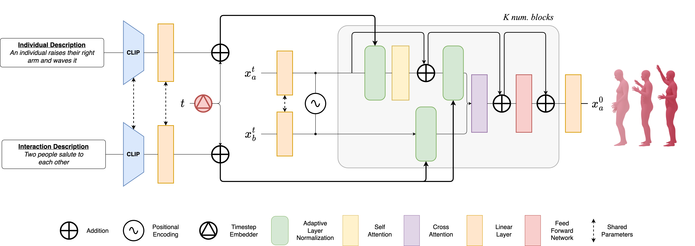
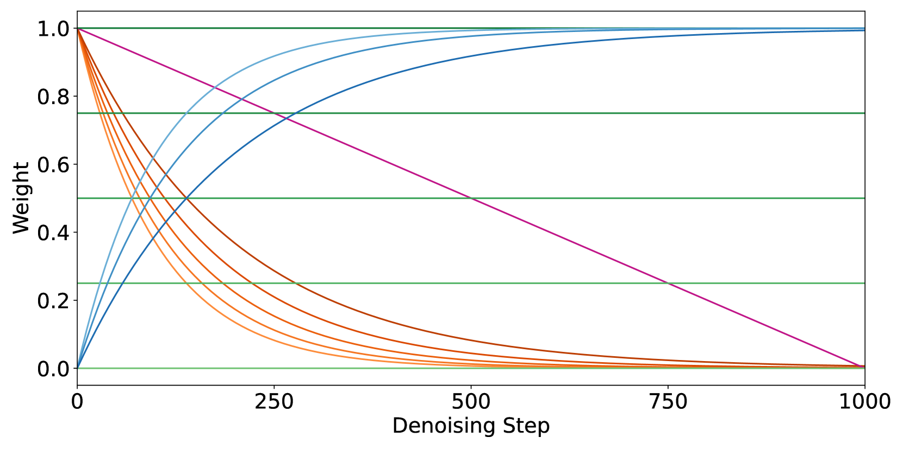
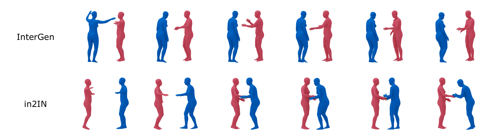
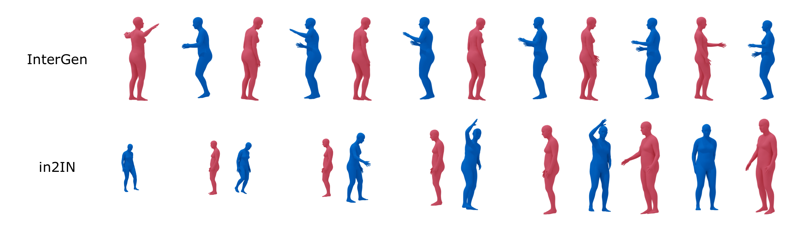
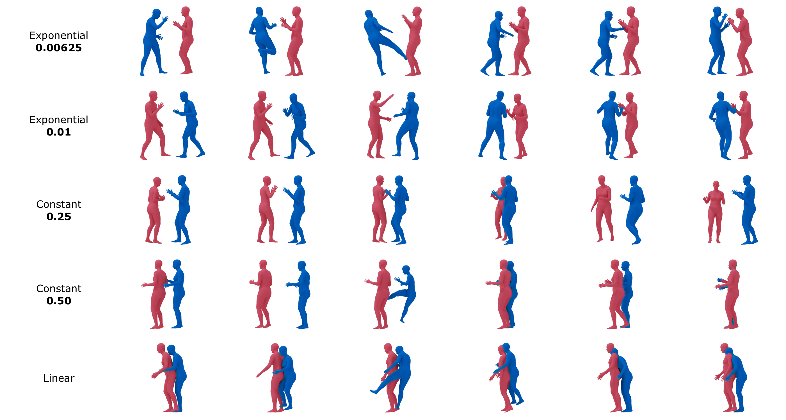
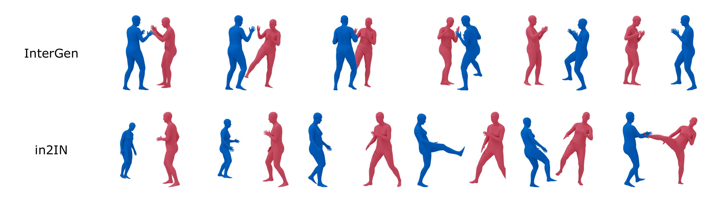
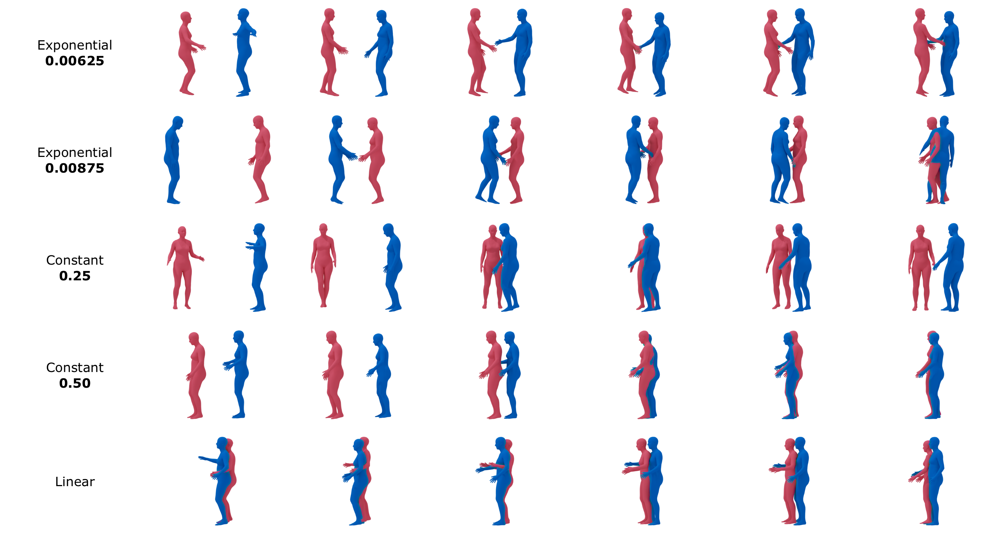
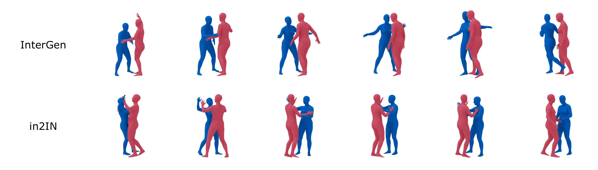
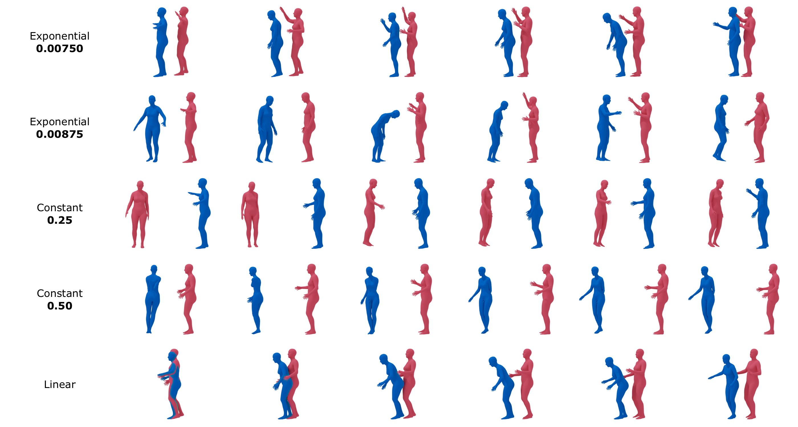

# in2IN：借助个体信息打造真实人际互动体验

发布时间：2024年04月15日

`LLM应用` `机器人` `元宇宙`

> in2IN: Leveraging individual Information to Generate Human INteractions

# 摘要

> 通过文本描述激发人与人互动的运动生成，在机器人、游戏、动画乃至元宇宙等众多领域大有裨益。然而，这种建模的实用性也带来了模拟复杂人际动态的难题。捕捉每个个体间互动的多样性同样充满挑战。现有方法因数据集和条件策略的局限，导致生成的互动在个体内部动态上缺乏多样性。为此，我们推出了in2IN，这是一种创新的扩散模型，不仅依据整体互动的文本描述，还包括每个参与者行动的个体描述，共同指导运动生成。我们利用大型语言模型扩充InterHuman数据集，增添个体化描述，使得in2IN在该数据集上的表现达到顶尖水平。进一步地，为了提升现有互动数据集的个体多样性，我们提出了DualMDM模型组合技术，它融合了in2IN生成的多人互动和基于HumanML3D预训练的单人运动先验生成的运动。由此，DualMDM不仅提高了个体多样性，更在保持人际互动连贯性的基础上，增强了对个体内部动态的操控能力。

> Generating human-human motion interactions conditioned on textual descriptions is a very useful application in many areas such as robotics, gaming, animation, and the metaverse. Alongside this utility also comes a great difficulty in modeling the highly dimensional inter-personal dynamics. In addition, properly capturing the intra-personal diversity of interactions has a lot of challenges. Current methods generate interactions with limited diversity of intra-person dynamics due to the limitations of the available datasets and conditioning strategies. For this, we introduce in2IN, a novel diffusion model for human-human motion generation which is conditioned not only on the textual description of the overall interaction but also on the individual descriptions of the actions performed by each person involved in the interaction. To train this model, we use a large language model to extend the InterHuman dataset with individual descriptions. As a result, in2IN achieves state-of-the-art performance in the InterHuman dataset. Furthermore, in order to increase the intra-personal diversity on the existing interaction datasets, we propose DualMDM, a model composition technique that combines the motions generated with in2IN and the motions generated by a single-person motion prior pre-trained on HumanML3D. As a result, DualMDM generates motions with higher individual diversity and improves control over the intra-person dynamics while maintaining inter-personal coherence.

[Arxiv](https://arxiv.org/abs/2404.09988)