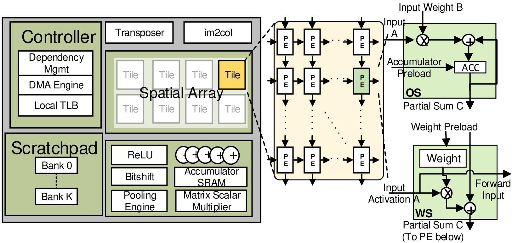
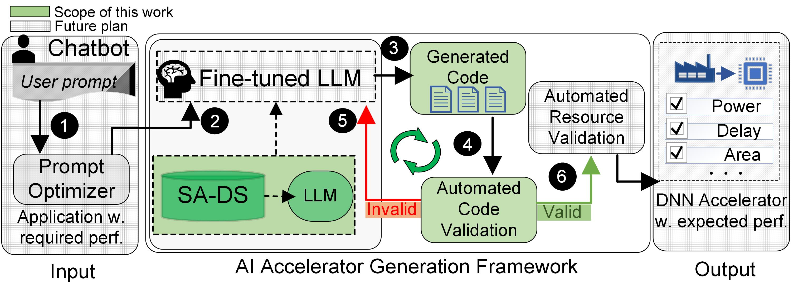
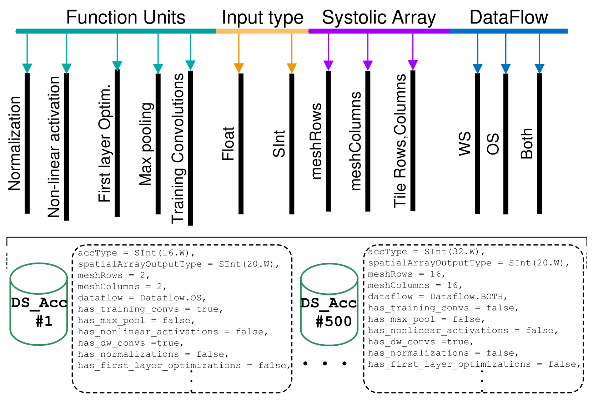
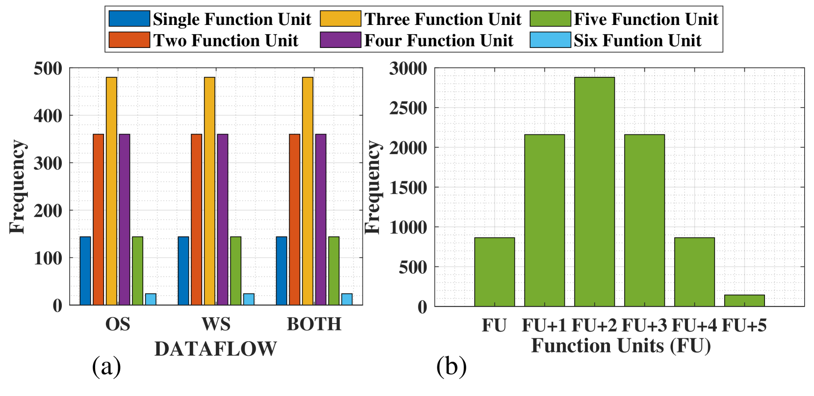

# 为大型语言模型所驱动的人工智能加速器生成而设计的数据集。

发布时间：2024年04月16日

`LLM应用` `深度学习硬件加速` `数据集`

> A Dataset for Large Language Model-Driven AI Accelerator Generation

# 摘要

> 在深度神经网络硬件加速技术的快速发展中，脉动阵列加速器的全面潜力因专业知识和时间投入的高要求而难以实现。大型语言模型（LLMs）提供了一种自动化代码生成的解决方案，这对于提升硬件描述性代码等领域的效率和性能至关重要。然而，LLMs在硬件加速器设计中的应用成功与否，取决于是否有合适的专用数据集。为了填补这一空白，我们推出了基于脉动阵列的加速器数据集（SA-DS）。SA-DS汇集了多样化的空间阵列，遵循Berkeley Gemmini加速器生成器的标准模板，便于设计复用、调整和个性化定制。我们期望SA-DS能够激发以LLM为驱动的DNN硬件加速器架构研究的新浪潮。SA-DS以开放的MIT许可证发布，旨在成为未来DNN硬件加速研究的基石，其代码库可在GitHub上找到。

> In the ever-evolving landscape of Deep Neural Networks (DNN) hardware acceleration, unlocking the true potential of systolic array accelerators has long been hindered by the daunting challenges of expertise and time investment. Large Language Models (LLMs) offer a promising solution for automating code generation which is key to unlocking unprecedented efficiency and performance in various domains, including hardware descriptive code. However, the successful application of LLMs to hardware accelerator design is contingent upon the availability of specialized datasets tailored for this purpose. To bridge this gap, we introduce the Systolic Array-based Accelerator DataSet (SA-DS). SA-DS comprises of a diverse collection of spatial arrays following the standardized Berkeley's Gemmini accelerator generator template, enabling design reuse, adaptation, and customization. SA-DS is intended to spark LLM-centred research on DNN hardware accelerator architecture. We envision that SA-DS provides a framework which will shape the course of DNN hardware acceleration research for generations to come. SA-DS is open-sourced under the permissive MIT license at this https://github.com/ACADLab/SA-DS.

[Arxiv](https://arxiv.org/abs/2404.10875)