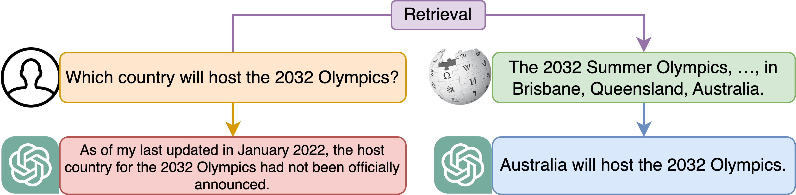
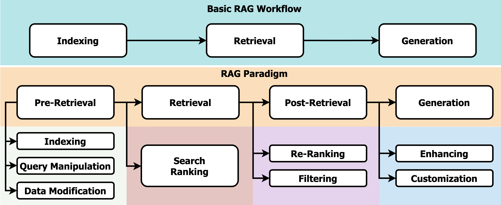

# 针对大型语言模型，本文进行了一项关于检索增强文本生成的研究调查。

发布时间：2024年04月16日

`分类：RAG

这篇论文摘要主要讨论了检索增强生成（RAG）技术，这是一种结合了检索技术和深度学习的最新进展的方法，用于提升大型语言模型（LLMs）的性能。论文摘要中提到了RAG技术的不同阶段，包括检索前处理、检索阶段、检索后处理和生成阶段，以及对RAG技术的发展历程、关键研究、评估方法和未来研究方向的探讨。因此，这篇论文应该归类为RAG。` `文本生成` `信息检索`

> A Survey on Retrieval-Augmented Text Generation for Large Language Models

# 摘要

> 检索增强生成（RAG）技术通过结合检索技术与深度学习的最新进展，突破了大型语言模型（LLMs）的静态局限，实现了对最新外部信息的动态融合。这一方法专注于文本领域，有效解决了LLMs生成似是而非的错误响应的问题，利用现实世界数据提升了模型输出的精确度和可信度。随着RAG技术不断演进，涵盖了多个可能影响性能的概念，本文将其归纳为四个主要阶段：检索前处理、检索阶段、检索后处理和生成阶段，为读者提供了一个从检索角度深入分析的视角。文章追溯了RAG的发展历程，并通过分析关键研究，探讨了该领域的最新进展。同时，本文还介绍了RAG的评估方法，面对挑战，提出了未来研究的可能方向。通过构建系统化的框架和分类，本文旨在整合RAG领域的研究成果，阐释其技术原理，并强调其在扩展LLMs的适应性和应用范围方面的潜力。

> Retrieval-Augmented Generation (RAG) merges retrieval methods with deep learning advancements to address the static limitations of large language models (LLMs) by enabling the dynamic integration of up-to-date external information. This methodology, focusing primarily on the text domain, provides a cost-effective solution to the generation of plausible but incorrect responses by LLMs, thereby enhancing the accuracy and reliability of their outputs through the use of real-world data. As RAG grows in complexity and incorporates multiple concepts that can influence its performance, this paper organizes the RAG paradigm into four categories: pre-retrieval, retrieval, post-retrieval, and generation, offering a detailed perspective from the retrieval viewpoint. It outlines RAG's evolution and discusses the field's progression through the analysis of significant studies. Additionally, the paper introduces evaluation methods for RAG, addressing the challenges faced and proposing future research directions. By offering an organized framework and categorization, the study aims to consolidate existing research on RAG, clarify its technological underpinnings, and highlight its potential to broaden the adaptability and applications of LLMs.

[Arxiv](https://arxiv.org/abs/2404.10981)